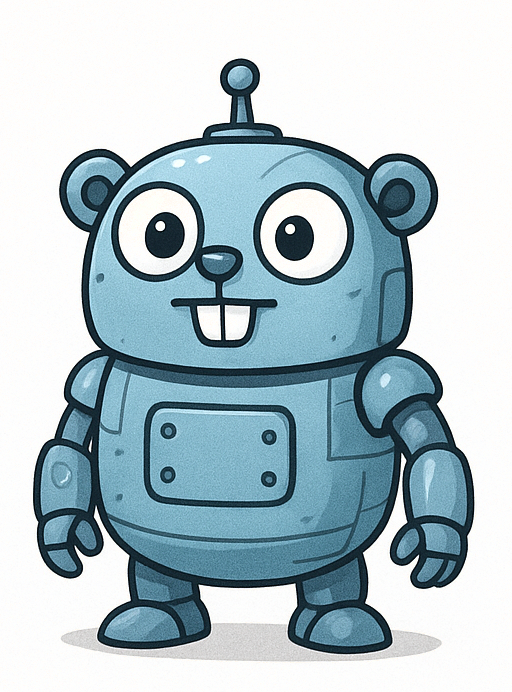
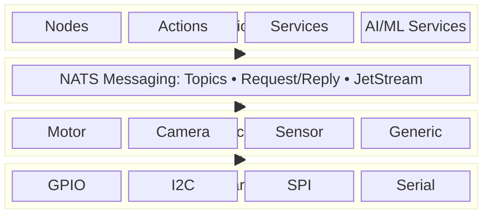
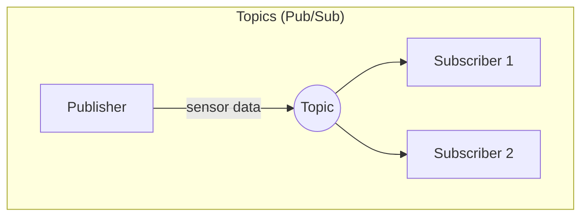
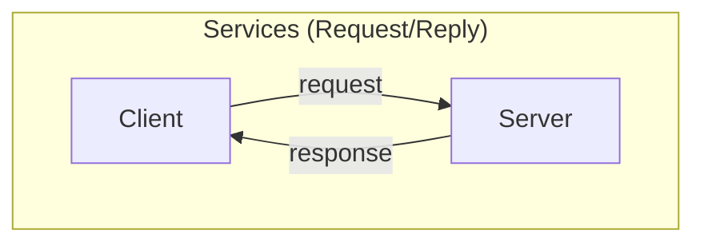
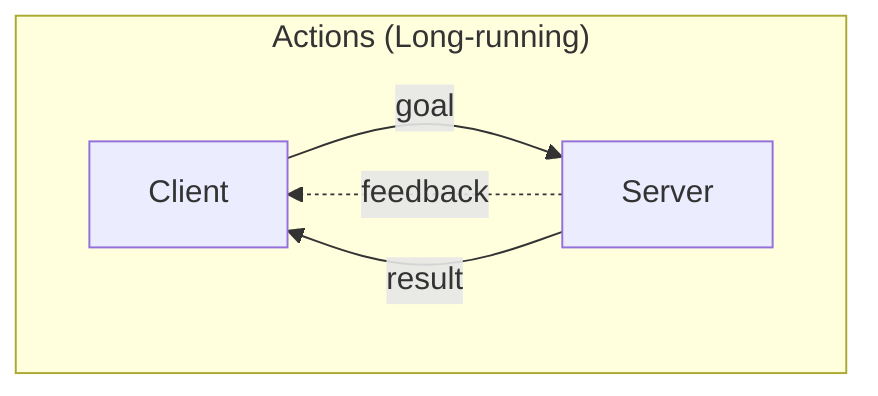

# Gorai



**A lightweight, Go-based alternative to ROS 2, YARP, and Viam optimized for AI**

*Pronounced "go-ray" (like stingray)*

Gorai provides the essential capabilities of modern robotics frameworks without the complexity of DDS, the legacy constraints of C++ middleware, or mandatory cloud dependencies. Single-binary deployment, type-safe messaging, and battle-tested infrastructure.

We originally wanted to name this project "Gort" after the iconic robot from *The Day the Earth Stood Still*, but that name has been taken for years by DevOps tooling for the excellent [GoBot](https://gobot.io/) project. Gorai is a contraction of **Go + Robot + AI**—and it evokes the [eye ray gun of Gort](https://youtu.be/K6iF5sINVns?t=92)!

## Why Gorai?

Gorai learns from three generations of robotics middleware:

| Aspect | Gorai | ROS 2 | Viam | YARP |
|--------|-------|-------|------|------|
| **Language** | Go + TinyGo | C++/Python | Go | C++ |
| **Middleware** | NATS | DDS | gRPC | Custom carriers |
| **Discovery** | NATS (embedded/cluster) | DDS multicast | Cloud/local | Name server |
| **Build** | Go modules | CMake + ament + colcon | Go modules | CMake |
| **AI/ML** | First-class + TPU/NPU | Package ecosystem | First-class services | Minimal |
| **MCU Support** | TinyGo | micro-ROS | None | None |
| **Cloud** | Optional | Ecosystem | Core feature | None |
| **License** | Apache 2.0 | Apache 2.0 | AGPL | BSD-3 |

## Design Principles

Drawing from [our analysis](docs/general-designs.md) of ROS 2, Viam, and YARP:

### What We Adopt

- **Resource-centric model** (from Viam): Unified abstraction for components and services
- **Named addressing** (from all): Hierarchical, human-readable identifiers
- **Transport abstraction** (from YARP): NATS as unified transport for pub/sub and request/reply
- **Configuration-driven** (from Viam): JSON config with hot reload
- **Device interfaces** (from all): Clean separation of hardware from logic
- **NWS/NWC pattern** (from YARP): Transparent local/remote resource access

### What We Differentiate

- **NATS as core**: Simpler than DDS, more capable than gRPC for pub/sub patterns
- **TinyGo support**: Unified language from microcontrollers to cloud
- **TPU/NPU focus**: Edge AI as primary concern, not afterthought
- **No cloud dependency**: Standalone-first, cloud-optional
- **Lower barrier**: Simpler than ROS 2, more flexible than Viam

### What We Avoid

- Heavy build systems that increase barrier to entry
- Mandatory cloud connectivity
- Complex middleware abstractions that leak implementation details
- Central coordinators as single points of failure

## Architecture Overview



## Communication Patterns

Gorai uses NATS to provide three core patterns (similar to ROS 2):







| Pattern | NATS Primitive | Use Case |
|---------|----------------|----------|
| **Topics** | Pub/Sub | Continuous sensor streams, telemetry |
| **Services** | Request/Reply | Synchronous RPC, configuration |
| **Actions** | Request/Reply + Pub/Sub | Long-running tasks with feedback |

## Quick Start

```go
n, _ := node.New("my_robot", node.WithNATS("nats://localhost:4222"))
defer n.Close()

// Publish sensor data
pub := pub.New[sensor.Image](n, "camera.image")
pub.Publish(ctx, &sensor.Image{Width: 640, Height: 480, Data: frame})

// Subscribe to commands
sub.New[geometry.Twist](n, "cmd_vel", func(msg *geometry.Twist) {
    drive(msg.Linear.X, msg.Angular.Z)
})

n.Spin(ctx)
```

## Core Features

### Resource Model

Every component (hardware) and service (software capability) is a resource:

```go
type Resource interface {
    Name() string
    Reconfigure(ctx context.Context, config Config) error
    Close(ctx context.Context) error
}
```

### Hot Reconfiguration

Update robot configuration without restart:

```json
{
  "components": [
    {
      "name": "left_motor",
      "type": "motor",
      "model": "gpio",
      "config": {
        "pin": 18,
        "frequency": 1000
      }
    }
  ]
}
```

### Device Interfaces

Clean abstraction for hardware:

```go
type Motor interface {
    Resource
    SetPower(ctx context.Context, power float64) error
    GetPosition(ctx context.Context) (float64, error)
    Stop(ctx context.Context) error
}
```

## AI/ML Integration

Gorai provides first-class support for edge AI with a focus on hardware acceleration and the Go ecosystem. See the [Go AI Ecosystem Reference](docs/go-ai-material.md) for a comprehensive overview.

### Services

- **Vision**: Object detection, classification, segmentation
- **ML Model**: Generic tensor inference with TPU/NPU acceleration
- **SLAM**: Localization and mapping
- **Navigation**: Waypoint and geospatial navigation

### Platform

Gorai targets **Linux-based systems** including:
- x86_64 servers and workstations
- ARM64 single-board computers (Raspberry Pi, Rockchip, NVIDIA Jetson)
- Microcontrollers via TinyGo

### Containers

Gorai supports deployment via **OCI-compliant containers**. We use [Podman](https://podman.io/) as our reference container runtime:

- **Daemonless**: No background service required
- **Rootless**: Run containers without root privileges
- **OCI-compliant**: Images work with Docker, Kubernetes, and other OCI runtimes
- **Pod support**: Native support for multi-container pods

See [nats/nats-setup.md](nats/nats-setup.md) for container-based NATS deployment.

### Hardware Acceleration

| Platform | Status | Library | Notes |
|----------|--------|---------|-------|
| Rockchip RK3588 NPU | **Working** | [go-rknnlite](https://github.com/swdee/go-rknnlite) | 6 TOPS, tested on Radxa Rock 5B |
| NVIDIA CUDA | **Working** | [onnxruntime_go](https://github.com/yalue/onnxruntime_go) | Requires CUDA 12.x, cuDNN 9.x |
| Intel OpenVINO | Partial | [GoCV](https://gocv.io/) | GoCV uses OpenVINO 2022.1; may need updates |
| Google Coral TPU | **No Go bindings** | - | CGo bindings to libedgetpu needed |
| Hailo NPU | **No Go bindings** | - | CGo bindings to HailoRT needed |

### Inference Runtimes

- **ONNX Runtime**: Primary path for PyTorch/TensorFlow models via [onnxruntime_go](https://github.com/yalue/onnxruntime_go) (CUDA support requires separate library build)
- **TensorFlow Lite**: Edge inference via [tflitego](https://github.com/nbortolotti/tflitego)
- **GoCV DNN**: OpenCV's neural network module (CUDA backend available)

### Model Licensing

**Be as certain of model licenses as you are of software licenses.** Many popular models have restrictive licenses that may conflict with your project:

| Model Family | License | Commercial Use |
|--------------|---------|----------------|
| YOLOv3/v4/v5/v7/v8 | GPL-3.0 | Requires open-sourcing your code |
| YOLOX | Apache 2.0 | Permissive |
| YOLOv9/v10 | GPL-3.0 | Requires open-sourcing your code |
| MobileNet | Apache 2.0 | Permissive |
| EfficientNet | Apache 2.0 | Permissive |
| ResNet | BSD | Permissive |
| CLIP | MIT | Permissive |
| Stable Diffusion | CreativeML Open RAIL-M | Restrictive |
| LLaMA/LLaMA 2 | Custom Meta License | Conditional |
| Mistral | Apache 2.0 | Permissive |

Always verify the license of:
1. The model architecture (original paper/implementation)
2. The pretrained weights (training data may have separate terms)
3. Any fine-tuned versions you use

For commercial robotics applications, prefer Apache 2.0, MIT, or BSD licensed models like YOLOX, MobileNet, and EfficientNet.

## Documentation

- [Framework Specification](specs/gorai-framework-specification.md) - Complete technical specification
- [Hello Sensor Design](specs/hello-sensor-design.md) - Example design document (CPU temperature sensor)
- [Code Organization](specs/code-organization.md) - Module structure and naming conventions
- [Go AI Ecosystem](docs/go-ai-material.md) - ML frameworks, inference runtimes, and hardware acceleration
- [Design Comparison](docs/general-designs.md) - Analysis of ROS 2, Viam, and YARP
- [ROS 2 Design](docs/ros2-design.md) - ROS 2 architecture summary
- [Viam Design](docs/viam-design.md) - Viam architecture summary
- [YARP Design](docs/yarp-design.md) - YARP architecture summary

### Design Document Philosophy

The [Hello Sensor Design](specs/hello-sensor-design.md) document serves as a template for Gorai component designs. This level of detail is intentional: a well-written design document is both documentation for humans and a blueprint for AI-assisted implementation. It includes:

- Architecture diagrams and component relationships
- Complete Protocol Buffer definitions
- Platform-specific implementation details
- Verification steps and expected outputs
- Test specifications

When contributing new components or services, follow this format. The specificity enables AI coding assistants to implement and test designs with minimal ambiguity.

## Example Projects

### [Gorai-Sentinel](projects/project-pan-tilt.md)
Pan-tilt sensor fusion platform with camera, ToF depth sensor, and servo control. Validates multi-sensor synchronization, real-time control loops, and the action/service patterns.

**Hardware**: ~$150-350 | **Complexity**: Beginner

### [Gorai-Skimmer](projects/project-simple-boat.md)
Autonomous surface vehicle for bathymetry and water monitoring. Differential thrust propulsion, GPS navigation, Open Echo sonar, and optional underwater camera/hydrophone.

**Hardware**: ~$530 | **Complexity**: Intermediate

## AI-Assisted Software Engineering

Gorai is developed using AI-assisted software engineering, primarily with [Claude Code](https://claude.ai/claude-code). This isn't a gimmick or experiment - it's a deliberate engineering choice that shapes how we build and maintain this project.

### Our Approach

The specifications, architecture documents, protocol buffer definitions, and core implementation code in this repository were largely generated through conversations with Claude. We treat AI-generated code the same way we treat code from any other source: **with appropriate verification**.

When you `go get` a package from GitHub, you're trusting code written by developers you've never met. You mitigate that trust through:
- Reading documentation and understanding the API
- Writing tests that verify the behavior you depend on
- Reviewing critical code paths
- Monitoring for security advisories

We apply the same discipline to AI-generated code:
- **Specifications are reviewed** for correctness and completeness
- **Interfaces are tested** against expected behavior
- **Generated code is read** before being committed
- **Integration tests verify** that components work together

### Why This Matters

AI-assisted development allows a small team (or even a single developer) to:
- Explore design spaces more quickly
- Generate boilerplate and scaffolding without tedium
- Maintain consistency across a large codebase
- Document as we build rather than after

We're not claiming AI writes perfect code. We're claiming that with proper engineering practices - the same practices you'd apply to any codebase - AI-generated code is a legitimate and productive foundation.

### What This Means for You

If you use Gorai, you should be comfortable with:
- Code that was generated with AI assistance
- An iterative development process where AI helps refine implementations
- Documentation and specs that reflect AI-human collaboration

If this approach concerns you, that's a valid position - but Gorai may not be the right project for you. We believe this is the future of software development, and we're building Gorai to prove it works.

### Transparency

We don't hide AI involvement. Commits generated with Claude Code are marked. This README was written with AI assistance. The framework specification was developed through extended conversations with Claude. We consider this transparency important - not because AI-generated code is suspect, but because it's honest.

## Project Goals

1. **Be written in Go** (and TinyGo for microcontrollers)
2. **Use AI-assisted coding** wherever possible
3. **Use NATS.io extensively** for all communication
4. **Define appropriate data types** for robotics
5. **Enable TPU/NPU** usage to the maximum extent
6. **Have a low barrier to entry** for adoption
7. **Be as modular as possible**
8. **Apply distributed systems lessons** from cloud software
9. **Have fun!**

## License

Apache 2.0
