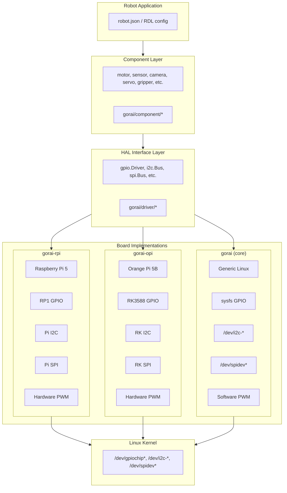
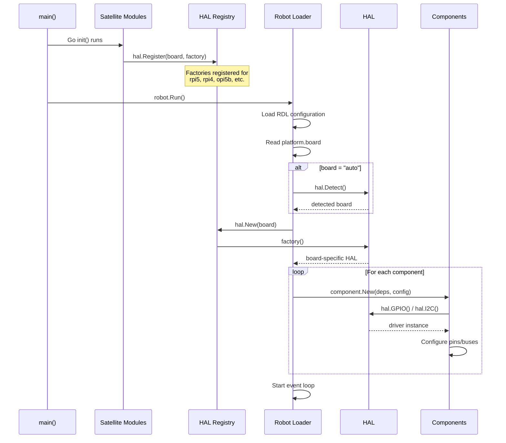

# Hardware Abstraction Layer Design

**Version:** 1.0
**Status:** Draft
**Last Updated:** 2025-01-24

## 1. Overview

This document defines the hardware abstraction architecture for Gorai, enabling consistent APIs across different single-board computers (SBCs) while allowing board-specific implementations in satellite modules.

### 1.1 Goals

1. **Consistent API**: Robot code works unchanged across Raspberry Pi, Orange Pi, and other boards
2. **Board-specific optimization**: Each board uses native APIs for best performance
3. **RDL integration**: Hardware selection is driven by robot configuration
4. **Modular packaging**: Board support in separate modules (`gorai-rpi`, `gorai-opi`)
5. **Zero-cost abstraction**: No runtime overhead when only one board is targeted

### 1.2 Supported Boards

| Board | Module | GPIO | I2C | SPI | PWM | UART |
|-------|--------|------|-----|-----|-----|------|
| Raspberry Pi 5 | `gorai-rpi` | RP1 chip | Yes | Yes | Yes | Yes |
| Raspberry Pi 4 | `gorai-rpi` | BCM2711 | Yes | Yes | Yes | Yes |
| Orange Pi 5B | `gorai-opi` | RK3588S | Yes | Yes | Yes | Yes |
| Generic Linux | `gorai` (core) | sysfs/gpiod | Yes | Yes | Limited | Yes |

### 1.3 Design Principles

1. **Interfaces in core, implementations in satellites**: `gorai` defines interfaces; `gorai-rpi` and `gorai-opi` provide implementations
2. **Registry-based discovery**: Implementations register at `init()` time
3. **RDL-driven selection**: The `platform` section selects appropriate drivers
4. **Graceful fallback**: Generic Linux drivers when board-specific unavailable
5. **Build-time optimization**: Use Go build tags for board-specific binaries

---

## 2. Architecture

### 2.1 Layer Diagram



### 2.2 Module Structure

```
gorai/                          # Core module
├── driver/
│   ├── driver.go               # Base Driver interface
│   ├── hal/
│   │   ├── hal.go              # HAL interface and registry
│   │   └── detect.go           # Board detection utilities
│   ├── gpio/
│   │   ├── gpio.go             # GPIO interfaces
│   │   └── linux/              # Generic Linux implementation
│   │       └── sysfs.go
│   ├── i2c/
│   │   ├── i2c.go              # I2C interfaces
│   │   └── linux/
│   │       └── i2c.go
│   ├── spi/
│   │   ├── spi.go              # SPI interfaces
│   │   └── linux/
│   │       └── spi.go
│   ├── pwm/
│   │   ├── pwm.go              # PWM interfaces
│   │   └── linux/
│   │       └── sysfs.go
│   └── serial/
│       ├── serial.go           # Serial interfaces
│       └── linux/
│           └── serial.go

gorai-rpi/                      # Raspberry Pi module
├── go.mod                      # module github.com/gorai/gorai-rpi
├── gpio/
│   ├── rp1.go                  # Pi 5 RP1 chip
│   └── bcm.go                  # Pi 4 BCM2711
├── i2c/
│   └── rpi.go
├── spi/
│   └── rpi.go
├── pwm/
│   └── rpi.go
└── register.go                 # init() registration

gorai-opi/                      # Orange Pi module
├── go.mod                      # module github.com/gorai/gorai-opi
├── gpio/
│   └── rk3588.go               # RK3588S GPIO
├── i2c/
│   └── opi.go
├── spi/
│   └── opi.go
├── pwm/
│   └── opi.go
└── register.go                 # init() registration
```

---

## 3. HAL Interface

### 3.1 Core HAL Type

```go
// driver/hal/hal.go
package hal

import (
    "context"

    "github.com/gorai/gorai/driver/gpio"
    "github.com/gorai/gorai/driver/i2c"
    "github.com/gorai/gorai/driver/spi"
    "github.com/gorai/gorai/driver/pwm"
    "github.com/gorai/gorai/driver/serial"
)

// HAL provides access to hardware peripherals.
type HAL interface {
    // Board returns the detected board identifier.
    Board() Board

    // GPIO returns the GPIO driver for this board.
    GPIO() (gpio.Driver, error)

    // I2C returns an I2C bus by number.
    I2C(bus int) (i2c.Bus, error)

    // SPI returns an SPI bus by number.
    SPI(bus int) (spi.Bus, error)

    // PWM returns a PWM controller by chip number.
    PWM(chip int) (pwm.Chip, error)

    // Serial returns a serial port by path.
    Serial(path string, config serial.Config) (serial.Port, error)

    // Close releases all hardware resources.
    Close(ctx context.Context) error
}

// Board identifies a hardware platform.
type Board string

const (
    BoardUnknown      Board = "unknown"
    BoardRaspberryPi5 Board = "rpi5"
    BoardRaspberryPi4 Board = "rpi4"
    BoardRaspberryPi3 Board = "rpi3"
    BoardOrangePi5B   Board = "opi5b"
    BoardOrangePi5    Board = "opi5"
    BoardGenericLinux Board = "linux"
)
```

### 3.2 HAL Registry

```go
// driver/hal/registry.go
package hal

import (
    "fmt"
    "sync"
)

// HALFactory creates a HAL for a specific board.
type HALFactory func() (HAL, error)

var (
    mu        sync.RWMutex
    factories = make(map[Board]HALFactory)
    fallback  HALFactory
)

// Register registers a HAL factory for a board.
func Register(board Board, factory HALFactory) {
    mu.Lock()
    defer mu.Unlock()
    factories[board] = factory
}

// RegisterFallback registers a fallback HAL factory.
func RegisterFallback(factory HALFactory) {
    mu.Lock()
    defer mu.Unlock()
    fallback = factory
}

// New creates a HAL for the specified board.
// If board is empty, auto-detection is attempted.
func New(board Board) (HAL, error) {
    mu.RLock()
    defer mu.RUnlock()

    if board == "" || board == BoardUnknown {
        board = Detect()
    }

    if factory, ok := factories[board]; ok {
        return factory()
    }

    if fallback != nil {
        return fallback()
    }

    return nil, fmt.Errorf("no HAL available for board %q", board)
}

// Available returns all registered board types.
func Available() []Board {
    mu.RLock()
    defer mu.RUnlock()

    boards := make([]Board, 0, len(factories))
    for board := range factories {
        boards = append(boards, board)
    }
    return boards
}
```

### 3.3 Board Detection

```go
// driver/hal/detect.go
package hal

import (
    "os"
    "strings"
)

// Detect attempts to identify the current board.
func Detect() Board {
    // Check device tree model
    if model, err := os.ReadFile("/proc/device-tree/model"); err == nil {
        modelStr := strings.ToLower(string(model))

        switch {
        case strings.Contains(modelStr, "raspberry pi 5"):
            return BoardRaspberryPi5
        case strings.Contains(modelStr, "raspberry pi 4"):
            return BoardRaspberryPi4
        case strings.Contains(modelStr, "raspberry pi 3"):
            return BoardRaspberryPi3
        case strings.Contains(modelStr, "orange pi 5b"):
            return BoardOrangePi5B
        case strings.Contains(modelStr, "orange pi 5"):
            return BoardOrangePi5
        }
    }

    // Check compatible strings
    if compat, err := os.ReadFile("/proc/device-tree/compatible"); err == nil {
        compatStr := strings.ToLower(string(compat))

        switch {
        case strings.Contains(compatStr, "brcm,bcm2712"):
            return BoardRaspberryPi5
        case strings.Contains(compatStr, "brcm,bcm2711"):
            return BoardRaspberryPi4
        case strings.Contains(compatStr, "rockchip,rk3588"):
            return BoardOrangePi5B // Could be OPi5 or 5B
        }
    }

    return BoardGenericLinux
}

// DetectInfo returns detailed board information.
type BoardInfo struct {
    Board       Board
    Model       string
    Revision    string
    Serial      string
    GPIOChips   []string
    I2CBuses    []int
    SPIBuses    []int
}

func DetectInfo() BoardInfo {
    info := BoardInfo{
        Board: Detect(),
    }

    // Read model
    if model, err := os.ReadFile("/proc/device-tree/model"); err == nil {
        info.Model = strings.TrimRight(string(model), "\x00\n")
    }

    // Enumerate GPIO chips
    entries, _ := os.ReadDir("/dev")
    for _, e := range entries {
        name := e.Name()
        if strings.HasPrefix(name, "gpiochip") {
            info.GPIOChips = append(info.GPIOChips, "/dev/"+name)
        }
    }

    // TODO: Enumerate I2C and SPI buses

    return info
}
```

---

## 4. GPIO Interface

### 4.1 Interface Definition

The GPIO interface is already defined in `driver/gpio/gpio.go`. Key additions for HAL integration:

```go
// driver/gpio/gpio.go additions

// ChipInfo describes a GPIO chip.
type ChipInfo struct {
    Name   string
    Label  string
    Lines  int
    Path   string
}

// LineInfo describes a GPIO line.
type LineInfo struct {
    Number    int
    Name      string
    Consumer  string
    Direction Direction
    Active    bool
}

// Driver provides GPIO access.
type Driver interface {
    driver.Driver

    // Chips returns available GPIO chips.
    Chips() []ChipInfo

    // Pin returns a GPIO pin by number.
    Pin(number int) (Pin, error)

    // PinByName returns a GPIO pin by name.
    PinByName(name string) (Pin, error)

    // PinByChipLine returns a GPIO pin by chip and line number.
    PinByChipLine(chip int, line int) (Pin, error)
}
```

### 4.2 Pin Mapping

Each board defines its own pin mapping:

```go
// gorai-rpi/gpio/pins.go
package gpio

// Raspberry Pi 5 physical pin to GPIO line mapping
var RPi5Pins = map[string]int{
    // Physical pin -> RP1 GPIO line
    "3":  2,   // GPIO2 / SDA1
    "5":  3,   // GPIO3 / SCL1
    "7":  4,   // GPIO4
    "8":  14,  // GPIO14 / TXD
    "10": 15,  // GPIO15 / RXD
    "11": 17,  // GPIO17
    "12": 18,  // GPIO18 / PWM0
    "13": 27,  // GPIO27
    "15": 22,  // GPIO22
    "16": 23,  // GPIO23
    "18": 24,  // GPIO24
    "19": 10,  // GPIO10 / MOSI
    "21": 9,   // GPIO9 / MISO
    "22": 25,  // GPIO25
    "23": 11,  // GPIO11 / SCLK
    "24": 8,   // GPIO8 / CE0
    "26": 7,   // GPIO7 / CE1
    "29": 5,   // GPIO5
    "31": 6,   // GPIO6
    "32": 12,  // GPIO12 / PWM0
    "33": 13,  // GPIO13 / PWM1
    "35": 19,  // GPIO19 / MISO
    "36": 16,  // GPIO16
    "37": 26,  // GPIO26
    "38": 20,  // GPIO20 / MOSI
    "40": 21,  // GPIO21 / SCLK
}

// BCM GPIO names (common alias)
var BCMNames = map[string]int{
    "GPIO2":  2,
    "GPIO3":  3,
    "GPIO4":  4,
    // ... etc
}
```

```go
// gorai-opi/gpio/pins.go
package gpio

// Orange Pi 5B physical pin to RK3588 GPIO mapping
var OPi5BPins = map[string]int{
    // Physical pin -> RK3588 GPIO bank*32 + line
    "3":  139, // GPIO4_B3 / I2C2_SDA
    "5":  140, // GPIO4_B4 / I2C2_SCL
    "7":  36,  // GPIO1_A4
    "8":  13,  // GPIO0_B5 / UART2_TX
    "10": 14,  // GPIO0_B6 / UART2_RX
    "11": 35,  // GPIO1_A3
    "12": 42,  // GPIO1_B2 / PWM14
    "13": 150, // GPIO4_C6
    // ... etc
}

// GPIO bank calculations for RK3588
// GPIO0_A0 = 0, GPIO0_A7 = 7
// GPIO0_B0 = 8, GPIO0_B7 = 15
// GPIO1_A0 = 32, etc.
func RK3588Pin(bank, group, line int) int {
    return bank*32 + group*8 + line
}
```

---

## 5. PWM Interface

### 5.1 Interface Definition

```go
// driver/pwm/pwm.go
package pwm

import (
    "context"

    "github.com/gorai/gorai/driver"
)

// Chip represents a PWM controller chip.
type Chip interface {
    driver.Driver

    // Channels returns the number of PWM channels.
    Channels() int

    // Channel returns a PWM channel.
    Channel(n int) (Channel, error)
}

// Channel represents a single PWM output.
type Channel interface {
    // Enable enables PWM output.
    Enable(ctx context.Context) error

    // Disable disables PWM output.
    Disable(ctx context.Context) error

    // Enabled returns whether PWM is enabled.
    Enabled() bool

    // SetPeriod sets the PWM period in nanoseconds.
    SetPeriod(ctx context.Context, ns uint64) error

    // Period returns the current period in nanoseconds.
    Period() uint64

    // SetDuty sets the duty cycle in nanoseconds.
    SetDuty(ctx context.Context, ns uint64) error

    // Duty returns the current duty in nanoseconds.
    Duty() uint64

    // SetDutyCycle sets the duty cycle as a fraction (0.0 to 1.0).
    SetDutyCycle(ctx context.Context, duty float64) error

    // DutyCycle returns the duty cycle as a fraction.
    DutyCycle() float64

    // SetFrequency sets the PWM frequency in Hz.
    SetFrequency(ctx context.Context, hz float64) error

    // Frequency returns the frequency in Hz.
    Frequency() float64
}

// Config holds PWM configuration.
type Config struct {
    Frequency float64 // Hz (default: 1000)
    DutyCycle float64 // 0.0 to 1.0 (default: 0.0)
}

// DefaultConfig returns default PWM configuration.
func DefaultConfig() Config {
    return Config{
        Frequency: 1000,
        DutyCycle: 0.0,
    }
}
```

### 5.2 Board-Specific PWM

```go
// gorai-rpi/pwm/rpi.go
package pwm

// Raspberry Pi 5 PWM channels via RP1
// PWM0: GPIO12, GPIO18
// PWM1: GPIO13, GPIO19

type rpi5PWM struct {
    chip int
    // Uses /sys/class/pwm/pwmchip* interface
}

// gorai-opi/pwm/opi.go
package pwm

// Orange Pi 5B PWM via RK3588
// PWM0-3: dedicated PWM pins
// PWM4-15: GPIO-muxed PWM

type opiPWM struct {
    chip int
    // Uses /sys/class/pwm/pwmchip* interface
}
```

---

## 6. RDL Integration

### 6.1 Platform Section

The RDL `platform` section drives HAL selection:

```json
{
  "platform": {
    "board": "rpi5",
    "gpio": {
      "driver": "rp1",
      "chip": 0
    },
    "i2c": {
      "buses": [1]
    },
    "spi": {
      "buses": [0]
    },
    "pwm": {
      "chips": [0, 1]
    }
  }
}
```

### 6.2 Platform Schema Addition

```json
{
  "platform": {
    "type": "object",
    "properties": {
      "board": {
        "type": "string",
        "enum": ["rpi5", "rpi4", "rpi3", "opi5b", "opi5", "linux", "auto"],
        "default": "auto",
        "description": "Target board (auto-detected if not specified)"
      },
      "gpio": {
        "type": "object",
        "properties": {
          "driver": {
            "type": "string",
            "description": "GPIO driver to use (board-specific)"
          },
          "chip": {
            "type": "integer",
            "description": "Default GPIO chip number"
          }
        }
      },
      "i2c": {
        "type": "object",
        "properties": {
          "buses": {
            "type": "array",
            "items": {"type": "integer"},
            "description": "I2C bus numbers to enable"
          }
        }
      },
      "spi": {
        "type": "object",
        "properties": {
          "buses": {
            "type": "array",
            "items": {"type": "integer"},
            "description": "SPI bus numbers to enable"
          }
        }
      },
      "pwm": {
        "type": "object",
        "properties": {
          "chips": {
            "type": "array",
            "items": {"type": "integer"},
            "description": "PWM chip numbers to enable"
          }
        }
      }
    }
  }
}
```

### 6.3 Component Attributes with Pin References

Components reference pins using board-agnostic names:

```json
{
  "components": [
    {
      "name": "status_led",
      "type": "gpio",
      "model": "output",
      "attributes": {
        "pin": "GPIO17"
      }
    },
    {
      "name": "motor_pwm",
      "type": "gpio",
      "model": "pwm",
      "attributes": {
        "pin": "GPIO18",
        "frequency": 20000
      }
    },
    {
      "name": "imu",
      "type": "imu",
      "model": "mpu6050",
      "attributes": {
        "i2c_bus": 1,
        "address": "0x68"
      }
    }
  ]
}
```

### 6.4 Pin Reference Resolution

The HAL resolves pin references based on the selected board:

```go
// driver/hal/pins.go
package hal

// PinRef represents a board-agnostic pin reference.
type PinRef struct {
    // One of these must be set:
    GPIO     int    // GPIO number (e.g., 17)
    Name     string // Name (e.g., "GPIO17", "SDA1")
    Physical int    // Physical header pin (e.g., 11)
}

// ParsePinRef parses a pin reference from RDL.
func ParsePinRef(v any) (PinRef, error) {
    switch val := v.(type) {
    case int:
        return PinRef{GPIO: val}, nil
    case float64:
        return PinRef{GPIO: int(val)}, nil
    case string:
        // Check for physical pin format "PIN11"
        if strings.HasPrefix(val, "PIN") {
            n, err := strconv.Atoi(val[3:])
            return PinRef{Physical: n}, err
        }
        // Check for GPIO number "17"
        if n, err := strconv.Atoi(val); err == nil {
            return PinRef{GPIO: n}, nil
        }
        // Treat as name
        return PinRef{Name: val}, nil
    default:
        return PinRef{}, fmt.Errorf("invalid pin reference: %v", v)
    }
}

// ResolvePin resolves a PinRef to a concrete GPIO line for the board.
func (h *hal) ResolvePin(ref PinRef) (int, error) {
    switch {
    case ref.Physical > 0:
        return h.physicalToGPIO(ref.Physical)
    case ref.Name != "":
        return h.nameToGPIO(ref.Name)
    default:
        return ref.GPIO, nil
    }
}
```

---

## 7. Satellite Module Pattern

### 7.1 Module Structure

Each satellite module follows this pattern:

```go
// gorai-rpi/go.mod
module github.com/gorai/gorai-rpi

go 1.22

require (
    github.com/gorai/gorai v0.1.0
)
```

```go
// gorai-rpi/register.go
package gorairpi

import (
    "github.com/gorai/gorai/driver/hal"

    // Import implementations to trigger init()
    _ "github.com/gorai/gorai-rpi/gpio"
    _ "github.com/gorai/gorai-rpi/i2c"
    _ "github.com/gorai/gorai-rpi/pwm"
    _ "github.com/gorai/gorai-rpi/spi"
)

func init() {
    // Register HAL factories for Raspberry Pi boards
    hal.Register(hal.BoardRaspberryPi5, newRPi5HAL)
    hal.Register(hal.BoardRaspberryPi4, newRPi4HAL)
    hal.Register(hal.BoardRaspberryPi3, newRPi3HAL)
}

func newRPi5HAL() (hal.HAL, error) {
    return &rpiHAL{
        board:   hal.BoardRaspberryPi5,
        gpioMgr: gpio.NewRP1Manager(),
        i2cMgr:  i2c.NewRPiManager(),
        spiMgr:  spi.NewRPiManager(),
        pwmMgr:  pwm.NewRPiManager(),
    }, nil
}
```

### 7.2 Import Pattern for Binary

Robot binaries import satellite modules to include board support:

```go
// cmd/myrobot/main.go
package main

import (
    "github.com/gorai/gorai/pkg/robot"

    // Import board support (triggers registration)
    _ "github.com/gorai/gorai-rpi"  // Raspberry Pi support
    _ "github.com/gorai/gorai-opi"  // Orange Pi support
)

func main() {
    robot.Run()
}
```

### 7.3 Conditional Imports with Build Tags

For optimized single-board binaries, use build tags:

```go
// cmd/myrobot/boards_rpi.go
//go:build rpi

package main

import _ "github.com/gorai/gorai-rpi"
```

```go
// cmd/myrobot/boards_opi.go
//go:build opi

package main

import _ "github.com/gorai/gorai-opi"
```

```go
// cmd/myrobot/boards_all.go
//go:build !rpi && !opi

package main

import (
    _ "github.com/gorai/gorai-rpi"
    _ "github.com/gorai/gorai-opi"
)
```

Build commands:
```bash
# Build for Raspberry Pi only
go build -tags rpi -o myrobot-rpi ./cmd/myrobot

# Build for Orange Pi only
go build -tags opi -o myrobot-opi ./cmd/myrobot

# Build universal (default)
go build -o myrobot ./cmd/myrobot
```

---

## 8. Runtime Behavior

### 8.1 Initialization Sequence



### 8.2 Error Handling

```go
// Creating HAL with graceful fallback
func createHAL(config *config.Platform) (hal.HAL, error) {
    board := hal.Board(config.Board)

    h, err := hal.New(board)
    if err != nil {
        // Try generic Linux fallback
        log.Warn("Board-specific HAL unavailable, using generic Linux",
            "board", board, "error", err)
        h, err = hal.New(hal.BoardGenericLinux)
        if err != nil {
            return nil, fmt.Errorf("no HAL available: %w", err)
        }
    }

    // Verify required peripherals exist
    if config.GPIO != nil {
        if _, err := h.GPIO(); err != nil {
            return nil, fmt.Errorf("GPIO unavailable: %w", err)
        }
    }

    return h, nil
}
```

---

## 9. TinyGo-Inspired Patterns

While Gorai runs on Linux (not bare metal like TinyGo), we adopt several TinyGo patterns:

### 9.1 Consistent Peripheral Interfaces

Like TinyGo's `machine` package, Gorai defines consistent interfaces across all boards:

| TinyGo | Gorai | Notes |
|--------|-------|-------|
| `machine.Pin` | `gpio.Pin` | Same concept, different backing |
| `machine.I2C` | `i2c.Bus` | Gorai uses bus abstraction |
| `machine.SPI` | `spi.Bus` | Same pattern |
| `machine.UART` | `serial.Port` | Gorai uses serial naming |
| `machine.PWM` | `pwm.Channel` | TinyGo bundles in Pin |

### 9.2 Configuration Pattern

TinyGo uses Config structs with Configure() methods:

```go
// TinyGo pattern
type I2CConfig struct {
    Frequency uint32
    SDA       Pin
    SCL       Pin
}

func (i2c *I2C) Configure(config I2CConfig) error
```

Gorai adapts this for runtime configuration via RDL:

```go
// Gorai pattern
type I2CConfig struct {
    Bus       int    `json:"bus"`
    Frequency int    `json:"frequency"`
}

func (b *i2cBus) Configure(ctx context.Context, config I2CConfig) error
```

### 9.3 Named Pins

TinyGo defines pin aliases per board:

```go
// TinyGo board_pico.go
const (
    LED = GPIO25
    SDA = GPIO4
    SCL = GPIO5
)
```

Gorai uses runtime mapping:

```go
// Gorai pin aliases resolved at runtime
aliases := map[string]int{
    "LED":  17,
    "SDA1": 2,
    "SCL1": 3,
}
```

### 9.4 What We Don't Copy

- **Build-time board selection**: Gorai supports runtime detection
- **Global variables**: Gorai uses explicit HAL instance
- **SVD code generation**: Not applicable to Linux userspace
- **Interrupt handlers**: Linux uses standard polling/edge detection

---

## 10. Implementation Roadmap

### Phase 1: Core Interfaces (Current)

1. ~~Define base interfaces in `driver/`~~ (done)
2. Add HAL abstraction layer
3. Implement generic Linux drivers
4. Add board detection

### Phase 2: Raspberry Pi Support (gorai-rpi)

1. Create `gorai-rpi` module
2. Implement RP1 GPIO driver for Pi 5
3. Implement BCM GPIO for Pi 4/3
4. Implement Pi-specific I2C/SPI/PWM
5. Test on physical hardware

### Phase 3: Orange Pi Support (gorai-opi)

1. Create `gorai-opi` module
2. Implement RK3588 GPIO driver
3. Implement OPi-specific I2C/SPI/PWM
4. Test on physical hardware

### Phase 4: RDL Integration

1. Add `platform` section to RDL schema
2. Implement pin reference resolution
3. Add `gorai validate` checks for platform
4. Update component constructors to use HAL

### Phase 5: Build System

1. Add build tags for board selection
2. Implement `gorai build --target` flag
3. Document cross-compilation

---

## 11. Example: Motor Component

### 11.1 Using HAL in Component

```go
// component/motor/gpio/motor.go
package gpio

import (
    "context"

    "github.com/gorai/gorai/driver/gpio"
    "github.com/gorai/gorai/driver/hal"
    "github.com/gorai/gorai/pkg/registry"
)

func init() {
    registry.RegisterComponent("motor", "gpio", New)
}

type Config struct {
    PinForward any `json:"pin_forward"`
    PinReverse any `json:"pin_reverse"`
    PinPWM     any `json:"pin_pwm"`
    MaxRPM     int `json:"max_rpm"`
}

type Motor struct {
    forward gpio.Pin
    reverse gpio.Pin
    pwm     gpio.PWM
    maxRPM  int
}

func New(ctx context.Context, deps registry.Dependencies, conf registry.Config) (any, error) {
    var cfg Config
    if err := mapstructure.Decode(conf, &cfg); err != nil {
        return nil, err
    }

    // Get HAL from dependencies
    h, err := deps.Get("hal")
    if err != nil {
        return nil, fmt.Errorf("HAL not available: %w", err)
    }
    hw := h.(hal.HAL)

    // Get GPIO driver
    gpioDriver, err := hw.GPIO()
    if err != nil {
        return nil, err
    }

    // Resolve and configure pins
    fwdRef, _ := hal.ParsePinRef(cfg.PinForward)
    fwdNum, err := hw.ResolvePin(fwdRef)
    if err != nil {
        return nil, fmt.Errorf("resolve pin_forward: %w", err)
    }
    forward, err := gpioDriver.Pin(fwdNum)
    if err != nil {
        return nil, err
    }
    forward.SetDirection(ctx, gpio.Output)

    // Similar for reverse and PWM pins...

    return &Motor{
        forward: forward,
        // ...
    }, nil
}
```

### 11.2 RDL Configuration

```json
{
  "platform": {
    "board": "rpi5"
  },
  "components": [
    {
      "name": "left_motor",
      "type": "motor",
      "model": "gpio",
      "attributes": {
        "pin_forward": "GPIO17",
        "pin_reverse": "GPIO18",
        "pin_pwm": "GPIO12",
        "max_rpm": 200
      }
    }
  ]
}
```

---

## 12. Summary

This hardware abstraction design enables:

1. **Write once, run anywhere**: Robot code using consistent HAL interfaces
2. **Board optimization**: Native drivers in satellite modules
3. **Configuration-driven**: RDL selects board and peripherals
4. **Gradual adoption**: Generic Linux fallback always available
5. **TinyGo inspiration**: Familiar patterns for embedded developers
6. **Modular packaging**: Board support in separate repos

The key insight is that while TinyGo targets bare metal with compile-time board selection, Gorai targets Linux with runtime detection and configuration-driven selection. This allows the same robot binary to run on different boards while still enabling optimized single-board builds when desired.
