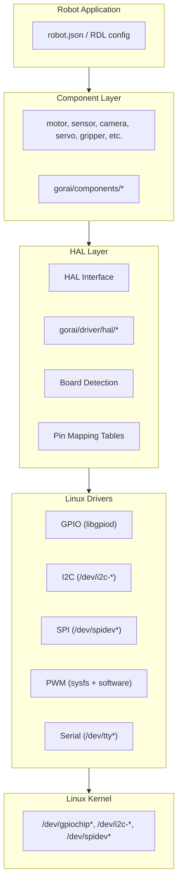
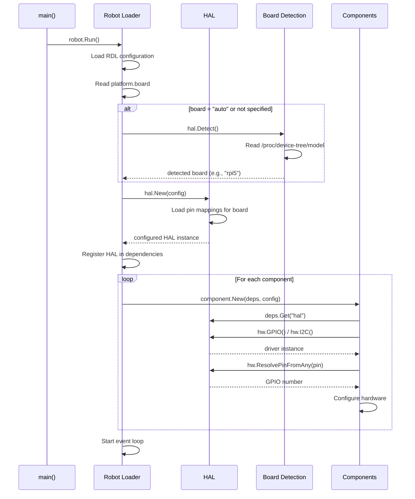

# Hardware Abstraction Layer Design

**Version:** 1.0
**Status:** Draft
**Last Updated:** 2025-01-24

## 1. Overview

This document defines the hardware abstraction architecture for Gorai, enabling consistent APIs across different single-board computers (SBCs). All board support is included in the main `gorai` module—no separate satellite modules are needed.

### 1.1 Goals

1. **Consistent API**: Robot code works unchanged across Raspberry Pi, Orange Pi, and other boards
2. **Single module**: All board support included in `gorai`—just import and go
3. **RDL integration**: Hardware selection is driven by robot configuration
4. **Auto-detection**: Board is detected automatically, or can be specified in RDL
5. **Unified Linux drivers**: All boards use the same Linux kernel interfaces (gpiod, i2c-dev, spidev)

### 1.2 Supported Boards

| Board | GPIO Chip | I2C | SPI | PWM | UART |
|-------|-----------|-----|-----|-----|------|
| Raspberry Pi 5 | `/dev/gpiochip4` (RP1) | Yes | Yes | Yes | Yes |
| Raspberry Pi 4 | `/dev/gpiochip0` (BCM2711) | Yes | Yes | Yes | Yes |
| Orange Pi 5B | `/dev/gpiochip0` (RK3588S) | Yes | Yes | Yes | Yes |
| Generic Linux | `/dev/gpiochip0` | Yes | Yes | Software | Yes |

### 1.3 Design Principles

1. **Single repo simplicity**: All board support in `gorai`—no satellite modules to import
2. **Standard Linux interfaces**: All boards use gpiod, /dev/i2c-*, /dev/spidev*, /sys/class/pwm
3. **RDL-driven selection**: The `platform` section selects board and configures peripherals
4. **Automatic detection**: Board detected from `/proc/device-tree/model` if not specified
5. **Pin mapping tables**: Board-specific pin mappings are data, not code

---

## 2. Architecture

### 2.1 Layer Diagram



### 2.2 Module Structure

All board support is contained within the main `gorai` module:

```
gorai/driver/
├── driver.go                   # Base Driver and Pin interfaces
├── hal/
│   ├── hal.go                  # HAL interface and implementation
│   ├── detect.go               # Board detection from /proc/device-tree
│   ├── pins.go                 # Pin reference parsing
│   ├── pins_rpi.go             # Raspberry Pi pin mappings
│   ├── pins_opi.go             # Orange Pi pin mappings
│   ├── errors.go               # HAL-specific errors
│   └── linux.go                # Linux driver factory functions
├── gpio/
│   ├── gpio.go                 # GPIO interfaces
│   └── linux/
│       └── gpiod.go            # libgpiod-based implementation
├── i2c/
│   ├── i2c.go                  # I2C interfaces
│   └── linux/
│       └── i2c.go              # /dev/i2c-* implementation
├── spi/
│   ├── spi.go                  # SPI interfaces
│   └── linux/
│       └── spidev.go           # /dev/spidev* implementation
├── pwm/
│   ├── pwm.go                  # PWM interfaces
│   └── linux/
│       ├── sysfs.go            # Hardware PWM via /sys/class/pwm
│       └── software.go         # Software PWM via GPIO
└── serial/
    ├── serial.go               # Serial interfaces
    └── linux/
        └── serial.go           # /dev/tty* implementation
```

**Key insight**: Since all supported boards use the same Linux kernel interfaces, the only board-specific code is pin mapping tables (pure data). No separate modules needed.

---

## 3. HAL Interface

### 3.1 Core HAL Type

```go
// driver/hal/hal.go
package hal

import (
    "context"

    "github.com/gorai/gorai/driver/gpio"
    "github.com/gorai/gorai/driver/i2c"
    "github.com/gorai/gorai/driver/spi"
    "github.com/gorai/gorai/driver/pwm"
    "github.com/gorai/gorai/driver/serial"
)

// HAL provides access to hardware peripherals.
type HAL interface {
    // Board returns the detected board identifier.
    Board() Board

    // GPIO returns the GPIO driver for this board.
    GPIO() (gpio.Driver, error)

    // I2C returns an I2C bus by number.
    I2C(bus int) (i2c.Bus, error)

    // SPI returns an SPI bus by number.
    SPI(bus int) (spi.Bus, error)

    // PWM returns a PWM controller by chip number.
    PWM(chip int) (pwm.Chip, error)

    // Serial returns a serial port by path.
    Serial(path string, config serial.Config) (serial.Port, error)

    // Close releases all hardware resources.
    Close(ctx context.Context) error
}

// Board identifies a hardware platform.
type Board string

const (
    BoardUnknown      Board = "unknown"
    BoardRaspberryPi5 Board = "rpi5"
    BoardRaspberryPi4 Board = "rpi4"
    BoardRaspberryPi3 Board = "rpi3"
    BoardOrangePi5B   Board = "opi5b"
    BoardOrangePi5    Board = "opi5"
    BoardGenericLinux Board = "linux"
)
```

### 3.2 HAL Registry

```go
// driver/hal/registry.go
package hal

import (
    "fmt"
    "sync"
)

// HALFactory creates a HAL for a specific board.
type HALFactory func() (HAL, error)

var (
    mu        sync.RWMutex
    factories = make(map[Board]HALFactory)
    fallback  HALFactory
)

// Register registers a HAL factory for a board.
func Register(board Board, factory HALFactory) {
    mu.Lock()
    defer mu.Unlock()
    factories[board] = factory
}

// RegisterFallback registers a fallback HAL factory.
func RegisterFallback(factory HALFactory) {
    mu.Lock()
    defer mu.Unlock()
    fallback = factory
}

// New creates a HAL for the specified board.
// If board is empty, auto-detection is attempted.
func New(board Board) (HAL, error) {
    mu.RLock()
    defer mu.RUnlock()

    if board == "" || board == BoardUnknown {
        board = Detect()
    }

    if factory, ok := factories[board]; ok {
        return factory()
    }

    if fallback != nil {
        return fallback()
    }

    return nil, fmt.Errorf("no HAL available for board %q", board)
}

// Available returns all registered board types.
func Available() []Board {
    mu.RLock()
    defer mu.RUnlock()

    boards := make([]Board, 0, len(factories))
    for board := range factories {
        boards = append(boards, board)
    }
    return boards
}
```

### 3.3 Board Detection

```go
// driver/hal/detect.go
package hal

import (
    "os"
    "strings"
)

// Detect attempts to identify the current board.
func Detect() Board {
    // Check device tree model
    if model, err := os.ReadFile("/proc/device-tree/model"); err == nil {
        modelStr := strings.ToLower(string(model))

        switch {
        case strings.Contains(modelStr, "raspberry pi 5"):
            return BoardRaspberryPi5
        case strings.Contains(modelStr, "raspberry pi 4"):
            return BoardRaspberryPi4
        case strings.Contains(modelStr, "raspberry pi 3"):
            return BoardRaspberryPi3
        case strings.Contains(modelStr, "orange pi 5b"):
            return BoardOrangePi5B
        case strings.Contains(modelStr, "orange pi 5"):
            return BoardOrangePi5
        }
    }

    // Check compatible strings
    if compat, err := os.ReadFile("/proc/device-tree/compatible"); err == nil {
        compatStr := strings.ToLower(string(compat))

        switch {
        case strings.Contains(compatStr, "brcm,bcm2712"):
            return BoardRaspberryPi5
        case strings.Contains(compatStr, "brcm,bcm2711"):
            return BoardRaspberryPi4
        case strings.Contains(compatStr, "rockchip,rk3588"):
            return BoardOrangePi5B // Could be OPi5 or 5B
        }
    }

    return BoardGenericLinux
}

// DetectInfo returns detailed board information.
type BoardInfo struct {
    Board       Board
    Model       string
    Revision    string
    Serial      string
    GPIOChips   []string
    I2CBuses    []int
    SPIBuses    []int
}

func DetectInfo() BoardInfo {
    info := BoardInfo{
        Board: Detect(),
    }

    // Read model
    if model, err := os.ReadFile("/proc/device-tree/model"); err == nil {
        info.Model = strings.TrimRight(string(model), "\x00\n")
    }

    // Enumerate GPIO chips
    entries, _ := os.ReadDir("/dev")
    for _, e := range entries {
        name := e.Name()
        if strings.HasPrefix(name, "gpiochip") {
            info.GPIOChips = append(info.GPIOChips, "/dev/"+name)
        }
    }

    // TODO: Enumerate I2C and SPI buses

    return info
}
```

---

## 4. GPIO Interface

### 4.1 Interface Definition

The GPIO interface is already defined in `driver/gpio/gpio.go`. Key additions for HAL integration:

```go
// driver/gpio/gpio.go additions

// ChipInfo describes a GPIO chip.
type ChipInfo struct {
    Name   string
    Label  string
    Lines  int
    Path   string
}

// LineInfo describes a GPIO line.
type LineInfo struct {
    Number    int
    Name      string
    Consumer  string
    Direction Direction
    Active    bool
}

// Driver provides GPIO access.
type Driver interface {
    driver.Driver

    // Chips returns available GPIO chips.
    Chips() []ChipInfo

    // Pin returns a GPIO pin by number.
    Pin(number int) (Pin, error)

    // PinByName returns a GPIO pin by name.
    PinByName(name string) (Pin, error)

    // PinByChipLine returns a GPIO pin by chip and line number.
    PinByChipLine(chip int, line int) (Pin, error)
}
```

### 4.2 Pin Mapping

Each board has its own pin mapping table in the HAL:

```go
// driver/hal/pins_rpi.go
package hal

// Raspberry Pi 5 physical pin to GPIO line mapping
var rpi5PhysicalPins = map[int]int{
    // Physical pin -> RP1 GPIO line
    3:  2,   // GPIO2 / SDA1
    5:  3,   // GPIO3 / SCL1
    7:  4,   // GPIO4
    8:  14,  // GPIO14 / TXD
    10: 15,  // GPIO15 / RXD
    11: 17,  // GPIO17
    12: 18,  // GPIO18 / PWM0
    13: 27,  // GPIO27
    15: 22,  // GPIO22
    16: 23,  // GPIO23
    18: 24,  // GPIO24
    19: 10,  // GPIO10 / MOSI
    21: 9,   // GPIO9 / MISO
    22: 25,  // GPIO25
    23: 11,  // GPIO11 / SCLK
    24: 8,   // GPIO8 / CE0
    26: 7,   // GPIO7 / CE1
    29: 5,   // GPIO5
    31: 6,   // GPIO6
    32: 12,  // GPIO12 / PWM0
    33: 13,  // GPIO13 / PWM1
    35: 19,  // GPIO19 / MISO
    36: 16,  // GPIO16
    37: 26,  // GPIO26
    38: 20,  // GPIO20 / MOSI
    40: 21,  // GPIO21 / SCLK
}

// RPi named pins (common aliases)
var rpiNamedPins = map[string]int{
    "SDA1": 2, "SCL1": 3, "SDA": 2, "SCL": 3,
    "TXD": 14, "RXD": 15, "TX": 14, "RX": 15,
    "MOSI": 10, "MISO": 9, "SCLK": 11, "CE0": 8, "CE1": 7,
    "PWM0": 18, "PWM1": 19,
}
```

```go
// driver/hal/pins_opi.go
package hal

// Orange Pi 5B physical pin to RK3588 GPIO mapping
var opi5PhysicalPins = map[int]int{
    // Physical pin -> RK3588 GPIO bank*32 + line
    3:  139, // GPIO4_B3 / I2C2_SDA
    5:  140, // GPIO4_B4 / I2C2_SCL
    7:  36,  // GPIO1_A4
    8:  13,  // GPIO0_B5 / UART2_TX
    10: 14,  // GPIO0_B6 / UART2_RX
    11: 35,  // GPIO1_A3
    12: 42,  // GPIO1_B2 / PWM14
    13: 150, // GPIO4_C6
    // ... etc
}

// OPi named pins
var opiNamedPins = map[string]int{
    "SDA2": 139, "SCL2": 140, "SDA": 139, "SCL": 140,
    "UART2_TX": 13, "UART2_RX": 14, "TX": 13, "RX": 14,
    "PWM14": 42,
}

// GPIO bank calculations for RK3588
// GPIO0_A0 = 0, GPIO0_A7 = 7
// GPIO0_B0 = 8, GPIO0_B7 = 15
// GPIO1_A0 = 32, etc.
func rk3588Pin(bank, group, line int) int {
    return bank*32 + group*8 + line
}
```

---

## 5. PWM Interface

### 5.1 Interface Definition

```go
// driver/pwm/pwm.go
package pwm

import (
    "context"

    "github.com/gorai/gorai/driver"
)

// Chip represents a PWM controller chip.
type Chip interface {
    driver.Driver

    // Channels returns the number of PWM channels.
    Channels() int

    // Channel returns a PWM channel.
    Channel(n int) (Channel, error)
}

// Channel represents a single PWM output.
type Channel interface {
    // Enable enables PWM output.
    Enable(ctx context.Context) error

    // Disable disables PWM output.
    Disable(ctx context.Context) error

    // Enabled returns whether PWM is enabled.
    Enabled() bool

    // SetPeriod sets the PWM period in nanoseconds.
    SetPeriod(ctx context.Context, ns uint64) error

    // Period returns the current period in nanoseconds.
    Period() uint64

    // SetDuty sets the duty cycle in nanoseconds.
    SetDuty(ctx context.Context, ns uint64) error

    // Duty returns the current duty in nanoseconds.
    Duty() uint64

    // SetDutyCycle sets the duty cycle as a fraction (0.0 to 1.0).
    SetDutyCycle(ctx context.Context, duty float64) error

    // DutyCycle returns the duty cycle as a fraction.
    DutyCycle() float64

    // SetFrequency sets the PWM frequency in Hz.
    SetFrequency(ctx context.Context, hz float64) error

    // Frequency returns the frequency in Hz.
    Frequency() float64
}

// Config holds PWM configuration.
type Config struct {
    Frequency float64 // Hz (default: 1000)
    DutyCycle float64 // 0.0 to 1.0 (default: 0.0)
}

// DefaultConfig returns default PWM configuration.
func DefaultConfig() Config {
    return Config{
        Frequency: 1000,
        DutyCycle: 0.0,
    }
}
```

### 5.2 Board PWM Details

All boards use the same Linux sysfs PWM interface (`/sys/class/pwm/pwmchip*`).
The only board-specific configuration is the chip number and available channels:

| Board | PWM Chip | Channels | Hardware PWM Pins |
|-------|----------|----------|-------------------|
| Raspberry Pi 5 | `pwmchip2` | 2 | GPIO12, GPIO13, GPIO18, GPIO19 |
| Raspberry Pi 4 | `pwmchip0` | 2 | GPIO12, GPIO13, GPIO18, GPIO19 |
| Orange Pi 5B | `pwmchip0` | Multiple | PWM0-3 dedicated, PWM4-15 muxed |

```go
// driver/pwm/linux/sysfs.go - works on all boards
package linux

// Chip paths by board
var defaultPWMChip = map[hal.Board]int{
    hal.BoardRaspberryPi5: 2,
    hal.BoardRaspberryPi4: 0,
    hal.BoardOrangePi5B:   0,
}
```

For pins without hardware PWM support, software PWM is used via GPIO toggling.

---

## 6. RDL Integration

### 6.1 Platform Section

The RDL `platform` section drives HAL selection:

```json
{
  "platform": {
    "board": "rpi5",
    "gpio": {
      "driver": "rp1",
      "chip": 0
    },
    "i2c": {
      "buses": [1]
    },
    "spi": {
      "buses": [0]
    },
    "pwm": {
      "chips": [0, 1]
    }
  }
}
```

### 6.2 Platform Schema Addition

```json
{
  "platform": {
    "type": "object",
    "properties": {
      "board": {
        "type": "string",
        "enum": ["rpi5", "rpi4", "rpi3", "opi5b", "opi5", "linux", "auto"],
        "default": "auto",
        "description": "Target board (auto-detected if not specified)"
      },
      "gpio": {
        "type": "object",
        "properties": {
          "driver": {
            "type": "string",
            "description": "GPIO driver to use (board-specific)"
          },
          "chip": {
            "type": "integer",
            "description": "Default GPIO chip number"
          }
        }
      },
      "i2c": {
        "type": "object",
        "properties": {
          "buses": {
            "type": "array",
            "items": {"type": "integer"},
            "description": "I2C bus numbers to enable"
          }
        }
      },
      "spi": {
        "type": "object",
        "properties": {
          "buses": {
            "type": "array",
            "items": {"type": "integer"},
            "description": "SPI bus numbers to enable"
          }
        }
      },
      "pwm": {
        "type": "object",
        "properties": {
          "chips": {
            "type": "array",
            "items": {"type": "integer"},
            "description": "PWM chip numbers to enable"
          }
        }
      }
    }
  }
}
```

### 6.3 Component Attributes with Pin References

Components reference pins using board-agnostic names:

```json
{
  "components": [
    {
      "name": "status_led",
      "type": "gpio",
      "model": "output",
      "attributes": {
        "pin": "GPIO17"
      }
    },
    {
      "name": "motor_pwm",
      "type": "gpio",
      "model": "pwm",
      "attributes": {
        "pin": "GPIO18",
        "frequency": 20000
      }
    },
    {
      "name": "imu",
      "type": "imu",
      "model": "mpu6050",
      "attributes": {
        "i2c_bus": 1,
        "address": "0x68"
      }
    }
  ]
}
```

### 6.4 Pin Reference Resolution

The HAL resolves pin references based on the selected board:

```go
// driver/hal/pins.go
package hal

// PinRef represents a board-agnostic pin reference.
type PinRef struct {
    // One of these must be set:
    GPIO     int    // GPIO number (e.g., 17)
    Name     string // Name (e.g., "GPIO17", "SDA1")
    Physical int    // Physical header pin (e.g., 11)
}

// ParsePinRef parses a pin reference from RDL.
func ParsePinRef(v any) (PinRef, error) {
    switch val := v.(type) {
    case int:
        return PinRef{GPIO: val}, nil
    case float64:
        return PinRef{GPIO: int(val)}, nil
    case string:
        // Check for physical pin format "PIN11"
        if strings.HasPrefix(val, "PIN") {
            n, err := strconv.Atoi(val[3:])
            return PinRef{Physical: n}, err
        }
        // Check for GPIO number "17"
        if n, err := strconv.Atoi(val); err == nil {
            return PinRef{GPIO: n}, nil
        }
        // Treat as name
        return PinRef{Name: val}, nil
    default:
        return PinRef{}, fmt.Errorf("invalid pin reference: %v", v)
    }
}

// ResolvePin resolves a PinRef to a concrete GPIO line for the board.
func (h *hal) ResolvePin(ref PinRef) (int, error) {
    switch {
    case ref.Physical > 0:
        return h.physicalToGPIO(ref.Physical)
    case ref.Name != "":
        return h.nameToGPIO(ref.Name)
    default:
        return ref.GPIO, nil
    }
}
```

---

## 7. Why No Satellite Modules?

The original design considered separate modules (`gorai-rpi`, `gorai-opi`) for board-specific code. This was rejected because:

### 7.1 Linux Standardizes Hardware Access

All supported boards use the **same Linux kernel interfaces**:

| Interface | Linux API | Works Identically on All Boards |
|-----------|-----------|--------------------------------|
| GPIO | `/dev/gpiochip*` via libgpiod | Yes |
| I2C | `/dev/i2c-*` via ioctl | Yes |
| SPI | `/dev/spidev*` via ioctl | Yes |
| PWM | `/sys/class/pwm/*` via sysfs | Yes |
| Serial | `/dev/tty*` via termios | Yes |

### 7.2 Board Differences Are Just Data

The only board-specific elements are **configuration values**, not code:

```go
// This is ALL that differs between boards - just data tables:

// Default GPIO chip number
var defaultGPIOChip = map[Board]int{
    BoardRaspberryPi5: 4,   // RP1 chip
    BoardRaspberryPi4: 0,   // BCM2711
    BoardOrangePi5B:   0,   // RK3588
}

// Physical pin to GPIO mappings
var rpi5Pins = map[int]int{3: 2, 5: 3, 7: 4, 8: 14, ...}
var opi5Pins = map[int]int{3: 139, 5: 140, 7: 36, ...}
```

### 7.3 Benefits of Single Module

| Aspect | Separate Repos | Single Repo (chosen) |
|--------|---------------|---------------------|
| User imports | `gorai` + `gorai-rpi` + ... | Just `gorai` |
| Dependency management | Complex | Simple |
| Testing | Multiple repos | Single test suite |
| Binary size overhead | Negligible (~2KB of pin tables) | Same |
| Development | Multiple repos to maintain | One repo |

### 7.4 Usage

Just import `gorai` and it works on any supported board:

```go
package main

import "github.com/gorai/gorai/pkg/robot"

func main() {
    robot.Run()  // Auto-detects board
}
```

---

## 8. Runtime Behavior

### 8.1 Initialization Sequence



### 8.2 Error Handling

```go
// Creating HAL with graceful fallback
func createHAL(config *config.Platform) (hal.HAL, error) {
    board := hal.Board(config.Board)

    h, err := hal.New(board)
    if err != nil {
        // Try generic Linux fallback
        log.Warn("Board-specific HAL unavailable, using generic Linux",
            "board", board, "error", err)
        h, err = hal.New(hal.BoardGenericLinux)
        if err != nil {
            return nil, fmt.Errorf("no HAL available: %w", err)
        }
    }

    // Verify required peripherals exist
    if config.GPIO != nil {
        if _, err := h.GPIO(); err != nil {
            return nil, fmt.Errorf("GPIO unavailable: %w", err)
        }
    }

    return h, nil
}
```

---

## 9. TinyGo-Inspired Patterns

While Gorai runs on Linux (not bare metal like TinyGo), we adopt several TinyGo patterns:

### 9.1 Consistent Peripheral Interfaces

Like TinyGo's `machine` package, Gorai defines consistent interfaces across all boards:

| TinyGo | Gorai | Notes |
|--------|-------|-------|
| `machine.Pin` | `gpio.Pin` | Same concept, different backing |
| `machine.I2C` | `i2c.Bus` | Gorai uses bus abstraction |
| `machine.SPI` | `spi.Bus` | Same pattern |
| `machine.UART` | `serial.Port` | Gorai uses serial naming |
| `machine.PWM` | `pwm.Channel` | TinyGo bundles in Pin |

### 9.2 Configuration Pattern

TinyGo uses Config structs with Configure() methods:

```go
// TinyGo pattern
type I2CConfig struct {
    Frequency uint32
    SDA       Pin
    SCL       Pin
}

func (i2c *I2C) Configure(config I2CConfig) error
```

Gorai adapts this for runtime configuration via RDL:

```go
// Gorai pattern
type I2CConfig struct {
    Bus       int    `json:"bus"`
    Frequency int    `json:"frequency"`
}

func (b *i2cBus) Configure(ctx context.Context, config I2CConfig) error
```

### 9.3 Named Pins

TinyGo defines pin aliases per board:

```go
// TinyGo board_pico.go
const (
    LED = GPIO25
    SDA = GPIO4
    SCL = GPIO5
)
```

Gorai uses runtime mapping:

```go
// Gorai pin aliases resolved at runtime
aliases := map[string]int{
    "LED":  17,
    "SDA1": 2,
    "SCL1": 3,
}
```

### 9.4 What We Don't Copy

- **Build-time board selection**: Gorai supports runtime detection
- **Global variables**: Gorai uses explicit HAL instance
- **SVD code generation**: Not applicable to Linux userspace
- **Interrupt handlers**: Linux uses standard polling/edge detection

---

## 10. Implementation Roadmap

### Phase 1: HAL Infrastructure

1. ~~Define base interfaces in `driver/`~~ (done)
2. Create `driver/hal/` package:
   - `hal.go` - HAL interface and implementation
   - `detect.go` - Board detection
   - `pins.go` - Pin reference parsing
   - `pins_rpi.go` - Raspberry Pi pin mappings
   - `pins_opi.go` - Orange Pi pin mappings
   - `errors.go` - Error types
   - `linux.go` - Linux driver factories

### Phase 2: Linux Driver Implementations

1. `driver/gpio/linux/gpiod.go` - libgpiod GPIO driver
2. `driver/i2c/linux/i2c.go` - I2C bus driver
3. `driver/pwm/pwm.go` - PWM interfaces
4. `driver/pwm/linux/software.go` - Software PWM
5. `driver/pwm/linux/sysfs.go` - Hardware PWM (optional)

### Phase 3: Component Migration

1. Refactor `components/pwm/gpiod/` to use HAL
2. Refactor `components/link/i2c_bridge/` to use HAL
3. Update other GPIO-based components

### Phase 4: Runtime Integration

1. Add HAL initialization to robot runtime
2. Register HAL in dependency injection
3. Add `platform` section to RDL schema
4. Add `gorai validate` checks for platform

### Phase 5: Testing

1. Test on Raspberry Pi 5
2. Test on Raspberry Pi 4
3. Test on Orange Pi 5B
4. Test auto-detection on each board

---

## 11. Example: Motor Component

### 11.1 Using HAL in Component

```go
// component/motor/gpio/motor.go
package gpio

import (
    "context"

    "github.com/gorai/gorai/driver/gpio"
    "github.com/gorai/gorai/driver/hal"
    "github.com/gorai/gorai/pkg/registry"
)

func init() {
    registry.RegisterComponent("motor", "gpio", New)
}

type Config struct {
    PinForward any `json:"pin_forward"`
    PinReverse any `json:"pin_reverse"`
    PinPWM     any `json:"pin_pwm"`
    MaxRPM     int `json:"max_rpm"`
}

type Motor struct {
    forward gpio.Pin
    reverse gpio.Pin
    pwm     gpio.PWM
    maxRPM  int
}

func New(ctx context.Context, deps registry.Dependencies, conf registry.Config) (any, error) {
    var cfg Config
    if err := mapstructure.Decode(conf, &cfg); err != nil {
        return nil, err
    }

    // Get HAL from dependencies
    h, err := deps.Get("hal")
    if err != nil {
        return nil, fmt.Errorf("HAL not available: %w", err)
    }
    hw := h.(hal.HAL)

    // Get GPIO driver
    gpioDriver, err := hw.GPIO()
    if err != nil {
        return nil, err
    }

    // Resolve and configure pins
    fwdRef, _ := hal.ParsePinRef(cfg.PinForward)
    fwdNum, err := hw.ResolvePin(fwdRef)
    if err != nil {
        return nil, fmt.Errorf("resolve pin_forward: %w", err)
    }
    forward, err := gpioDriver.Pin(fwdNum)
    if err != nil {
        return nil, err
    }
    forward.SetDirection(ctx, gpio.Output)

    // Similar for reverse and PWM pins...

    return &Motor{
        forward: forward,
        // ...
    }, nil
}
```

### 11.2 RDL Configuration

```json
{
  "platform": {
    "board": "rpi5"
  },
  "components": [
    {
      "name": "left_motor",
      "type": "motor",
      "model": "gpio",
      "attributes": {
        "pin_forward": "GPIO17",
        "pin_reverse": "GPIO18",
        "pin_pwm": "GPIO12",
        "max_rpm": 200
      }
    }
  ]
}
```

---

## 12. Summary

This hardware abstraction design enables:

1. **Write once, run anywhere**: Robot code using consistent HAL interfaces
2. **Single import**: Just `import "github.com/gorai/gorai"` for all board support
3. **Configuration-driven**: RDL `platform` section selects board and peripherals
4. **Auto-detection**: Board detected automatically from `/proc/device-tree/model`
5. **Standard Linux interfaces**: All boards use gpiod, i2c-dev, spidev, sysfs PWM
6. **Pin abstraction**: Use `"GPIO17"`, `"PIN12"`, or `"SDA1"` instead of raw numbers

The key insight is that Linux standardizes hardware access across all SBCs. The only board-specific elements are pin mapping tables (pure data), which are compiled into the single `gorai` binary. No separate satellite modules are needed.

---

## 13. HAL Implementation Specification

This section provides concrete implementation details for the HAL infrastructure, enabling components to be refactored from direct hardware access to HAL-based access.

### 13.1 File Structure

```
gorai/driver/
├── driver.go                 # Base Driver and Pin interfaces (exists)
├── hal/
│   ├── hal.go                # HAL interface and concrete type
│   ├── registry.go           # Board factory registry
│   ├── detect.go             # Board detection
│   ├── pins.go               # Pin reference parsing and resolution
│   └── errors.go             # HAL-specific errors
├── gpio/
│   ├── gpio.go               # GPIO interfaces (exists)
│   └── linux/
│       ├── gpiod.go          # libgpiod-based implementation
│       └── sysfs.go          # sysfs fallback (legacy)
├── i2c/
│   ├── i2c.go                # I2C interfaces (exists)
│   └── linux/
│       └── i2c.go            # /dev/i2c-* implementation
├── pwm/
│   ├── pwm.go                # PWM interfaces (NEW)
│   └── linux/
│       ├── sysfs.go          # /sys/class/pwm implementation
│       └── software.go       # Software PWM via GPIO
├── spi/
│   ├── spi.go                # SPI interfaces (exists)
│   └── linux/
│       └── spidev.go         # /dev/spidev* implementation
└── serial/
    ├── serial.go             # Serial interfaces (exists)
    └── linux/
        └── serial.go         # /dev/tty* implementation
```

### 13.2 Core HAL Implementation

#### driver/hal/hal.go

```go
// Package hal provides the Hardware Abstraction Layer for Gorai.
//
// The HAL enables board-agnostic component development by providing
// consistent interfaces to GPIO, I2C, SPI, PWM, and serial peripherals.
// Components obtain HAL via dependency injection and use it to access
// hardware without knowing the underlying board or driver.
package hal

import (
    "context"
    "fmt"
    "sync"

    "github.com/gorai/gorai/driver"
    "github.com/gorai/gorai/driver/gpio"
    "github.com/gorai/gorai/driver/i2c"
    "github.com/gorai/gorai/driver/pwm"
    "github.com/gorai/gorai/driver/serial"
    "github.com/gorai/gorai/driver/spi"
)

// HAL provides access to hardware peripherals.
// Components obtain HAL from dependencies and use it for all hardware access.
type HAL interface {
    driver.Driver

    // Board returns the detected or configured board identifier.
    Board() Board

    // GPIO returns the GPIO driver for this board.
    // The driver is lazily initialized on first call.
    GPIO() (gpio.Driver, error)

    // I2C returns an I2C bus by number (e.g., 1 for /dev/i2c-1).
    // Returns a cached bus if already opened.
    I2C(bus int) (i2c.Bus, error)

    // SPI returns an SPI bus by number (e.g., 0 for /dev/spidev0.*).
    SPI(bus int) (spi.Bus, error)

    // PWM returns a PWM controller.
    // For hardware PWM, chip is the pwmchip number.
    // For software PWM, use SoftwarePWM() instead.
    PWM(chip int) (pwm.Chip, error)

    // SoftwarePWM creates a software PWM channel on a GPIO pin.
    // This is useful when hardware PWM is not available.
    SoftwarePWM(pin int) (pwm.Channel, error)

    // Serial opens a serial port with the given configuration.
    Serial(path string, config serial.Config) (serial.Port, error)

    // ResolvePin resolves a board-agnostic pin reference to a GPIO number.
    // Supports formats: "GPIO17", "PIN11", 17, "SDA1"
    ResolvePin(ref PinRef) (int, error)

    // ResolvePinFromAny parses and resolves a pin reference from RDL config.
    // Accepts int, float64, or string values.
    ResolvePinFromAny(v any) (int, error)
}

// hal is the concrete HAL implementation.
type hal struct {
    board    Board
    config   Config
    mu       sync.RWMutex

    // Lazily initialized drivers
    gpioDriver gpio.Driver
    i2cBuses   map[int]i2c.Bus
    spiBuses   map[int]spi.Bus
    pwmChips   map[int]pwm.Chip
    softPWMs   map[int]pwm.Channel

    // Pin mapping for this board
    pinMapper PinMapper

    closed bool
}

// Config holds HAL configuration from RDL platform section.
type Config struct {
    // Board specifies the target board. Empty or "auto" for detection.
    Board string `json:"board"`

    // GPIO configuration
    GPIO struct {
        // Chip is the default GPIO chip number (e.g., 4 for /dev/gpiochip4)
        Chip int `json:"chip"`
    } `json:"gpio"`

    // I2C configuration
    I2C struct {
        // Buses lists enabled I2C bus numbers
        Buses []int `json:"buses"`
    } `json:"i2c"`

    // SPI configuration
    SPI struct {
        // Buses lists enabled SPI bus numbers
        Buses []int `json:"buses"`
    } `json:"spi"`

    // PWM configuration
    PWM struct {
        // Chips lists enabled PWM chip numbers
        Chips []int `json:"chips"`
    } `json:"pwm"`
}

// New creates a new HAL with the given configuration.
// If board is empty or "auto", board detection is performed.
func New(config Config) (HAL, error) {
    board := Board(config.Board)
    if board == "" || board == BoardAuto {
        board = Detect()
    }

    h := &hal{
        board:    board,
        config:   config,
        i2cBuses: make(map[int]i2c.Bus),
        spiBuses: make(map[int]spi.Bus),
        pwmChips: make(map[int]pwm.Chip),
        softPWMs: make(map[int]pwm.Channel),
    }

    // Get pin mapper for this board
    h.pinMapper = GetPinMapper(board)

    return h, nil
}

// Name implements driver.Driver.
func (h *hal) Name() string {
    return fmt.Sprintf("hal:%s", h.board)
}

// Board returns the board identifier.
func (h *hal) Board() Board {
    return h.board
}

// GPIO returns the GPIO driver, initializing if needed.
func (h *hal) GPIO() (gpio.Driver, error) {
    h.mu.Lock()
    defer h.mu.Unlock()

    if h.closed {
        return nil, ErrHALClosed
    }

    if h.gpioDriver != nil {
        return h.gpioDriver, nil
    }

    // Create GPIO driver based on board
    chip := h.config.GPIO.Chip
    if chip == 0 {
        chip = h.defaultGPIOChip()
    }

    driver, err := h.createGPIODriver(chip)
    if err != nil {
        return nil, fmt.Errorf("failed to create GPIO driver: %w", err)
    }

    h.gpioDriver = driver
    return driver, nil
}

// I2C returns an I2C bus, opening if needed.
func (h *hal) I2C(bus int) (i2c.Bus, error) {
    h.mu.Lock()
    defer h.mu.Unlock()

    if h.closed {
        return nil, ErrHALClosed
    }

    if existing, ok := h.i2cBuses[bus]; ok {
        return existing, nil
    }

    b, err := h.createI2CBus(bus)
    if err != nil {
        return nil, fmt.Errorf("failed to open I2C bus %d: %w", bus, err)
    }

    h.i2cBuses[bus] = b
    return b, nil
}

// PWM returns a PWM chip, opening if needed.
func (h *hal) PWM(chip int) (pwm.Chip, error) {
    h.mu.Lock()
    defer h.mu.Unlock()

    if h.closed {
        return nil, ErrHALClosed
    }

    if existing, ok := h.pwmChips[chip]; ok {
        return existing, nil
    }

    c, err := h.createPWMChip(chip)
    if err != nil {
        return nil, fmt.Errorf("failed to open PWM chip %d: %w", chip, err)
    }

    h.pwmChips[chip] = c
    return c, nil
}

// SoftwarePWM creates a software PWM channel on a GPIO pin.
func (h *hal) SoftwarePWM(pin int) (pwm.Channel, error) {
    h.mu.Lock()
    defer h.mu.Unlock()

    if h.closed {
        return nil, ErrHALClosed
    }

    if existing, ok := h.softPWMs[pin]; ok {
        return existing, nil
    }

    // Get GPIO driver
    if h.gpioDriver == nil {
        chip := h.config.GPIO.Chip
        if chip == 0 {
            chip = h.defaultGPIOChip()
        }
        driver, err := h.createGPIODriver(chip)
        if err != nil {
            return nil, fmt.Errorf("failed to create GPIO driver: %w", err)
        }
        h.gpioDriver = driver
    }

    // Get the GPIO pin
    gpioPin, err := h.gpioDriver.Pin(pin)
    if err != nil {
        return nil, fmt.Errorf("failed to get GPIO pin %d: %w", pin, err)
    }

    // Create software PWM
    ch, err := h.createSoftwarePWM(gpioPin)
    if err != nil {
        return nil, fmt.Errorf("failed to create software PWM: %w", err)
    }

    h.softPWMs[pin] = ch
    return ch, nil
}

// SPI returns an SPI bus.
func (h *hal) SPI(bus int) (spi.Bus, error) {
    h.mu.Lock()
    defer h.mu.Unlock()

    if h.closed {
        return nil, ErrHALClosed
    }

    if existing, ok := h.spiBuses[bus]; ok {
        return existing, nil
    }

    b, err := h.createSPIBus(bus)
    if err != nil {
        return nil, fmt.Errorf("failed to open SPI bus %d: %w", bus, err)
    }

    h.spiBuses[bus] = b
    return b, nil
}

// Serial opens a serial port.
func (h *hal) Serial(path string, config serial.Config) (serial.Port, error) {
    if h.closed {
        return nil, ErrHALClosed
    }
    return h.createSerialPort(path, config)
}

// ResolvePin resolves a pin reference to a GPIO number.
func (h *hal) ResolvePin(ref PinRef) (int, error) {
    return h.pinMapper.Resolve(ref)
}

// ResolvePinFromAny parses and resolves a pin from RDL config value.
func (h *hal) ResolvePinFromAny(v any) (int, error) {
    ref, err := ParsePinRef(v)
    if err != nil {
        return 0, err
    }
    return h.ResolvePin(ref)
}

// Close releases all resources.
func (h *hal) Close(ctx context.Context) error {
    h.mu.Lock()
    defer h.mu.Unlock()

    if h.closed {
        return nil
    }
    h.closed = true

    var errs []error

    // Close software PWMs
    for pin, ch := range h.softPWMs {
        if closer, ok := ch.(interface{ Close(context.Context) error }); ok {
            if err := closer.Close(ctx); err != nil {
                errs = append(errs, fmt.Errorf("close soft PWM pin %d: %w", pin, err))
            }
        }
    }

    // Close PWM chips
    for chip, c := range h.pwmChips {
        if err := c.Close(ctx); err != nil {
            errs = append(errs, fmt.Errorf("close PWM chip %d: %w", chip, err))
        }
    }

    // Close SPI buses
    for bus, b := range h.spiBuses {
        if err := b.Close(ctx); err != nil {
            errs = append(errs, fmt.Errorf("close SPI bus %d: %w", bus, err))
        }
    }

    // Close I2C buses
    for bus, b := range h.i2cBuses {
        if err := b.Close(ctx); err != nil {
            errs = append(errs, fmt.Errorf("close I2C bus %d: %w", bus, err))
        }
    }

    // Close GPIO driver
    if h.gpioDriver != nil {
        if err := h.gpioDriver.Close(ctx); err != nil {
            errs = append(errs, fmt.Errorf("close GPIO driver: %w", err))
        }
    }

    if len(errs) > 0 {
        return fmt.Errorf("errors closing HAL: %v", errs)
    }
    return nil
}

// defaultGPIOChip returns the default GPIO chip for the board.
func (h *hal) defaultGPIOChip() int {
    switch h.board {
    case BoardRaspberryPi5:
        return 4 // RP1 chip
    case BoardRaspberryPi4, BoardRaspberryPi3:
        return 0 // BCM chip
    case BoardOrangePi5B, BoardOrangePi5:
        return 0 // RK3588 main GPIO
    default:
        return 0
    }
}
```

#### driver/hal/registry.go

Since all board support is built into the main module, the registry is simplified.
It exists mainly for testing (mock HAL injection) and future extensibility.

```go
package hal

// SupportedBoards returns all boards with built-in support.
func SupportedBoards() []Board {
    return []Board{
        BoardRaspberryPi5,
        BoardRaspberryPi4,
        BoardRaspberryPi3,
        BoardOrangePi5B,
        BoardOrangePi5,
        BoardGenericLinux,
    }
}

// IsSupported returns true if the board has built-in support.
func IsSupported(board Board) bool {
    for _, b := range SupportedBoards() {
        if b == board {
            return true
        }
    }
    return false
}

// For testing: allow injecting a mock HAL
var testHAL HAL

// SetTestHAL sets a mock HAL for testing. Pass nil to clear.
func SetTestHAL(h HAL) {
    testHAL = h
}

// New creates a HAL for the given configuration.
// If board is empty or "auto", auto-detection is performed.
func New(config Config) (HAL, error) {
    // Allow test injection
    if testHAL != nil {
        return testHAL, nil
    }

    board := Board(config.Board)
    if board == "" || board == BoardAuto {
        board = Detect()
    }

    if !IsSupported(board) {
        return nil, fmt.Errorf("unsupported board: %s", board)
    }

    return newHAL(board, config)
}

// newHAL creates the concrete HAL implementation.
func newHAL(board Board, config Config) (*hal, error) {
    h := &hal{
        board:     board,
        config:    config,
        i2cBuses:  make(map[int]i2c.Bus),
        spiBuses:  make(map[int]spi.Bus),
        pwmChips:  make(map[int]pwm.Chip),
        softPWMs:  make(map[int]pwm.Channel),
        pinMapper: GetPinMapper(board),
    }
    return h, nil
}
```

Note: The factory/registry pattern from the original design was removed since all
board support is compiled into the single binary. The simplified version just
needs to check if a board is supported and create the HAL with appropriate pin mappings.

#### driver/hal/detect.go

```go
package hal

import (
    "os"
    "strings"
)

// Board identifies a hardware platform.
type Board string

const (
    BoardUnknown      Board = "unknown"
    BoardAuto         Board = "auto"
    BoardRaspberryPi5 Board = "rpi5"
    BoardRaspberryPi4 Board = "rpi4"
    BoardRaspberryPi3 Board = "rpi3"
    BoardOrangePi5B   Board = "opi5b"
    BoardOrangePi5    Board = "opi5"
    BoardGenericLinux Board = "linux"
)

// String returns the board identifier string.
func (b Board) String() string {
    return string(b)
}

// IsRaspberryPi returns true for any Raspberry Pi board.
func (b Board) IsRaspberryPi() bool {
    switch b {
    case BoardRaspberryPi5, BoardRaspberryPi4, BoardRaspberryPi3:
        return true
    }
    return false
}

// IsOrangePi returns true for any Orange Pi board.
func (b Board) IsOrangePi() bool {
    switch b {
    case BoardOrangePi5B, BoardOrangePi5:
        return true
    }
    return false
}

// Detect attempts to identify the current board.
// Returns BoardGenericLinux if detection fails.
func Detect() Board {
    // Try device tree model first
    if model, err := os.ReadFile("/proc/device-tree/model"); err == nil {
        modelStr := strings.ToLower(strings.TrimRight(string(model), "\x00\n"))

        switch {
        case strings.Contains(modelStr, "raspberry pi 5"):
            return BoardRaspberryPi5
        case strings.Contains(modelStr, "raspberry pi 4"):
            return BoardRaspberryPi4
        case strings.Contains(modelStr, "raspberry pi 3"):
            return BoardRaspberryPi3
        case strings.Contains(modelStr, "orange pi 5b"):
            return BoardOrangePi5B
        case strings.Contains(modelStr, "orange pi 5"):
            return BoardOrangePi5
        }
    }

    // Try compatible strings
    if compat, err := os.ReadFile("/proc/device-tree/compatible"); err == nil {
        compatStr := strings.ToLower(string(compat))

        switch {
        case strings.Contains(compatStr, "brcm,bcm2712"):
            return BoardRaspberryPi5
        case strings.Contains(compatStr, "brcm,bcm2711"):
            return BoardRaspberryPi4
        case strings.Contains(compatStr, "brcm,bcm2837"):
            return BoardRaspberryPi3
        case strings.Contains(compatStr, "rockchip,rk3588"):
            // Could be OPi5 or 5B, check more specifically
            if model, _ := os.ReadFile("/proc/device-tree/model"); model != nil {
                if strings.Contains(strings.ToLower(string(model)), "5b") {
                    return BoardOrangePi5B
                }
            }
            return BoardOrangePi5
        }
    }

    return BoardGenericLinux
}

// BoardInfo contains detailed information about the detected board.
type BoardInfo struct {
    Board       Board
    Model       string
    Revision    string
    Serial      string
    GPIOChips   []string
    I2CBuses    []int
    SPIBuses    []int
    PWMChips    []int
}

// DetectInfo returns detailed board information.
func DetectInfo() BoardInfo {
    info := BoardInfo{
        Board: Detect(),
    }

    // Read model
    if model, err := os.ReadFile("/proc/device-tree/model"); err == nil {
        info.Model = strings.TrimRight(string(model), "\x00\n")
    }

    // Read serial
    if serial, err := os.ReadFile("/proc/device-tree/serial-number"); err == nil {
        info.Serial = strings.TrimRight(string(serial), "\x00\n")
    }

    // Enumerate GPIO chips
    if entries, err := os.ReadDir("/dev"); err == nil {
        for _, e := range entries {
            name := e.Name()
            if strings.HasPrefix(name, "gpiochip") {
                info.GPIOChips = append(info.GPIOChips, "/dev/"+name)
            }
        }
    }

    // Enumerate I2C buses
    if entries, err := os.ReadDir("/dev"); err == nil {
        for _, e := range entries {
            name := e.Name()
            if strings.HasPrefix(name, "i2c-") {
                var bus int
                if _, err := fmt.Sscanf(name, "i2c-%d", &bus); err == nil {
                    info.I2CBuses = append(info.I2CBuses, bus)
                }
            }
        }
    }

    // Enumerate SPI buses
    if entries, err := os.ReadDir("/dev"); err == nil {
        seen := make(map[int]bool)
        for _, e := range entries {
            name := e.Name()
            if strings.HasPrefix(name, "spidev") {
                var bus, cs int
                if _, err := fmt.Sscanf(name, "spidev%d.%d", &bus, &cs); err == nil {
                    if !seen[bus] {
                        info.SPIBuses = append(info.SPIBuses, bus)
                        seen[bus] = true
                    }
                }
            }
        }
    }

    // Enumerate PWM chips
    if entries, err := os.ReadDir("/sys/class/pwm"); err == nil {
        for _, e := range entries {
            name := e.Name()
            if strings.HasPrefix(name, "pwmchip") {
                var chip int
                if _, err := fmt.Sscanf(name, "pwmchip%d", &chip); err == nil {
                    info.PWMChips = append(info.PWMChips, chip)
                }
            }
        }
    }

    return info
}
```

#### driver/hal/pins.go

```go
package hal

import (
    "fmt"
    "strconv"
    "strings"
)

// PinRef represents a board-agnostic pin reference.
type PinRef struct {
    // GPIO is the GPIO number (BCM on Pi, line number on others)
    GPIO int

    // Name is a named reference like "GPIO17", "SDA1", "LED"
    Name string

    // Physical is the physical header pin number
    Physical int
}

// ParsePinRef parses a pin reference from an RDL config value.
// Accepts: int, float64, string (e.g., "GPIO17", "PIN11", "17", "SDA1")
func ParsePinRef(v any) (PinRef, error) {
    switch val := v.(type) {
    case int:
        return PinRef{GPIO: val}, nil
    case float64:
        return PinRef{GPIO: int(val)}, nil
    case string:
        return parsePinString(val)
    default:
        return PinRef{}, fmt.Errorf("invalid pin reference type: %T", v)
    }
}

func parsePinString(s string) (PinRef, error) {
    s = strings.TrimSpace(s)
    upper := strings.ToUpper(s)

    // Check for physical pin format "PIN11" or "PHYSICAL11"
    if strings.HasPrefix(upper, "PIN") {
        n, err := strconv.Atoi(s[3:])
        if err != nil {
            return PinRef{}, fmt.Errorf("invalid physical pin: %s", s)
        }
        return PinRef{Physical: n}, nil
    }
    if strings.HasPrefix(upper, "PHYSICAL") {
        n, err := strconv.Atoi(s[8:])
        if err != nil {
            return PinRef{}, fmt.Errorf("invalid physical pin: %s", s)
        }
        return PinRef{Physical: n}, nil
    }

    // Check for pure number
    if n, err := strconv.Atoi(s); err == nil {
        return PinRef{GPIO: n}, nil
    }

    // Check for GPIO number "GPIO17"
    if strings.HasPrefix(upper, "GPIO") {
        n, err := strconv.Atoi(s[4:])
        if err != nil {
            return PinRef{}, fmt.Errorf("invalid GPIO number: %s", s)
        }
        return PinRef{GPIO: n}, nil
    }

    // Treat as named reference (e.g., "SDA1", "SCL1", "LED")
    return PinRef{Name: s}, nil
}

// String returns a string representation of the pin reference.
func (p PinRef) String() string {
    if p.Physical > 0 {
        return fmt.Sprintf("PIN%d", p.Physical)
    }
    if p.Name != "" {
        return p.Name
    }
    return fmt.Sprintf("GPIO%d", p.GPIO)
}

// PinMapper resolves pin references to GPIO numbers for a specific board.
type PinMapper interface {
    // Resolve converts a PinRef to a GPIO line number.
    Resolve(ref PinRef) (int, error)

    // PhysicalToGPIO converts a physical header pin to GPIO number.
    PhysicalToGPIO(physical int) (int, error)

    // NameToGPIO converts a named pin to GPIO number.
    NameToGPIO(name string) (int, error)
}

// GetPinMapper returns the appropriate pin mapper for a board.
func GetPinMapper(board Board) PinMapper {
    switch board {
    case BoardRaspberryPi5:
        return &rpi5PinMapper{}
    case BoardRaspberryPi4, BoardRaspberryPi3:
        return &rpi4PinMapper{}
    case BoardOrangePi5B, BoardOrangePi5:
        return &opi5PinMapper{}
    default:
        return &genericPinMapper{}
    }
}

// Raspberry Pi 5 pin mapper
type rpi5PinMapper struct{}

// RPi5 physical pin to BCM GPIO mapping
var rpi5PhysicalPins = map[int]int{
    3: 2, 5: 3, 7: 4, 8: 14, 10: 15,
    11: 17, 12: 18, 13: 27, 15: 22, 16: 23,
    18: 24, 19: 10, 21: 9, 22: 25, 23: 11,
    24: 8, 26: 7, 27: 0, 28: 1, 29: 5,
    31: 6, 32: 12, 33: 13, 35: 19, 36: 16,
    37: 26, 38: 20, 40: 21,
}

// RPi named pins
var rpiNamedPins = map[string]int{
    "SDA1": 2, "SCL1": 3, "SDA": 2, "SCL": 3,
    "TXD": 14, "RXD": 15, "TX": 14, "RX": 15,
    "MOSI": 10, "MISO": 9, "SCLK": 11, "CE0": 8, "CE1": 7,
    "PWM0": 18, "PWM1": 19,
}

func (m *rpi5PinMapper) Resolve(ref PinRef) (int, error) {
    if ref.Physical > 0 {
        return m.PhysicalToGPIO(ref.Physical)
    }
    if ref.Name != "" {
        return m.NameToGPIO(ref.Name)
    }
    return ref.GPIO, nil
}

func (m *rpi5PinMapper) PhysicalToGPIO(physical int) (int, error) {
    if gpio, ok := rpi5PhysicalPins[physical]; ok {
        return gpio, nil
    }
    return 0, fmt.Errorf("invalid physical pin %d for Raspberry Pi 5", physical)
}

func (m *rpi5PinMapper) NameToGPIO(name string) (int, error) {
    upper := strings.ToUpper(name)
    if gpio, ok := rpiNamedPins[upper]; ok {
        return gpio, nil
    }
    // Try parsing as GPIO number
    if strings.HasPrefix(upper, "GPIO") {
        n, err := strconv.Atoi(name[4:])
        if err != nil {
            return 0, fmt.Errorf("invalid GPIO name: %s", name)
        }
        return n, nil
    }
    return 0, fmt.Errorf("unknown pin name %q for Raspberry Pi 5", name)
}

// Raspberry Pi 4/3 pin mapper (same as Pi 5 for BCM)
type rpi4PinMapper struct {
    rpi5PinMapper
}

// Orange Pi 5 pin mapper
type opi5PinMapper struct{}

// OPi5 physical pin to RK3588 GPIO mapping
// GPIO number = bank*32 + group*8 + line
var opi5PhysicalPins = map[int]int{
    3: 139, 5: 140, 7: 36, 8: 13, 10: 14,
    11: 35, 12: 42, 13: 150, 15: 63, 16: 138,
    18: 43, 19: 138, 21: 41, 22: 43, 23: 44,
    24: 42, 26: 149, 27: 140, 28: 141, 29: 133,
    31: 134, 32: 135, 33: 150, 35: 36, 36: 149,
    37: 44, 38: 37, 40: 38,
}

// OPi5 named pins
var opi5NamedPins = map[string]int{
    "SDA2": 139, "SCL2": 140, "SDA": 139, "SCL": 140,
    "UART2_TX": 13, "UART2_RX": 14, "TX": 13, "RX": 14,
    "PWM14": 42,
}

func (m *opi5PinMapper) Resolve(ref PinRef) (int, error) {
    if ref.Physical > 0 {
        return m.PhysicalToGPIO(ref.Physical)
    }
    if ref.Name != "" {
        return m.NameToGPIO(ref.Name)
    }
    return ref.GPIO, nil
}

func (m *opi5PinMapper) PhysicalToGPIO(physical int) (int, error) {
    if gpio, ok := opi5PhysicalPins[physical]; ok {
        return gpio, nil
    }
    return 0, fmt.Errorf("invalid physical pin %d for Orange Pi 5", physical)
}

func (m *opi5PinMapper) NameToGPIO(name string) (int, error) {
    upper := strings.ToUpper(name)
    if gpio, ok := opi5NamedPins[upper]; ok {
        return gpio, nil
    }
    return 0, fmt.Errorf("unknown pin name %q for Orange Pi 5", name)
}

// Generic pin mapper (pass-through)
type genericPinMapper struct{}

func (m *genericPinMapper) Resolve(ref PinRef) (int, error) {
    if ref.Physical > 0 {
        return 0, fmt.Errorf("physical pin references require board-specific mapping")
    }
    if ref.Name != "" {
        return m.NameToGPIO(ref.Name)
    }
    return ref.GPIO, nil
}

func (m *genericPinMapper) PhysicalToGPIO(physical int) (int, error) {
    return 0, fmt.Errorf("physical pin references not supported on generic Linux")
}

func (m *genericPinMapper) NameToGPIO(name string) (int, error) {
    upper := strings.ToUpper(name)
    if strings.HasPrefix(upper, "GPIO") {
        n, err := strconv.Atoi(name[4:])
        if err != nil {
            return 0, fmt.Errorf("invalid GPIO name: %s", name)
        }
        return n, nil
    }
    return 0, fmt.Errorf("named pins require board-specific mapping: %s", name)
}
```

#### driver/hal/errors.go

```go
package hal

import "errors"

var (
    // ErrHALClosed is returned when operations are attempted on a closed HAL.
    ErrHALClosed = errors.New("HAL is closed")

    // ErrPinNotFound is returned when a pin reference cannot be resolved.
    ErrPinNotFound = errors.New("pin not found")

    // ErrBusNotAvailable is returned when a requested bus doesn't exist.
    ErrBusNotAvailable = errors.New("bus not available")

    // ErrChipNotAvailable is returned when a requested chip doesn't exist.
    ErrChipNotAvailable = errors.New("chip not available")

    // ErrFeatureNotSupported is returned for unsupported features.
    ErrFeatureNotSupported = errors.New("feature not supported on this board")
)
```

### 13.3 PWM Driver Interface

#### driver/pwm/pwm.go

```go
// Package pwm provides PWM (Pulse Width Modulation) driver interfaces.
package pwm

import (
    "context"

    "github.com/gorai/gorai/driver"
)

// Chip represents a PWM controller with one or more channels.
type Chip interface {
    driver.Driver

    // Channels returns the number of available PWM channels.
    Channels() int

    // Channel returns a PWM channel by index.
    Channel(n int) (Channel, error)
}

// Channel represents a single PWM output channel.
type Channel interface {
    // Enable starts PWM signal generation.
    Enable(ctx context.Context) error

    // Disable stops PWM signal generation.
    Disable(ctx context.Context) error

    // Enabled returns whether PWM output is currently enabled.
    Enabled() bool

    // SetPeriod sets the PWM period in nanoseconds.
    SetPeriod(ctx context.Context, ns uint64) error

    // Period returns the current period in nanoseconds.
    Period() uint64

    // SetDuty sets the duty cycle (high time) in nanoseconds.
    SetDuty(ctx context.Context, ns uint64) error

    // Duty returns the current duty in nanoseconds.
    Duty() uint64

    // SetDutyCycle sets the duty cycle as a fraction (0.0 to 1.0).
    SetDutyCycle(ctx context.Context, duty float64) error

    // DutyCycle returns the duty cycle as a fraction (0.0 to 1.0).
    DutyCycle() float64

    // SetFrequency sets the PWM frequency in Hz.
    SetFrequency(ctx context.Context, hz float64) error

    // Frequency returns the current frequency in Hz.
    Frequency() float64
}

// ServoChannel extends Channel with servo-specific methods.
type ServoChannel interface {
    Channel

    // SetPulse sets the pulse width in microseconds.
    // Standard servo range is 1000-2000µs with 1500µs center.
    SetPulse(ctx context.Context, us float64) error

    // Pulse returns the current pulse width in microseconds.
    Pulse() float64

    // SetNormalized sets position using -1.0 to 1.0 range.
    // -1.0 = min pulse, 0.0 = center, 1.0 = max pulse.
    SetNormalized(ctx context.Context, value float64) error

    // Normalized returns the current position as -1.0 to 1.0.
    Normalized() float64

    // SetAngle sets position in degrees (0-180 for standard servo).
    SetAngle(ctx context.Context, degrees float64) error

    // Angle returns the current position in degrees.
    Angle() float64
}

// Config holds PWM channel configuration.
type Config struct {
    // Frequency in Hz (default: 50 for servos, 1000 for motors)
    Frequency float64

    // DutyCycle as fraction 0.0-1.0 (default: 0.0)
    DutyCycle float64

    // Inverted sets active-low output (default: false)
    Inverted bool
}

// ServoConfig holds servo-specific configuration.
type ServoConfig struct {
    Config

    // MinPulseUs is the minimum pulse width in microseconds (default: 1000)
    MinPulseUs float64

    // MaxPulseUs is the maximum pulse width in microseconds (default: 2000)
    MaxPulseUs float64

    // MinAngle is the minimum angle in degrees (default: 0)
    MinAngle float64

    // MaxAngle is the maximum angle in degrees (default: 180)
    MaxAngle float64
}

// DefaultConfig returns default PWM configuration.
func DefaultConfig() Config {
    return Config{
        Frequency: 1000,
        DutyCycle: 0.0,
        Inverted:  false,
    }
}

// DefaultServoConfig returns default servo configuration.
func DefaultServoConfig() ServoConfig {
    return ServoConfig{
        Config: Config{
            Frequency: 50,
            DutyCycle: 0.0,
            Inverted:  false,
        },
        MinPulseUs: 1000,
        MaxPulseUs: 2000,
        MinAngle:   0,
        MaxAngle:   180,
    }
}
```

### 13.4 Linux Driver Implementations

#### driver/hal/linux.go

```go
//go:build linux

package hal

import (
    "context"
    "fmt"

    "github.com/gorai/gorai/driver/gpio"
    gpiolinux "github.com/gorai/gorai/driver/gpio/linux"
    "github.com/gorai/gorai/driver/i2c"
    i2clinux "github.com/gorai/gorai/driver/i2c/linux"
    "github.com/gorai/gorai/driver/pwm"
    pwmlinux "github.com/gorai/gorai/driver/pwm/linux"
    "github.com/gorai/gorai/driver/serial"
    seriallinux "github.com/gorai/gorai/driver/serial/linux"
    "github.com/gorai/gorai/driver/spi"
    spilinux "github.com/gorai/gorai/driver/spi/linux"
)

// createGPIODriver creates a GPIO driver for the board.
func (h *hal) createGPIODriver(chip int) (gpio.Driver, error) {
    chipPath := fmt.Sprintf("/dev/gpiochip%d", chip)
    return gpiolinux.NewGPIOD(chipPath)
}

// createI2CBus creates an I2C bus.
func (h *hal) createI2CBus(bus int) (i2c.Bus, error) {
    devicePath := fmt.Sprintf("/dev/i2c-%d", bus)
    return i2clinux.Open(devicePath)
}

// createSPIBus creates an SPI bus.
func (h *hal) createSPIBus(bus int) (spi.Bus, error) {
    return spilinux.Open(bus)
}

// createPWMChip creates a hardware PWM chip.
func (h *hal) createPWMChip(chip int) (pwm.Chip, error) {
    return pwmlinux.OpenChip(chip)
}

// createSoftwarePWM creates a software PWM channel.
func (h *hal) createSoftwarePWM(pin gpio.Pin) (pwm.Channel, error) {
    return pwmlinux.NewSoftware(pin)
}

// createSerialPort opens a serial port.
func (h *hal) createSerialPort(path string, config serial.Config) (serial.Port, error) {
    return seriallinux.Open(path, config)
}
```

#### driver/i2c/linux/i2c.go

```go
//go:build linux

// Package linux provides Linux I2C implementation via /dev/i2c-*.
package linux

import (
    "context"
    "fmt"
    "os"
    "sync"

    "github.com/gorai/gorai/driver/i2c"
    "golang.org/x/sys/unix"
)

const (
    i2cSlave      = 0x0703
    i2cSlaveForce = 0x0706
)

// Bus implements i2c.Bus for Linux.
type Bus struct {
    file *os.File
    fd   int
    path string
    mu   sync.Mutex
}

// Open opens an I2C bus device.
func Open(devicePath string) (*Bus, error) {
    file, err := os.OpenFile(devicePath, os.O_RDWR, 0)
    if err != nil {
        return nil, fmt.Errorf("failed to open I2C bus %s: %w", devicePath, err)
    }

    return &Bus{
        file: file,
        fd:   int(file.Fd()),
        path: devicePath,
    }, nil
}

// Name implements driver.Driver.
func (b *Bus) Name() string {
    return fmt.Sprintf("i2c:%s", b.path)
}

// Close closes the I2C bus.
func (b *Bus) Close(ctx context.Context) error {
    if b.file != nil {
        return b.file.Close()
    }
    return nil
}

// Device returns a device handle for the given address.
func (b *Bus) Device(addr uint16) i2c.Device {
    return &Device{
        bus:  b,
        addr: addr,
    }
}

// setSlaveAddress sets the target I2C address.
func (b *Bus) setSlaveAddress(address uint16) error {
    _, _, errno := unix.Syscall(
        unix.SYS_IOCTL,
        uintptr(b.fd),
        i2cSlave,
        uintptr(address),
    )
    if errno != 0 {
        return fmt.Errorf("failed to set slave address 0x%02X: %v", address, errno)
    }
    return nil
}

// Device implements i2c.Device for Linux.
type Device struct {
    bus  *Bus
    addr uint16
}

// Address returns the device address.
func (d *Device) Address() uint16 {
    return d.addr
}

// Read reads n bytes from the device.
func (d *Device) Read(ctx context.Context, n int) ([]byte, error) {
    d.bus.mu.Lock()
    defer d.bus.mu.Unlock()

    if err := d.bus.setSlaveAddress(d.addr); err != nil {
        return nil, err
    }

    buf := make([]byte, n)
    read, err := d.bus.file.Read(buf)
    if err != nil {
        return nil, fmt.Errorf("read failed: %w", err)
    }
    if read < n {
        return nil, fmt.Errorf("short read: got %d, expected %d", read, n)
    }

    return buf, nil
}

// Write writes data to the device.
func (d *Device) Write(ctx context.Context, data []byte) error {
    d.bus.mu.Lock()
    defer d.bus.mu.Unlock()

    if err := d.bus.setSlaveAddress(d.addr); err != nil {
        return err
    }

    written, err := d.bus.file.Write(data)
    if err != nil {
        return fmt.Errorf("write failed: %w", err)
    }
    if written < len(data) {
        return fmt.Errorf("short write: wrote %d, expected %d", written, len(data))
    }

    return nil
}

// WriteRead writes data then reads n bytes.
func (d *Device) WriteRead(ctx context.Context, write []byte, readLen int) ([]byte, error) {
    d.bus.mu.Lock()
    defer d.bus.mu.Unlock()

    if err := d.bus.setSlaveAddress(d.addr); err != nil {
        return nil, err
    }

    // Write
    if _, err := d.bus.file.Write(write); err != nil {
        return nil, fmt.Errorf("write failed: %w", err)
    }

    // Read
    buf := make([]byte, readLen)
    if _, err := d.bus.file.Read(buf); err != nil {
        return nil, fmt.Errorf("read failed: %w", err)
    }

    return buf, nil
}

// ReadReg reads n bytes from a register.
func (d *Device) ReadReg(ctx context.Context, reg byte, n int) ([]byte, error) {
    return d.WriteRead(ctx, []byte{reg}, n)
}

// WriteReg writes data to a register.
func (d *Device) WriteReg(ctx context.Context, reg byte, data []byte) error {
    buf := make([]byte, 1+len(data))
    buf[0] = reg
    copy(buf[1:], data)
    return d.Write(ctx, buf)
}

// ReadByte reads a single byte.
func (d *Device) ReadByte(ctx context.Context) (byte, error) {
    data, err := d.Read(ctx, 1)
    if err != nil {
        return 0, err
    }
    return data[0], nil
}

// WriteByte writes a single byte.
func (d *Device) WriteByte(ctx context.Context, b byte) error {
    return d.Write(ctx, []byte{b})
}

// ReadByteReg reads a single byte from a register.
func (d *Device) ReadByteReg(ctx context.Context, reg byte) (byte, error) {
    data, err := d.ReadReg(ctx, reg, 1)
    if err != nil {
        return 0, err
    }
    return data[0], nil
}

// WriteByteReg writes a single byte to a register.
func (d *Device) WriteByteReg(ctx context.Context, reg, value byte) error {
    return d.WriteReg(ctx, reg, []byte{value})
}

// Verify interface compliance
var _ i2c.Bus = (*Bus)(nil)
var _ i2c.Device = (*Device)(nil)
```

### 13.5 Component Migration Pattern

Components should be updated to use HAL for hardware access. Here's the pattern:

#### Before (Direct Hardware Access)

```go
// components/pwm/gpiod/pwm.go - BEFORE (current)
func New(ctx context.Context, deps registry.Dependencies, conf registry.Config) (any, error) {
    cfg, _ := ParseConfig(conf)

    // Direct hardware access - NOT HAL compliant
    chip, _ := gpiocdev.NewChip(cfg.Chip)
    line, _ := chip.RequestLine(cfg.Pin, gpiocdev.AsOutput(0))

    return &PWM{chip: chip, line: line}, nil
}
```

#### After (HAL-Based Access)

```go
// components/pwm/hal/pwm.go - AFTER (HAL compliant)
func New(ctx context.Context, deps registry.Dependencies, conf registry.Config) (any, error) {
    cfg, _ := ParseConfig(conf)

    // Get HAL from dependencies
    h, err := deps.Get("hal")
    if err != nil {
        return nil, fmt.Errorf("HAL not available: %w", err)
    }
    hw := h.(hal.HAL)

    // Resolve board-agnostic pin reference
    pinNum, err := hw.ResolvePinFromAny(cfg.Pin)
    if err != nil {
        return nil, fmt.Errorf("failed to resolve pin: %w", err)
    }

    // Create software PWM via HAL
    channel, err := hw.SoftwarePWM(pinNum)
    if err != nil {
        return nil, fmt.Errorf("failed to create PWM: %w", err)
    }

    // Configure for servo if needed
    if err := channel.SetFrequency(ctx, cfg.FrequencyHz); err != nil {
        return nil, err
    }

    return &PWM{channel: channel, config: cfg}, nil
}
```

### 13.6 HAL Integration with Robot Runtime

The robot runtime creates HAL and provides it to components via dependencies:

```go
// pkg/runtime/robot.go

func (r *Robot) initHAL(ctx context.Context) error {
    // Parse platform config from RDL
    halConfig := hal.Config{
        Board: r.config.Platform.Board,
    }

    // Create HAL
    h, err := hal.NewFromRegistry(halConfig)
    if err != nil {
        return fmt.Errorf("failed to create HAL: %w", err)
    }

    r.hal = h

    // Register HAL in dependencies for components
    r.deps.Register("hal", h)

    r.logger.Info("HAL initialized",
        "board", h.Board(),
        "detected", hal.Detect())

    return nil
}

func (r *Robot) Close(ctx context.Context) error {
    // Close components first...

    // Then close HAL
    if r.hal != nil {
        if err := r.hal.Close(ctx); err != nil {
            r.logger.Warn("error closing HAL", "error", err)
        }
    }

    return nil
}
```

### 13.7 Migration Checklist

When migrating a component to HAL:

1. **Remove direct hardware imports**
   - Remove: `github.com/warthog618/go-gpiocdev`
   - Remove: `golang.org/x/sys/unix` (for ioctl)
   - Remove: direct `/dev/*` file operations

2. **Add HAL dependency**
   ```go
   h, err := deps.Get("hal")
   hw := h.(hal.HAL)
   ```

3. **Replace pin configuration**
   - Before: `chip: "/dev/gpiochip4", pin: 18`
   - After: `pin: "GPIO18"` or `pin: "PIN12"` or `pin: 18`

4. **Use HAL methods**
   - GPIO: `hw.GPIO()` → `driver.Pin(n)`
   - I2C: `hw.I2C(bus)` → `bus.Device(addr)`
   - PWM: `hw.SoftwarePWM(pin)` or `hw.PWM(chip).Channel(n)`
   - Serial: `hw.Serial(path, config)`

5. **Update RDL schema**
   - Add `platform.board` field
   - Update pin fields to accept string references

6. **Test on multiple boards**
   - Test with `board: "rpi5"`, `board: "linux"`, etc.
   - Verify pin resolution works correctly

### 13.8 Implementation Priority

**Phase 1: Core Infrastructure** (Required first)
1. `driver/hal/hal.go` - HAL interface and implementation
2. `driver/hal/detect.go` - Board detection
3. `driver/hal/pins.go` - Pin reference parsing and resolution
4. `driver/hal/pins_rpi.go` - Raspberry Pi pin mappings
5. `driver/hal/pins_opi.go` - Orange Pi pin mappings
6. `driver/hal/errors.go` - Error types
7. `driver/hal/linux.go` - Linux driver factory functions

**Phase 2: Driver Implementations**
1. `driver/pwm/pwm.go` - PWM interfaces
2. `driver/i2c/linux/i2c.go` - Linux I2C implementation
3. `driver/gpio/linux/gpiod.go` - libgpiod implementation
4. `driver/pwm/linux/software.go` - Software PWM

**Phase 3: Component Migration**
1. Refactor `components/pwm/gpiod/` → `components/pwm/hal/`
2. Refactor `components/link/i2c_bridge/` to use HAL
3. Update existing GPIO-based components

**Phase 4: Runtime Integration**
1. Add HAL initialization to robot runtime
2. Update dependency injection system
3. Add `platform` section to RDL schema

---

## 14. Appendix: Board-Specific Details

### 14.1 Raspberry Pi 5

| Resource | Path/Value |
|----------|------------|
| GPIO Chip | `/dev/gpiochip4` (RP1) |
| I2C Buses | `/dev/i2c-1` (user), `/dev/i2c-0` (reserved) |
| SPI Bus | `/dev/spidev0.0`, `/dev/spidev0.1` |
| Hardware PWM | `/sys/class/pwm/pwmchip2` (2 channels) |
| UART | `/dev/ttyAMA0`, `/dev/ttyAMA10` |

### 14.2 Raspberry Pi 4

| Resource | Path/Value |
|----------|------------|
| GPIO Chip | `/dev/gpiochip0` (BCM2711) |
| I2C Buses | `/dev/i2c-1` (user) |
| SPI Bus | `/dev/spidev0.0`, `/dev/spidev0.1` |
| Hardware PWM | `/sys/class/pwm/pwmchip0` (2 channels) |
| UART | `/dev/ttyS0`, `/dev/ttyAMA0` |

### 14.3 Orange Pi 5B

| Resource | Path/Value |
|----------|------------|
| GPIO Chip | `/dev/gpiochip0` - `/dev/gpiochip4` (RK3588) |
| I2C Buses | `/dev/i2c-0` through `/dev/i2c-6` |
| SPI Bus | `/dev/spidev0.0` |
| Hardware PWM | `/sys/class/pwm/pwmchip0` (multiple channels) |
| UART | `/dev/ttyS0`, `/dev/ttyS2` |

### 14.4 GPIO Chip Selection by Board

```go
// Default GPIO chip for each board
func defaultGPIOChip(board Board) int {
    switch board {
    case BoardRaspberryPi5:
        return 4  // RP1 chip
    case BoardRaspberryPi4, BoardRaspberryPi3:
        return 0  // BCM chip
    case BoardOrangePi5B, BoardOrangePi5:
        return 0  // Main RK3588 GPIO controller
    default:
        return 0
    }
}
```
