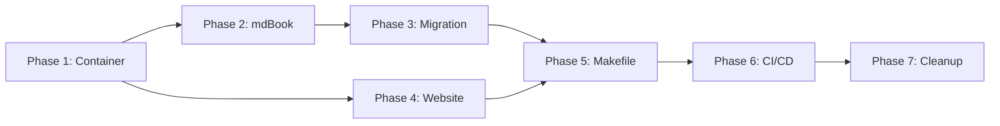

# Publication Implementation Plan

**Implements:** `specs/publication.md`
**Created:** 2024-12-08

This plan details the implementation steps for the Gorai publication infrastructure.

---

## Overview

| Deliverable | Description |
|-------------|-------------|
| Publishing container | Single container with mdBook, MkDocs, pkgsite |
| Book migration | Move `book/tmp/` content to `publish/book/src/` |
| Website scaffold | Initial MkDocs site with landing page and navigation |
| Makefile targets | Build and serve commands |
| CI/CD workflow | GitHub Actions for automated publishing |

---

## Phase 1: Directory Structure and Container

**Goal:** Create the foundational infrastructure.

### 1.1 Create Directory Structure

```bash
mkdir -p publish/container
mkdir -p publish/book/src
mkdir -p publish/book/theme
mkdir -p publish/website/docs/getting-started
mkdir -p publish/website/docs/guides
mkdir -p publish/website/docs/examples
mkdir -p publish/website/docs/reference
mkdir -p publish/website/docs/community
mkdir -p publish/website/overrides
```

**Files to create:**
- [ ] `publish/container/Containerfile`
- [ ] `publish/container/entrypoint.sh`
- [ ] `publish/.gitignore` (ignore `dist/`)

### 1.2 Create Container Definition

**File:** `publish/container/Containerfile`

Copy the Containerfile from `specs/publication.md` section "Publishing Container".

Key components:
- Base: `golang:1.23-bookworm`
- Rust toolchain for mdBook
- mdBook + mdbook-mermaid + mdbook-toc
- Python 3 + mkdocs-material + plugins
- pkgsite

### 1.3 Create Entrypoint Script

**File:** `publish/container/entrypoint.sh`

Copy the entrypoint script from `specs/publication.md`.

Commands:
- `book` / `book-serve`
- `website` / `website-serve`
- `api` / `api-serve`
- `all`
- `help`

### 1.4 Create .gitignore

**File:** `publish/.gitignore`

```
dist/
```

### 1.5 Build and Test Container

```bash
podman build -t gorai-publish publish/container/
podman run --rm gorai-publish help
```

**Verification:**
- Container builds without errors
- Help command shows all options
- mdbook, mkdocs, and pkgsite are accessible

---

## Phase 2: mdBook Configuration

**Goal:** Set up mdBook with proper configuration.

### 2.1 Create book.toml

**File:** `publish/book/book.toml`

Copy configuration from `specs/publication.md` section "mdBook Configuration".

### 2.2 Create Book Introduction

**File:** `publish/book/src/README.md`

```markdown
# Introduction

Welcome to *Gorai: Building Modern Robots with Go and NATS*.

*Pronounced "Go-ray-I" (rhymes with "samurai")*

This book is your comprehensive guide to building robots with the Gorai
framework—a lightweight, Go-based alternative to ROS 2, YARP, and Viam
optimized for AI.

## What You'll Learn

- The Gorai mental model and architecture
- NATS messaging patterns for robotics
- Building sensors, actuators, and vision components
- Testing strategies for robot software
- AI/ML integration with hardware acceleration
- AI-assisted development workflows

## Prerequisites

- Basic Go knowledge (variables, functions, structs, interfaces)
- Command-line familiarity
- Optional: Basic electronics understanding

Let's build some robots.
```

### 2.3 Create SUMMARY.md

**File:** `publish/book/src/SUMMARY.md`

Copy the SUMMARY.md structure from `specs/publication.md`.

### 2.4 Create Chapter Directory Structure

Create placeholder README.md files for each chapter:

```bash
for ch in ch01 ch02 ch03 ch04 ch05 ch06 ch07 ch08 ch09 ch10 ch11 ch12 ch13 ch14 ch15 appendices; do
  mkdir -p publish/book/src/$ch
  echo "# Chapter" > publish/book/src/$ch/README.md
done
```

### 2.5 Test Book Build

```bash
podman run --rm -v ${PWD}:/workspace:Z gorai-publish book
```

**Verification:**
- Book builds without errors
- Output appears in `publish/dist/book/`
- HTML is navigable

---

## Phase 3: Book Content Migration

**Goal:** Migrate existing book content from `book/tmp/` to new structure.

### 3.1 Content Mapping

| Source File | Target Location |
|-------------|-----------------|
| `ch00_introduction.md` | `publish/book/src/README.md` |
| `ch01_s1_landscape.md` | `publish/book/src/ch01/landscape.md` |
| `ch01_s2_philosophy.md` | `publish/book/src/ch01/philosophy.md` |
| `ch01_s3_audience.md` | `publish/book/src/ch01/audience.md` |
| `ch01_s4_whatyoullbuild.md` | `publish/book/src/ch01/whatyoullbuild.md` |
| `ch01_s5_prerequisites.md` | `publish/book/src/ch01/prerequisites.md` |
| `ch02_s1_bigpicture.md` | `publish/book/src/ch02/bigpicture.md` |
| `ch02_s2_coreconcepts.md` | `publish/book/src/ch02/coreconcepts.md` |
| `ch02_s3_distributed.md` | `publish/book/src/ch02/distributed.md` |
| `ch02_s4_config.md` | `publish/book/src/ch02/config.md` |
| `ch02_s5_nwsnwc.md` | `publish/book/src/ch02/nwsnwc.md` |
| `ch03_s1_whynats.md` | `publish/book/src/ch03/whynats.md` |
| `ch03_s2_fundamentals.md` | `publish/book/src/ch03/fundamentals.md` |
| `ch03_s3_patterns.md` | `publish/book/src/ch03/patterns.md` |
| `ch03_s4_qos.md` | `publish/book/src/ch03/qos.md` |
| `ch03_s5_jetstream.md` | `publish/book/src/ch03/jetstream.md` |
| `ch03_s6_cli.md` | `publish/book/src/ch03/cli.md` |
| `ch04_s1_interface.md` | `publish/book/src/ch04/interface.md` |
| `ch04_s2_builtin.md` | `publish/book/src/ch04/builtin.md` |
| `ch04_s3_datatypes.md` | `publish/book/src/ch04/datatypes.md` |
| `ch04_s4_fakes.md` | `publish/book/src/ch04/fakes.md` |
| `ch05_s1_actuator.md` | `publish/book/src/ch05/actuator.md` |
| `ch05_s2_motor.md` | `publish/book/src/ch05/motor.md` |
| `ch05_s3_motortypes.md` | `publish/book/src/ch05/motortypes.md` |
| `ch05_s4_control.md` | `publish/book/src/ch05/control.md` |
| `ch05_s5_servo.md` | `publish/book/src/ch05/servo.md` |
| `ch05_s6_base_arm.md` | `publish/book/src/ch05/base_arm.md` |
| `ch06_s1_camera.md` | `publish/book/src/ch06/camera.md` |
| `ch06_s2_types.md` | `publish/book/src/ch06/types.md` |
| `ch06_s3_dataflow.md` | `publish/book/src/ch06/dataflow.md` |
| `ch06_s4_cv.md` | `publish/book/src/ch06/cv.md` |
| `ch07_services.md` | `publish/book/src/ch07/README.md` |
| `ch08_devenv.md` | `publish/book/src/ch08/README.md` |
| `ch09_s1_overview.md` | `publish/book/src/ch09/overview.md` |
| `ch09_s2_reader.md` | `publish/book/src/ch09/reader.md` |
| `ch09_s3_sensor.md` | `publish/book/src/ch09/sensor.md` |
| `ch09_s4_main.md` | `publish/book/src/ch09/main.md` |
| `ch10_custom.md` | `publish/book/src/ch10/README.md` |
| `ch11_testing.md` | `publish/book/src/ch11/README.md` |
| `ch12_ml.md` | `publish/book/src/ch12/README.md` |
| `ch13_organization.md` | `publish/book/src/ch13/README.md` |
| `ch14_ai_dev.md` | `publish/book/src/ch14/README.md` |
| `ch15_conclusion.md` | `publish/book/src/ch15/README.md` |
| `appendices.md` | `publish/book/src/appendices/README.md` |
| `title_page.md` | (incorporate into README.md) |

### 3.2 Migration Steps

For each chapter:
1. Copy source file to target location
2. Update internal links to match new structure
3. Add chapter README.md with introduction
4. Verify Mermaid diagrams render

### 3.3 Create Chapter READMEs

Each chapter needs a README.md that introduces the chapter:

**Example:** `publish/book/src/ch01/README.md`

```markdown
# Why Gorai?

This chapter establishes the motivation, philosophy, and positioning of Gorai
in the robotics software landscape.

## In This Chapter

- [The Robotics Landscape](landscape.md) - History and pain points
- [Design Philosophy](philosophy.md) - Core principles
- [Who Should Use Gorai](audience.md) - Target users
- [What You'll Build](whatyoullbuild.md) - Preview of the book
- [Prerequisites](prerequisites.md) - What you need to know
```

### 3.4 Update SUMMARY.md with All Sections

Expand SUMMARY.md to include all migrated sections.

### 3.5 Verify Full Book Build

```bash
podman run --rm -v ${PWD}:/workspace:Z gorai-publish book
podman run --rm -it -p 3000:3000 -v ${PWD}:/workspace:Z gorai-publish book-serve
```

**Verification:**
- All chapters render correctly
- Navigation works
- Mermaid diagrams display
- Search functions
- No broken links

---

## Phase 4: Website Scaffold

**Goal:** Create initial MkDocs website structure.

### 4.1 Create mkdocs.yml

**File:** `publish/website/mkdocs.yml`

Copy configuration from `specs/publication.md` section "Material for MkDocs Configuration".

### 4.2 Create Landing Page

**File:** `publish/website/docs/index.md`

```markdown
# Gorai

**A lightweight, Go-based robotics framework built on NATS.io**

*Pronounced "Go-ray-I" (rhymes with "samurai")*

<div class="grid cards" markdown>

-   :material-clock-fast:{ .lg .middle } __Quick Start__

    ---

    Get up and running with Gorai in minutes

    [:octicons-arrow-right-24: Getting Started](getting-started/installation.md)

-   :material-book-open-variant:{ .lg .middle } __The Book__

    ---

    Comprehensive guide to building robots with Gorai

    [:octicons-arrow-right-24: Read the Book](/book/)

-   :material-api:{ .lg .middle } __API Reference__

    ---

    Complete Go package documentation

    [:octicons-arrow-right-24: API Docs](/api/)

-   :material-github:{ .lg .middle } __Source Code__

    ---

    View and contribute on GitHub

    [:octicons-arrow-right-24: GitHub](https://github.com/gorai/gorai)

</div>

## Why Gorai?

| Aspect | Gorai | ROS 2 | Viam |
|--------|-------|-------|------|
| **Language** | Go + TinyGo | C++/Python | Go |
| **Middleware** | NATS | DDS | gRPC |
| **Build** | Go modules | CMake + ament | Go modules |
| **AI/ML** | First-class | Package ecosystem | First-class |
| **MCU Support** | TinyGo | micro-ROS | None |

## Features

- **NATS-based messaging** for pub/sub, request/reply, and persistence
- **Protocol Buffer serialization** for type-safe communication
- **Resource-centric architecture** with unified component/service abstraction
- **First-class AI/ML support** with hardware acceleration
- **Hot reconfiguration** without restart
- **TinyGo compatibility** for microcontrollers
```

### 4.3 Create Getting Started Pages

**File:** `publish/website/docs/getting-started/installation.md`

```markdown
# Installation

## Prerequisites

- Go 1.21 or later
- NATS server (local or remote)
- Linux (primary) or macOS (development)

## Install Gorai

```bash
go get github.com/gorai/gorai
```

## Start NATS

Using Podman:

```bash
podman run -d --name nats -p 4222:4222 nats:latest
```

## Verify Installation

```bash
go run github.com/gorai/gorai/cmd/gorai version
```

## Next Steps

- [Quick Start](quickstart.md) - Build your first Gorai node
- [First Robot](first-robot.md) - Complete robot example
- [Concepts](concepts.md) - Understanding the architecture
```

Create placeholder files:
- `publish/website/docs/getting-started/quickstart.md`
- `publish/website/docs/getting-started/first-robot.md`
- `publish/website/docs/getting-started/concepts.md`

### 4.4 Create Guide Placeholders

```markdown
# Placeholder content for each guide
```

Files:
- `publish/website/docs/guides/components.md`
- `publish/website/docs/guides/services.md`
- `publish/website/docs/guides/nats.md`
- `publish/website/docs/guides/configuration.md`
- `publish/website/docs/guides/testing.md`

### 4.5 Create Example Placeholders

Files:
- `publish/website/docs/examples/hello-sensor.md`
- `publish/website/docs/examples/pan-tilt.md`
- `publish/website/docs/examples/skimmer.md`

### 4.6 Create Reference Placeholders

Files:
- `publish/website/docs/reference/framework-spec.md`
- `publish/website/docs/reference/api.md`
- `publish/website/docs/reference/cli.md`

### 4.7 Create Community Pages

**File:** `publish/website/docs/community/contributing.md`

```markdown
# Contributing to Gorai

We welcome contributions! Here's how to get started.

## Code of Conduct

Please read our [Code of Conduct](code-of-conduct.md) before contributing.

## How to Contribute

1. Fork the repository
2. Create a feature branch
3. Make your changes
4. Submit a pull request

## Development Setup

See the [Development Environment](../guides/testing.md) guide.
```

Files:
- `publish/website/docs/community/contributing.md`
- `publish/website/docs/community/code-of-conduct.md`
- `publish/website/docs/community/support.md`

### 4.8 Create Book Link Page

**File:** `publish/website/docs/book/index.md`

```markdown
# The Gorai Book

The complete guide to building robots with Gorai.

[Read the Book](/book/){ .md-button .md-button--primary }

## Chapters

1. Why Gorai?
2. Mental Model & Architecture
3. NATS: The Communication Backbone
4. Components: Sensors
5. Components: Actuators
6. Components: Vision
7. Services
8. Development Environment
9. Hello Sensor Deep Dive
10. Building Custom Components
11. Testing Strategies
12. AI/ML Integration
13. Project Organization
14. AI-Assisted Development
15. Conclusion & Next Steps
```

### 4.9 Test Website Build

```bash
podman run --rm -v ${PWD}:/workspace:Z gorai-publish website
podman run --rm -it -p 8000:8000 -v ${PWD}:/workspace:Z gorai-publish website-serve
```

**Verification:**
- Website builds without errors
- Navigation works
- Search functions
- Theme toggles work
- Mobile responsive

---

## Phase 5: Makefile Integration

**Goal:** Add publishing targets to the project Makefile.

### 5.1 Add Publishing Section

Add to `Makefile`:

```makefile
# =============================================================================
# Publishing
# =============================================================================

PUBLISH_IMAGE := gorai-publish
PUBLISH_DIR := publish

.PHONY: publish-container
publish-container: ## Build the publishing container
	podman build -t $(PUBLISH_IMAGE) $(PUBLISH_DIR)/container/

.PHONY: publish-all
publish-all: publish-container ## Build all documentation
	podman run --rm -v ${PWD}:/workspace:Z $(PUBLISH_IMAGE) all

.PHONY: publish-book
publish-book: publish-container ## Build the book
	podman run --rm -v ${PWD}:/workspace:Z $(PUBLISH_IMAGE) book

.PHONY: publish-website
publish-website: publish-container ## Build the website
	podman run --rm -v ${PWD}:/workspace:Z $(PUBLISH_IMAGE) website

.PHONY: serve-book
serve-book: publish-container ## Serve book with live reload (port 3000)
	podman run --rm -it -p 3000:3000 -v ${PWD}:/workspace:Z $(PUBLISH_IMAGE) book-serve

.PHONY: serve-website
serve-website: publish-container ## Serve website with live reload (port 8000)
	podman run --rm -it -p 8000:8000 -v ${PWD}:/workspace:Z $(PUBLISH_IMAGE) website-serve

.PHONY: serve-api
serve-api: publish-container ## Serve API reference (port 6060)
	podman run --rm -it -p 6060:6060 -v ${PWD}:/workspace:Z $(PUBLISH_IMAGE) api-serve

.PHONY: publish-clean
publish-clean: ## Clean build outputs
	rm -rf $(PUBLISH_DIR)/dist
```

### 5.2 Update Help Target

Ensure the help target includes the new publishing commands.

### 5.3 Test Makefile Targets

```bash
make publish-container
make publish-all
make serve-book  # In one terminal
make serve-website  # In another terminal
```

---

## Phase 6: CI/CD Setup

**Goal:** Automate documentation publishing.

### 6.1 Create GitHub Actions Workflow

**File:** `.github/workflows/publish-docs.yml`

```yaml
name: Publish Documentation

on:
  push:
    branches: [main]
    paths:
      - 'publish/**'
      - 'pkg/**'
      - 'component/**'
      - 'service/**'
      - 'specs/**'

  workflow_dispatch:

permissions:
  contents: read
  pages: write
  id-token: write

concurrency:
  group: "pages"
  cancel-in-progress: false

jobs:
  build:
    runs-on: ubuntu-latest
    steps:
      - name: Checkout
        uses: actions/checkout@v4

      - name: Build publishing container
        run: podman build -t gorai-publish publish/container/

      - name: Build book
        run: podman run --rm -v ${PWD}:/workspace gorai-publish book

      - name: Build website
        run: podman run --rm -v ${PWD}:/workspace gorai-publish website

      - name: Combine outputs
        run: |
          mkdir -p publish/dist/combined
          cp -r publish/dist/website/* publish/dist/combined/
          cp -r publish/dist/book publish/dist/combined/book

      - name: Upload artifact
        uses: actions/upload-pages-artifact@v3
        with:
          path: publish/dist/combined

  deploy:
    environment:
      name: github-pages
      url: ${{ steps.deployment.outputs.page_url }}
    runs-on: ubuntu-latest
    needs: build
    steps:
      - name: Deploy to GitHub Pages
        id: deployment
        uses: actions/deploy-pages@v4
```

### 6.2 Test Workflow Locally

Use `act` to test the workflow locally:

```bash
act push -j build
```

---

## Phase 7: Cleanup and Verification

**Goal:** Remove legacy content and verify everything works.

### 7.1 Verify All Builds

```bash
make publish-clean
make publish-all
```

Checklist:
- [ ] Book builds successfully
- [ ] Website builds successfully
- [ ] No broken links in book
- [ ] No broken links in website
- [ ] Mermaid diagrams render in book
- [ ] Search works in both

### 7.2 Remove Legacy Book Directory

Once migration is verified:

```bash
rm -rf book/tmp
# Keep book/gorai-robotics-book.md and book/gorai-robotics-book.pdf for reference
# Or move them to publish/book/ as historical artifacts
```

### 7.3 Update References

Search for references to old paths:
- `book/` → `publish/book/`
- Update any documentation that references the old structure

### 7.4 Update .gitignore

Ensure root `.gitignore` includes:

```
publish/dist/
```

---

## Implementation Checklist

### Phase 1: Directory Structure and Container
- [ ] Create `publish/` directory structure
- [ ] Create `publish/container/Containerfile`
- [ ] Create `publish/container/entrypoint.sh`
- [ ] Create `publish/.gitignore`
- [ ] Build and test container

### Phase 2: mdBook Configuration
- [ ] Create `publish/book/book.toml`
- [ ] Create `publish/book/src/README.md`
- [ ] Create `publish/book/src/SUMMARY.md`
- [ ] Create chapter directory structure
- [ ] Test book build

### Phase 3: Book Content Migration
- [ ] Copy all chapter content to new locations
- [ ] Create chapter README.md files
- [ ] Update internal links
- [ ] Update SUMMARY.md with all sections
- [ ] Verify full book build

### Phase 4: Website Scaffold
- [ ] Create `publish/website/mkdocs.yml`
- [ ] Create landing page
- [ ] Create getting-started pages
- [ ] Create guide placeholders
- [ ] Create example placeholders
- [ ] Create reference placeholders
- [ ] Create community pages
- [ ] Create book link page
- [ ] Test website build

### Phase 5: Makefile Integration
- [ ] Add publishing section to Makefile
- [ ] Test all make targets

### Phase 6: CI/CD Setup
- [ ] Create GitHub Actions workflow
- [ ] Test workflow locally
- [ ] Verify deployment

### Phase 7: Cleanup and Verification
- [ ] Verify all builds
- [ ] Remove legacy book directory
- [ ] Update references
- [ ] Update .gitignore

---

## Estimated Effort

| Phase | Tasks | Complexity |
|-------|-------|------------|
| 1 | Directory + Container | Low |
| 2 | mdBook Config | Low |
| 3 | Book Migration | Medium (45 files) |
| 4 | Website Scaffold | Medium |
| 5 | Makefile | Low |
| 6 | CI/CD | Low |
| 7 | Cleanup | Low |

---

## Dependencies



---

## Success Criteria

1. **Container works**: `make publish-container` succeeds
2. **Book builds**: `make publish-book` produces working HTML
3. **Website builds**: `make publish-website` produces working HTML
4. **Live reload works**: `make serve-book` and `make serve-website` function
5. **CI/CD deploys**: Push to main triggers successful deployment
6. **No regressions**: All existing book content is preserved and accessible
