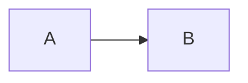

# Hugo Theme Migration Plan: No Theme → Docsy

This document provides step-by-step instructions for migrating the Gorai website from the current custom (no theme) setup to Docsy, while preserving the ability to easily switch themes later.

## Table of Contents

1. [Overview](#overview)
2. [Prerequisites](#prerequisites)
3. [Migration Strategy](#migration-strategy)
4. [Step-by-Step Instructions](#step-by-step-instructions)
5. [Content Migration](#content-migration)
6. [Configuration Changes](#configuration-changes)
7. [Shortcode Compatibility](#shortcode-compatibility)
8. [Testing](#testing)
9. [Rollback Plan](#rollback-plan)

---

## Overview

### Current State
- Custom layouts in `layouts/` directory
- Inline CSS in `baseof.html` (~65 lines)
- Custom shortcodes: `mermaid`, `callout`
- No sidebar navigation, search, or dark mode

### Target State
- Docsy theme via git submodule
- Theme-provided layouts (with override capability)
- Full search, sidebar navigation, dark mode
- Mermaid diagrams via Docsy native support
- Easy path to switch themes if needed

### Why Git Submodule (Not Hugo Modules)

We're using **git submodules** instead of Hugo Modules because:

1. **Simpler dependency management** - No Go toolchain required
2. **Explicit version control** - Theme version pinned in `.gitmodules`
3. **Easier theme switching** - Just change the submodule
4. **Offline development** - Theme files are local
5. **CI/CD simplicity** - `git submodule update --init` is universal

---

## Prerequisites

### Required Software

```bash
# Hugo Extended (required for Docsy SCSS)
hugo version
# Must show "extended" - e.g., "hugo v0.139.0+extended"

# If not extended, install it:
# macOS
brew install hugo

# Ubuntu/Debian (snap provides extended by default)
sudo snap install hugo

# Or download from https://github.com/gohugoio/hugo/releases
# Choose the "extended" version
```

### For Docsy Specifically

```bash
# Node.js and npm (for PostCSS)
node --version  # v18+ recommended
npm --version

# Install PostCSS dependencies (run from newsite directory)
npm init -y
npm install -D autoprefixer postcss postcss-cli
```

---

## Migration Strategy

### Directory Structure After Migration

```
publish/newsite/
├── themes/
│   └── docsy/                    # Git submodule
├── layouts/
│   └── shortcodes/
│       └── callout.html          # Keep for compatibility (maps to Docsy alerts)
├── assets/
│   └── scss/
│       └── _variables_project.scss  # Custom colors/branding
├── static/
│   └── images/                   # Logos, favicons
├── content/                      # Unchanged
├── config/
│   └── _default/
│       ├── hugo.toml             # Main config
│       ├── params.toml           # Theme parameters
│       └── menus.toml            # Navigation menus
├── package.json                  # npm dependencies
├── .gitmodules                   # Theme submodule reference
└── MIGRATION.md                  # This file
```

### Key Design Decisions

1. **Config split** - Use `config/_default/` directory for cleaner organization
2. **Minimal overrides** - Only override what's necessary
3. **Preserve custom shortcodes** - Map to Docsy equivalents
4. **Archive old layouts** - Keep in `layouts.archive/` for reference

---

## Step-by-Step Instructions

### Step 1: Create a Migration Branch

```bash
cd /path/to/gorai/publish/newsite
git checkout -b migrate-to-docsy
```

### Step 2: Add Docsy as Git Submodule

```bash
# Create themes directory
mkdir -p themes

# Add Docsy as submodule (pinned to specific version)
git submodule add --depth 1 https://github.com/google/docsy.git themes/docsy

# Pin to a specific release tag for stability
cd themes/docsy
git fetch --tags
git checkout v0.11.0  # Or latest stable: check https://github.com/google/docsy/releases
cd ../..

# Commit the submodule
git add .gitmodules themes/docsy
git commit -m "Add Docsy theme as git submodule (v0.11.0)"
```

### Step 3: Install npm Dependencies

```bash
# Initialize npm if not already done
npm init -y

# Install Docsy's required dependencies
npm install -D autoprefixer postcss postcss-cli

# Add to .gitignore
echo "node_modules/" >> .gitignore
```

### Step 4: Archive Current Custom Layouts

```bash
# Keep old layouts for reference (don't delete yet)
mkdir -p layouts.archive
mv layouts/_default layouts.archive/
mv layouts/index.html layouts.archive/

# Keep shortcodes (we'll update them)
# layouts/shortcodes/ stays in place
```

### Step 5: Reorganize Configuration

```bash
# Create config directory structure
mkdir -p config/_default

# Move and split hugo.toml
mv hugo.toml config/_default/hugo.toml
```

### Step 6: Update Configuration Files

Create/update the following configuration files:

**`config/_default/hugo.toml`** (main configuration):

```toml
# Gorai Website Configuration

baseURL = "https://gorai.dev/"
title = "Gorai"
languageCode = "en-us"
defaultContentLanguage = "en"

# Theme
theme = "docsy"

# Build settings
enableRobotsTXT = true
enableGitInfo = true
enableEmoji = true

# Disable unused features
disableKinds = ["taxonomy", "term"]

# Required for Docsy
[module]
  [module.hugoVersion]
    extended = true
    min = "0.110.0"

# Markup configuration
[markup]
  [markup.goldmark]
    [markup.goldmark.renderer]
      unsafe = true
  [markup.highlight]
    style = "dracula"
    lineNos = true
    lineNumbersInTable = true
    guessSyntax = true
    anchorLineNos = false
    codeFences = true
    noClasses = false
  [markup.tableOfContents]
    startLevel = 2
    endLevel = 4

# Output formats
[outputs]
  home = ["HTML", "RSS", "JSON"]
  section = ["HTML", "RSS"]

# Permalinks
[permalinks]
  docs = "/docs/:slug/"
  examples = "/examples/:slug/"

# Imaging (for Docsy image processing)
[imaging]
  resampleFilter = "CatmullRom"
  quality = 75
  anchor = "smart"

# Services
[services]
  [services.googleAnalytics]
    # id = "G-XXXXXXXXXX"  # Uncomment and add your ID
```

**`config/_default/params.toml`** (Docsy parameters):

```toml
# Docsy Theme Parameters

# Site description (used in meta tags)
description = "A lightweight, Go-based robotics framework built on NATS.io"
copyright = "Greg Herlein & Luca Herlein"

# Repository configuration
github_repo = "https://github.com/gorai/gorai"
github_project_repo = "https://github.com/gorai/gorai"
github_branch = "main"

# Documentation repository (if different from main repo)
# github_subdir = "docs"

# Google Custom Search Engine ID (optional)
# gcs_engine_id = "YOUR_GCS_ENGINE_ID"

# Algolia DocSearch (optional - apply at https://docsearch.algolia.com/)
# algolia_docsearch = true
# [params.algolia]
#   appId = "YOUR_APP_ID"
#   apiKey = "YOUR_API_KEY"
#   indexName = "gorai"

# Enable offline search (Lunr - no external service needed)
offlineSearch = true
offlineSearchMaxResults = 25
offlineSearchSummaryLength = 200

# UI Configuration
[ui]
  # Enable dark mode toggle
  showLightDarkModeMenu = true

  # Sidebar configuration
  sidebar_menu_compact = true
  sidebar_menu_foldable = true
  sidebar_cache_limit = 10

  # Breadcrumbs
  breadcrumb_disable = false

  # Taxonomy pages
  taxonomy_breadcrumb_disable = false

  # Table of contents
  [ui.readingtime]
    enable = false

# Feedback widget ("Was this page helpful?")
[ui.feedback]
  enable = true
  yes = 'Glad to hear it! <a href="https://github.com/gorai/gorai/issues/new">Suggestions welcome</a>.'
  no = 'Sorry to hear that. <a href="https://github.com/gorai/gorai/issues/new">Please tell us how we can improve</a>.'

# Links configuration
[links]
  # Developer-oriented links
  [[links.developer]]
    name = "GitHub"
    url = "https://github.com/gorai/gorai"
    icon = "fab fa-github"
    desc = "Source code and issues"
  [[links.developer]]
    name = "Discussions"
    url = "https://github.com/gorai/gorai/discussions"
    icon = "fa fa-comments"
    desc = "Community discussions"

# Mermaid diagram support
[mermaid]
  enable = true
  theme = "default"

# Prism syntax highlighting (alternative to Chroma)
# prism_syntax_highlighting = false

# Print entire section (for docs)
[print]
  disable_toc = false
```

**`config/_default/menus.toml`** (navigation menus):

```toml
# Main navigation menu

[[main]]
  identifier = "docs"
  name = "Documentation"
  url = "/docs/"
  weight = 10

[[main]]
  identifier = "examples"
  name = "Examples"
  url = "/examples/"
  weight = 20

[[main]]
  identifier = "community"
  name = "Community"
  url = "/community/"
  weight = 30

[[main]]
  identifier = "book"
  name = "Book"
  url = "/book/"
  weight = 40

[[main]]
  identifier = "github"
  name = "GitHub"
  url = "https://github.com/gorai/gorai"
  weight = 100
  pre = "<i class='fab fa-github'></i>"
  post = ""

# Footer links (optional)
# [[footer]]
#   name = "Privacy"
#   url = "/privacy/"
#   weight = 10
```

### Step 7: Update Shortcodes for Compatibility

**`layouts/shortcodes/callout.html`** (map to Docsy alerts):

```html
{{- $type := .Get "type" | default "info" -}}
{{- $title := .Get "title" | default "" -}}
{{/*
  Map our callout types to Docsy alert types:
  - info -> primary
  - warning -> warning
  - danger -> danger
  - success -> success
  - note -> secondary
*/}}
{{- $alertType := $type -}}
{{- if eq $type "info" }}{{ $alertType = "primary" }}{{ end -}}
{{- if eq $type "note" }}{{ $alertType = "secondary" }}{{ end -}}
<div class="alert alert-{{ $alertType }}" role="alert">
  {{- if $title }}
  <h4 class="alert-heading">{{ $title }}</h4>
  {{- end }}
  {{ .Inner | markdownify }}
</div>
```

**Note:** Docsy has native Mermaid support, so you can optionally remove `layouts/shortcodes/mermaid.html` and use fenced code blocks instead:

````markdown

````

Or keep the shortcode for backward compatibility.

### Step 8: Add Custom SCSS (Optional Branding)

Create **`assets/scss/_variables_project.scss`**:

```scss
// Gorai custom theme variables
// These override Docsy defaults

// Primary brand color (Gorai purple)
$primary: #663399;

// Secondary colors
$secondary: #6c757d;
$success: #28a745;
$info: #17a2b8;
$warning: #ffc107;
$danger: #dc3545;

// Fonts (optional - Docsy defaults are good)
// $font-family-sans-serif: -apple-system, BlinkMacSystemFont, "Segoe UI", Roboto, sans-serif;
// $font-family-monospace: "SF Mono", Monaco, "Courier New", monospace;

// Navbar
// $navbar-bg: $primary;
// $navbar-text-color: white;

// Footer
// $footer-bg: #2a2a2a;
// $footer-text-color: #999;
```

### Step 9: Add Static Assets

```bash
# Create directories
mkdir -p static/images

# Add logo and favicon (create or copy your existing assets)
# static/images/logo.svg       - Site logo
# static/images/favicon.png    - Favicon
# static/images/favicon.ico    - Favicon (IE compatibility)
```

### Step 10: Update Content Front Matter

Add Docsy-specific front matter to key pages:

**`content/docs/_index.md`**:

```yaml
---
title: "Documentation"
linkTitle: "Docs"
weight: 20
menu:
  main:
    weight: 20
---
```

**`content/docs/getting-started/_index.md`**:

```yaml
---
title: "Getting Started"
linkTitle: "Getting Started"
weight: 1
description: >
  Get up and running with Gorai quickly.
---
```

### Step 11: Build and Test

```bash
# Clean old build artifacts
make clean

# Build the site
hugo --gc --minify

# Or start dev server
hugo server --buildDrafts

# Check for errors in the output
```

### Step 12: Commit the Migration

```bash
git add -A
git commit -m "Migrate to Docsy theme

- Add Docsy as git submodule (v0.11.0)
- Reorganize config into config/_default/
- Add npm dependencies for PostCSS
- Update shortcodes for Docsy compatibility
- Archive old custom layouts
- Add custom SCSS variables for branding

🤖 Generated with [Claude Code](https://claude.com/claude-code)

Co-Authored-By: Claude <noreply@anthropic.com>"
```

---

## Content Migration

### Front Matter Updates

Docsy uses specific front matter keys. Update your content files:

| Old | New (Docsy) | Purpose |
|-----|-------------|---------|
| `title` | `title` | Same |
| `description` | `description` | Same |
| `weight` | `weight` | Same |
| - | `linkTitle` | Shorter title for nav |
| - | `no_list` | Hide child pages in list |
| - | `simple_list` | Simple list instead of cards |

### Section Organization

Docsy auto-generates sidebar navigation from the directory structure. Ensure:

1. Each directory has an `_index.md` file
2. Files have `weight` for ordering
3. Use `linkTitle` for shorter nav labels

---

## Shortcode Compatibility

### Callout → Alert

**Before (custom):**
```markdown

This is a warning message.

```

**After (Docsy native):**
```markdown
{}
This is a warning message.
{}
```

Both will work with the compatibility shortcode.

### Mermaid Diagrams

**Before (custom shortcode):**
```markdown

graph LR
    A --> B

```

**After (Docsy native - fenced code block):**
````markdown

````

Both approaches work in Docsy.

---

## Testing

### Verification Checklist

- [ ] Site builds without errors: `hugo --gc`
- [ ] Dev server runs: `hugo server`
- [ ] Homepage loads correctly
- [ ] Documentation sidebar appears
- [ ] Search works (type in search box)
- [ ] Dark mode toggle works
- [ ] Mermaid diagrams render
- [ ] Callout/alert shortcodes work
- [ ] Mobile responsive (resize browser)
- [ ] "Edit this page" links work (GitHub)

### Common Issues

| Issue | Solution |
|-------|----------|
| SCSS errors | Ensure Hugo Extended is installed |
| Missing PostCSS | Run `npm install` |
| Submodule empty | Run `git submodule update --init` |
| Search not working | Check `offlineSearch = true` in params.toml |
| Sidebar not showing | Ensure `_index.md` files exist |

---

## Rollback Plan

If migration fails, rollback is simple:

```bash
# Restore old layouts
mv layouts.archive/_default layouts/
mv layouts.archive/index.html layouts/

# Remove theme
rm -rf themes/docsy
git submodule deinit themes/docsy

# Restore old config
mv config/_default/hugo.toml hugo.toml
rm -rf config/

# Remove npm dependencies
rm -rf node_modules package.json package-lock.json

# Commit rollback
git checkout main
git branch -D migrate-to-docsy
```

---

## Next Steps After Migration

1. **Customize branding** - Update `_variables_project.scss`
2. **Add logo** - Place in `static/images/logo.svg`
3. **Configure search** - Consider Algolia DocSearch for larger sites
4. **Add analytics** - Uncomment Google Analytics in config
5. **Set up versioning** - For multiple documentation versions
6. **Review Docsy docs** - https://www.docsy.dev/docs/
