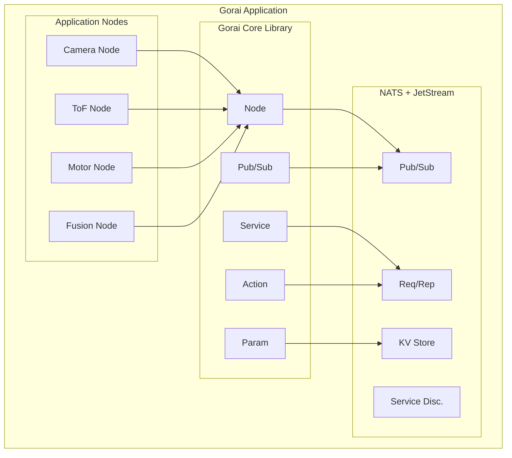
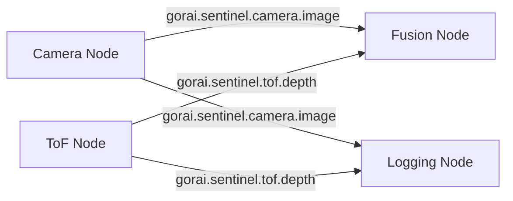
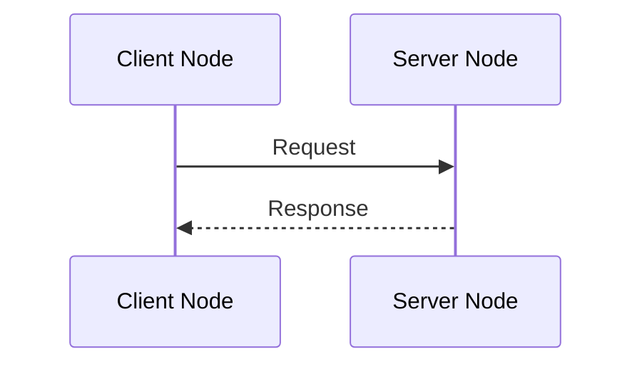
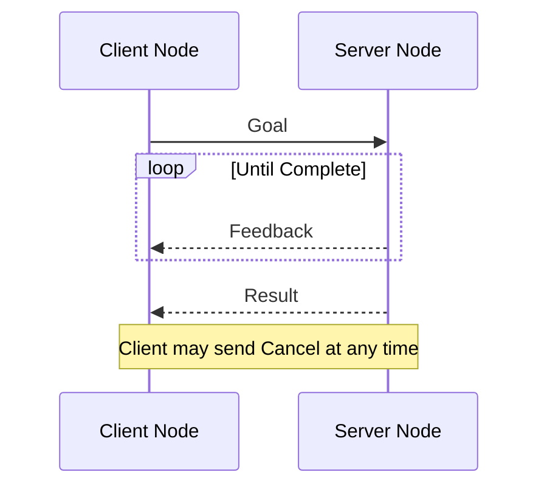

# Gorai: A Modern Robotics Framework

**A lightweight, Go-based alternative to ROS 2, YARP, and Viam optimized for AI**

---

## Executive Summary

Gorai is a modern robotics framework built on NATS.io, designed to provide the essential capabilities of ROS 2 without the complexity of DDS, the legacy baggage of YARP, or the licensing concerns of Viam. By leveraging NATS's battle-tested messaging infrastructure, Gorai offers a clean, Go-idiomatic approach to building distributed robot systems.

---

## Table of Contents

1. [Motivation](#motivation)
2. [Framework Architecture](#framework-architecture)
3. [Core Components](#core-components)
4. [Message Types](#message-types)
5. [Communication Patterns](#communication-patterns)
6. [Technical Decisions](#technical-decisions)
7. [Comparison with Alternatives](#comparison-with-alternatives)

---

## Motivation

### Problems with Existing Frameworks

**ROS 2**
- DDS middleware is complex to configure and debug
- Vendor fragmentation (FastDDS, Cyclone, Connext) causes interop headaches
- Heavy resource footprint for embedded systems
- Slow build times with C++ codebase
- Steep learning curve

**YARP**
- Primarily serves the iCub research community
- Limited adoption outside academia
- C++ complexity remains
- Smaller ecosystem and driver support

**Viam**
- Licensed under AGPL-3.0, which has significant implications for commercial use:
  - AGPL's "viral" nature requires derivative works to be licensed under AGPL
  - Network protection clause requires anyone running modified software as a service to release source code
  - Integration with proprietary robotics systems may trigger copyleft obligations
  - Commercial users often avoid AGPL due to legal complexity and disclosure requirements
- Cloud-centric architecture raises data sovereignty concerns
- Founded by MongoDB co-founder, who previously navigated contentious licensing debates
- Relatively young, API still evolving

### Why Go for Robotics?

Go occupies a compelling middle ground in the robotics language landscape:

| Challenge | Go's Answer |
|-----------|-------------|
| **Performance vs. Simplicity** | Compiled, statically typed, garbage collected—approaches C++ performance without the complexity burden |
| **Concurrency** | Goroutines and channels make concurrent programming tractable; compare to C++'s mutex-heavy approach requiring expert-level skill |
| **Deployment** | Single-binary deployment with easy cross-compilation and strong ARM support—critical for robotics hardware |
| **AI Integration** | Emerging ecosystem (TensorFlow, ONNX runtime bindings) enables a unified language stack rather than Python-to-C++ context switching |
| **Build Simplicity** | No CMake, no ABI compatibility nightmares, no dependency hell |

**Why not Python?** While accessible for prototyping, Python struggles with real-time performance requirements. Most performance-critical work relies on C/C++ dependencies under the hood.

**Why not C++?** Production-ready but carries significant complexity—build systems, dependency management, and ABI compatibility issues. Modern AI coding assistance is also weaker in C++ compared to Go.

### Why NATS?

| Aspect | Benefit |
|--------|---------|
| **NATS messaging** | Production-proven pub/sub, request/reply, persistence (JetStream), service discovery—all built in |
| **Operational simplicity** | NATS server is a single ~15MB binary; no configuration hell |
| **Edge-native** | Leaf nodes for edge deployment, low resource footprint |
| **Cloud-ready** | NATS already used in Kubernetes, Synadia Cloud available |

---

## Framework Architecture

### High-Level Design



### Subject Namespace Convention

Gorai uses a hierarchical subject naming scheme:

```
gorai.{robot}.{node}.{topic}

Examples:
gorai.sentinel.camera.image
gorai.sentinel.tof.pointcloud
gorai.sentinel.pantilt.state
gorai.sentinel.fusion.depth_image
```

Service and action subjects follow the same pattern with suffixes:

```
gorai.sentinel.pantilt.move_to.goal      # action goal
gorai.sentinel.pantilt.move_to.feedback  # action feedback
gorai.sentinel.pantilt.home.request      # service request
gorai.sentinel.pantilt.home.response     # service response
```

---

## Core Components

### Node

The fundamental unit of computation. Manages lifecycle, logging, and NATS connection.

```go
package main

import (
    "context"
    "github.com/gorai-robotics/gorai/pkg/node"
)

func main() {
    n, err := node.New("camera_driver",
        node.WithNATS("nats://localhost:4222"),
        node.WithNamespace("sentinel"),
        node.WithLogger(slog.Default()),
    )
    if err != nil {
        log.Fatal(err)
    }
    defer n.Close()

    // Node logic here

    n.Spin(context.Background())
}
```

**Node API**

| Method | Description |
|--------|-------------|
| `New(name, opts...)` | Create a new node |
| `Close()` | Clean shutdown |
| `Spin(ctx)` | Block and process callbacks |
| `Context()` | Get node's context |
| `Logger()` | Get structured logger |
| `NATS()` | Get underlying NATS connection |

### Publisher

Type-safe message publishing with generics.

```go
import "github.com/gorai-robotics/gorai/pkg/pub"

publisher := pub.New[sensor.Image](n, "camera.image",
    pub.WithQoS(pub.Reliable),
)

img := &sensor.Image{
    Header: std.NewHeader("camera_optical"),
    Width:  640,
    Height: 480,
    Data:   frameData,
}
publisher.Publish(ctx, img)
```

**Publisher Options**

| Option | Description |
|--------|-------------|
| `WithQoS(qos)` | BestEffort or Reliable delivery |
| `WithRetain()` | Keep last message for late subscribers (JetStream) |
| `WithHistory(n)` | Keep last N messages |

### Subscriber

Type-safe message subscription with callbacks.

```go
import "github.com/gorai-robotics/gorai/pkg/sub"

sub.New[geometry.Twist](n, "cmd_vel", func(msg *geometry.Twist) {
    log.Printf("Received velocity command: linear=%.2f, angular=%.2f",
        msg.Linear.X, msg.Angular.Z)
})
```

**Subscriber Options**

| Option | Description |
|--------|-------------|
| `WithQueueGroup(name)` | Load balance across subscribers |
| `WithBuffer(n)` | Channel buffer size |
| `WithStartTime(t)` | Replay from timestamp (JetStream) |

### Service

Synchronous request/reply pattern.

```go
import "github.com/gorai-robotics/gorai/pkg/srv"

// Server side
srv.NewServer[HomeRequest, HomeResponse](n, "pantilt.home",
    func(ctx context.Context, req *HomeRequest) (*HomeResponse, error) {
        err := moveToHome()
        return &HomeResponse{Success: err == nil}, err
    },
)

// Client side
client := srv.NewClient[HomeRequest, HomeResponse](n, "pantilt.home")
resp, err := client.Call(ctx, &HomeRequest{}, srv.WithTimeout(5*time.Second))
```

### Action

Long-running tasks with feedback and cancellation.

```go
import "github.com/gorai-robotics/gorai/pkg/action"

// Server side
action.NewServer[MoveToGoal, MoveToFeedback, MoveToResult](n, "pantilt.move_to",
    func(ctx context.Context, goal *MoveToGoal, fb action.FeedbackSender[MoveToFeedback]) (*MoveToResult, error) {
        for !atTarget() {
            if ctx.Err() != nil {
                return nil, ctx.Err() // cancelled
            }
            fb.Send(&MoveToFeedback{
                CurrentPan:  getCurrentPan(),
                CurrentTilt: getCurrentTilt(),
            })
            time.Sleep(50 * time.Millisecond)
        }
        return &MoveToResult{Success: true}, nil
    },
)

// Client side
client := action.NewClient[MoveToGoal, MoveToFeedback, MoveToResult](n, "pantilt.move_to")
handle, err := client.SendGoal(ctx, &MoveToGoal{Pan: 45.0, Tilt: -10.0})
for fb := range handle.Feedback() {
    log.Printf("Progress: pan=%.1f, tilt=%.1f", fb.CurrentPan, fb.CurrentTilt)
}
result, err := handle.Result()
```

### Parameter Store

Configuration backed by NATS KV.

```go
import "github.com/gorai-robotics/gorai/pkg/param"

store := param.NewStore(n)

// Set parameters
store.Set("camera.exposure", 100)
store.Set("camera.gain", 1.5)

// Get parameters
exposure, _ := param.Get[int](store, "camera.exposure")

// Watch for changes
store.Watch("camera.*", func(key string, value any) {
    log.Printf("Parameter changed: %s = %v", key, value)
})
```

---

## Message Types

### Standard Messages

Gorai defines a minimal set of robotics primitives using Protocol Buffers.

```protobuf
// std.proto
syntax = "proto3";
package gorai.std;

message Header {
    int64 timestamp_ns = 1;    // nanoseconds since Unix epoch
    string frame_id = 2;       // coordinate frame
    uint32 seq = 3;            // sequence number
}

message Time {
    int64 sec = 1;
    int32 nsec = 2;
}

message Duration {
    int64 sec = 1;
    int32 nsec = 2;
}
```

```protobuf
// geometry.proto
syntax = "proto3";
package gorai.geometry;

import "std.proto";

message Vector3 {
    double x = 1;
    double y = 2;
    double z = 3;
}

message Quaternion {
    double x = 1;
    double y = 2;
    double z = 3;
    double w = 4;
}

message Pose {
    Vector3 position = 1;
    Quaternion orientation = 2;
}

message PoseStamped {
    gorai.std.Header header = 1;
    Pose pose = 2;
}

message Twist {
    Vector3 linear = 1;
    Vector3 angular = 2;
}

message TwistStamped {
    gorai.std.Header header = 1;
    Twist twist = 2;
}

message Transform {
    Vector3 translation = 1;
    Quaternion rotation = 2;
}

message TransformStamped {
    gorai.std.Header header = 1;
    string child_frame_id = 2;
    Transform transform = 3;
}
```

```protobuf
// sensor.proto
syntax = "proto3";
package gorai.sensor;

import "std.proto";

message Image {
    gorai.std.Header header = 1;
    uint32 height = 2;
    uint32 width = 3;
    string encoding = 4;       // "rgb8", "bgr8", "mono8", "depth16", etc.
    bool is_bigendian = 5;
    uint32 step = 6;           // row length in bytes
    bytes data = 7;
}

message CompressedImage {
    gorai.std.Header header = 1;
    string format = 2;         // "jpeg", "png", "h264"
    bytes data = 3;
}

message PointField {
    string name = 1;
    uint32 offset = 2;
    uint32 datatype = 3;
    uint32 count = 4;
}

message PointCloud2 {
    gorai.std.Header header = 1;
    uint32 height = 2;
    uint32 width = 3;
    repeated PointField fields = 4;
    bool is_bigendian = 5;
    uint32 point_step = 6;
    uint32 row_step = 7;
    bytes data = 8;
    bool is_dense = 9;
}

message Range {
    gorai.std.Header header = 1;
    uint32 radiation_type = 2; // ULTRASOUND=0, INFRARED=1
    float field_of_view = 3;   // radians
    float min_range = 4;
    float max_range = 5;
    float range = 6;
}

message Imu {
    gorai.std.Header header = 1;
    gorai.geometry.Quaternion orientation = 2;
    gorai.geometry.Vector3 angular_velocity = 3;
    gorai.geometry.Vector3 linear_acceleration = 4;
}

message JointState {
    gorai.std.Header header = 1;
    repeated string name = 2;
    repeated double position = 3;
    repeated double velocity = 4;
    repeated double effort = 5;
}
```

```protobuf
// control.proto
syntax = "proto3";
package gorai.control;

import "std.proto";

message JointCommand {
    gorai.std.Header header = 1;
    repeated string name = 2;
    repeated double position = 3;    // desired position (optional)
    repeated double velocity = 4;    // desired velocity (optional)
    repeated double effort = 5;      // desired effort/torque (optional)
}

message PanTiltCommand {
    gorai.std.Header header = 1;
    double pan = 2;                  // radians
    double tilt = 3;                 // radians
}

message PanTiltState {
    gorai.std.Header header = 1;
    double pan = 2;
    double tilt = 3;
    double pan_velocity = 4;
    double tilt_velocity = 5;
}
```

---

## Communication Patterns

### Topic (Pub/Sub)

Many-to-many streaming data.



### Service (Request/Reply)

One server, many clients, synchronous.



### Action (Goal/Feedback/Result)

Long-running tasks with progress updates.



---

## Technical Decisions

### Serialization: Protocol Buffers

**Rationale**:
- Mature, fast, multi-language
- Schema evolution with backward compatibility
- Smaller wire format than JSON
- Good tooling (buf, protoc)

**Alternatives Considered**:
- **FlatBuffers**: Zero-copy, but more complex API
- **MessagePack**: Schema-less, harder to evolve
- **Cap'n Proto**: Good, but smaller ecosystem

**Decision**: Start with protobuf. Can add FlatBuffers for performance-critical paths (images) later.

### QoS Mapping to NATS

| Gorai QoS | NATS Implementation |
|----------|---------------------|
| BestEffort | Core NATS pub/sub |
| Reliable | JetStream with ack |
| Retained | JetStream with last-value retention |
| History(n) | JetStream with limit |
| Transient | Core NATS (default) |

### Image Transport

Images are large. Options:

1. **Compress in publisher**: JPEG/PNG, universally supported
2. **Shared memory**: Fast but local-only
3. **Chunking**: Split large messages
4. **Separate transport**: Use different mechanism for bulk data

**Phase 1 Decision**: Compress to JPEG for transport. Add shared memory optimization in Phase 2 for same-host subscribers.

### Time Synchronization

For sensor fusion, timestamps must be comparable.

**Phase 1**: Use system clock (`time.Now()`), assume NTP sync on all nodes.

**Phase 2**: Implement clock offset estimation via NATS request/reply.

### Error Handling

Go idioms:
- Return errors, don't panic
- Use `context.Context` for cancellation
- Wrap errors with context: `fmt.Errorf("camera capture: %w", err)`

### Logging

Use `log/slog` (Go 1.21+):
- Structured logging built into stdlib
- Zero external dependencies
- JSON output for production

```go
n.Logger().Info("frame captured",
    "width", frame.Width,
    "height", frame.Height,
    "latency_ms", time.Since(start).Milliseconds(),
)
```

### Testing

- **Unit tests**: Mock NATS with `github.com/nats-io/nats-server/v2/test`
- **Integration tests**: In-memory NATS server
- **Hardware tests**: Marked with build tag `//go:build hardware`

```go
func TestPublisherSubscriber(t *testing.T) {
    s := test.RunDefaultServer()
    defer s.Shutdown()

    n1, _ := node.New("pub", node.WithNATS(s.ClientURL()))
    n2, _ := node.New("sub", node.WithNATS(s.ClientURL()))
    defer n1.Close()
    defer n2.Close()

    received := make(chan *sensor.Image, 1)
    sub.New[sensor.Image](n2, "test.image", func(img *sensor.Image) {
        received <- img
    })

    pub := pub.New[sensor.Image](n1, "test.image")
    pub.Publish(context.Background(), &sensor.Image{Width: 640})

    select {
    case img := <-received:
        assert.Equal(t, uint32(640), img.Width)
    case <-time.After(time.Second):
        t.Fatal("timeout waiting for message")
    }
}
```

---

## Comparison with Alternatives

| Feature | Gorai | ROS 2 | YARP | Viam |
|---------|------|-------|------|------|
| **Language** | Go | C++/Python | C++ | Go |
| **Middleware** | NATS | DDS | Custom | Custom |
| **Deployment** | Single binary | Complex | Moderate | Cloud-centric |
| **Learning curve** | Low | High | Moderate | Low |
| **Ecosystem** | New | Massive | Niche | Growing |
| **Real-time** | Soft | Soft/Hard | Soft | Soft |
| **License** | Apache 2.0 | Apache 2.0 | LGPL | **AGPL** (copyleft) |
| **Commercial friendly** | Yes | Yes | Yes | **Caution** (AGPL viral clause) |
| **Cloud integration** | Native (NATS) | Limited | Limited | Native |

---

## Directory Structure

```
gorai/
├── go.mod
├── go.sum
├── README.md
├── LICENSE                      # Apache 2.0 or MIT
│
├── api/                         # Protocol buffer definitions
│   └── proto/
│       ├── gorai/
│       │   ├── std/
│       │   │   └── std.proto
│       │   ├── geometry/
│       │   │   └── geometry.proto
│       │   ├── sensor/
│       │   │   └── sensor.proto
│       │   └── control/
│       │       └── control.proto
│       └── buf.yaml
│
├── pkg/                         # Core library
│   ├── node/
│   │   ├── node.go
│   │   ├── options.go
│   │   └── node_test.go
│   ├── pub/
│   │   ├── publisher.go
│   │   └── publisher_test.go
│   ├── sub/
│   │   ├── subscriber.go
│   │   └── subscriber_test.go
│   ├── srv/
│   │   ├── server.go
│   │   ├── client.go
│   │   └── service_test.go
│   ├── action/
│   │   ├── server.go
│   │   ├── client.go
│   │   └── action_test.go
│   ├── param/
│   │   ├── store.go
│   │   └── store_test.go
│   └── tf/
│       ├── static.go
│       └── buffer.go
│
├── driver/                      # Hardware driver interfaces
│   ├── camera/
│   │   └── camera.go
│   ├── tof/
│   │   └── tof.go
│   └── servo/
│       └── servo.go
│
├── drivers/                     # Concrete implementations
│   ├── v4l2/
│   │   └── camera.go
│   ├── vl53l5cx/
│   │   └── tof.go
│   └── pca9685/
│       └── servo.go
│
├── cmd/
│   └── gorai/                    # CLI tool
│       └── main.go
│
└── docs/
    ├── getting-started.md
    ├── concepts.md
    └── api/
        └── messages.md
```

---

## CLI Tool: `gorai`

Minimal command-line interface for introspection and debugging.

```bash
# List active topics
$ gorai topic list
gorai.sentinel.camera.image         [sensor.Image]      29.8 Hz
gorai.sentinel.tof.depth_grid       [sensor.DepthGrid]  15.0 Hz
gorai.sentinel.pantilt.state        [control.PanTiltState]  49.7 Hz

# Echo messages
$ gorai topic echo gorai.sentinel.pantilt.state
header:
  timestamp_ns: 1699574932123456789
  frame_id: "tilt_link"
  seq: 1234
pan: 0.523
tilt: -0.175
pan_velocity: 0.0
tilt_velocity: 0.0
---

# Measure rate
$ gorai topic hz gorai.sentinel.camera.image
average rate: 29.97 Hz
min: 32.1ms, max: 34.8ms, std: 0.8ms

# Publish a message
$ gorai topic pub gorai.sentinel.pantilt.command '{"pan": 0.5, "tilt": -0.2}'

# Call a service
$ gorai service call gorai.sentinel.pantilt.home '{}'
success: true

# List parameters
$ gorai param list
gorai.sentinel.camera.exposure: -1
gorai.sentinel.camera.fps: 30
gorai.sentinel.pantilt.pan.home: 0.0
...

# Set parameter
$ gorai param set gorai.sentinel.camera.exposure 50
```

---

## Appendix A: NATS Quick Reference

### Running NATS

```bash
# Install
go install github.com/nats-io/nats-server/v2@latest

# Run with JetStream
nats-server -js

# Or with Docker
docker run -p 4222:4222 -p 8222:8222 nats:latest -js
```

### NATS CLI

```bash
# Install
go install github.com/nats-io/natscli/nats@latest

# Subscribe
nats sub "gorai.>"

# Publish
nats pub gorai.test "hello"

# Request/reply
nats request gorai.service.test '{"foo": "bar"}'

# JetStream streams
nats stream ls
nats stream info GORAI

# KV store
nats kv add PARAMS
nats kv put PARAMS camera.exposure 100
nats kv get PARAMS camera.exposure
```

---

## Appendix B: References

- [NATS Documentation](https://docs.nats.io/)
- [Protocol Buffers](https://protobuf.dev/)
- [ROS 2 Design](https://design.ros2.org/)
- [Viam Documentation](https://docs.viam.com/)
