# Serial Interface Specification

**Version 0.1.0**

Specification for bridging serial devices (UART, RS-485, RS-232) to the Gorai NATS messaging system.

---

## Table of Contents

1. [Overview](#overview)
2. [Architecture](#architecture)
3. [Serial Protocol](#serial-protocol)
4. [Framing Layer](#framing-layer)
5. [Gateway Service](#gateway-service)
6. [Topic Mapping](#topic-mapping)
7. [Implementation](#implementation)
8. [TinyGo Client](#tinygo-client)
9. [Error Handling](#error-handling)
10. [Examples](#examples)

---

## Overview

Many robotics devices communicate via serial interfaces (UART, RS-485, RS-232). Gorai provides a gateway architecture to bridge these devices into the NATS messaging system, enabling:

- Integration of microcontrollers without network stacks
- Support for legacy serial devices
- Low-latency local communication
- Unified messaging across serial and networked components

### Design Goals

- **Simple protocol**: Minimal overhead for constrained devices
- **Reliable transport**: Framing and checksums for noisy serial lines
- **Transparent bridging**: Serial devices appear as first-class NATS participants
- **TinyGo compatible**: Client library works on microcontrollers

---

## Architecture

### System Overview

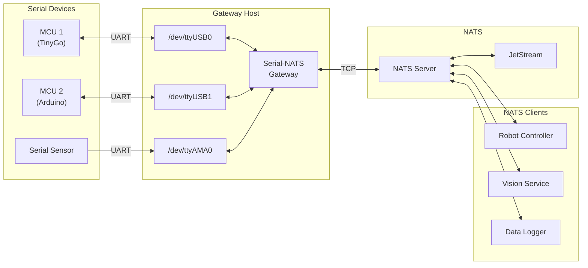

### Gateway Deployment Options

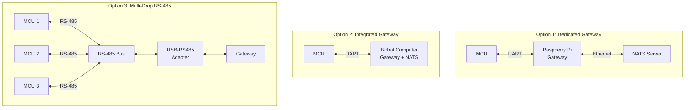

---

## Serial Protocol

### Protocol Overview

The Gorai Serial Protocol (GSP) is a text-based protocol inspired by NATS, designed for simplicity and ease of implementation on constrained devices.

### Message Types

| Type | Direction | Purpose |
|------|-----------|---------|
| `PUB` | Device → Gateway | Publish message to NATS |
| `SUB` | Device → Gateway | Subscribe to NATS subject |
| `UNSUB` | Device → Gateway | Unsubscribe from subject |
| `MSG` | Gateway → Device | Deliver message to device |
| `PING` | Bidirectional | Keepalive/latency check |
| `PONG` | Bidirectional | Response to PING |
| `+OK` | Gateway → Device | Command acknowledged |
| `-ERR` | Gateway → Device | Error response |

### Message Format

```
<COMMAND> <args...>\r\n[payload]
```

#### PUB - Publish Message

```
PUB <subject> <payload_length>\r\n<payload>
```

Example:
```
PUB sensor.temp 4\r\n23.5
```

#### SUB - Subscribe

```
SUB <subject> <subscription_id>\r\n
```

Example:
```
SUB motor.*.command 1\r\n
```

#### UNSUB - Unsubscribe

```
UNSUB <subscription_id>\r\n
```

#### MSG - Message Delivery

```
MSG <subject> <subscription_id> <payload_length>\r\n<payload>
```

Example:
```
MSG motor.left.command 1 12\r\n{"power":0.5}
```

#### PING/PONG - Keepalive

```
PING\r\n
PONG\r\n
```

### Protocol Sequence

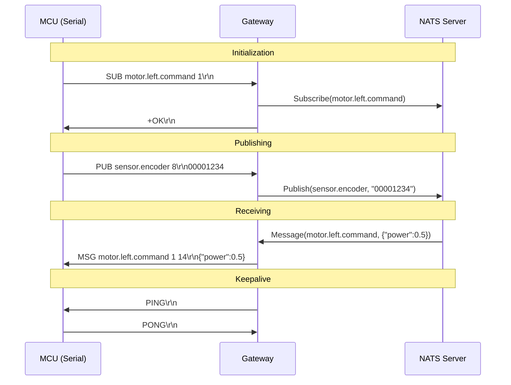

---

## Framing Layer

For reliable communication over noisy serial lines, messages are wrapped in frames.

### Frame Format

```
┌─────────┬────────┬─────────────┬──────────┬─────────┐
│  START  │ LENGTH │   PAYLOAD   │   CRC    │   END   │
│  (1B)   │  (2B)  │  (variable) │   (2B)   │  (1B)   │
└─────────┴────────┴─────────────┴──────────┴─────────┘
```

| Field | Size | Value | Description |
|-------|------|-------|-------------|
| START | 1 byte | `0x02` (STX) | Frame start marker |
| LENGTH | 2 bytes | Big-endian | Payload length (max 65535) |
| PAYLOAD | variable | GSP message | The protocol message |
| CRC | 2 bytes | CRC-16/CCITT | Checksum of LENGTH + PAYLOAD |
| END | 1 byte | `0x03` (ETX) | Frame end marker |

### CRC-16/CCITT

- Polynomial: 0x1021
- Initial value: 0xFFFF
- Input/output reflection: No

### Alternative: COBS Encoding

For environments where byte-stuffing is preferred over length-prefixed framing:

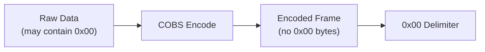

COBS (Consistent Overhead Byte Stuffing) eliminates `0x00` bytes from the payload, allowing `0x00` to serve as an unambiguous frame delimiter.

### Frame State Machine

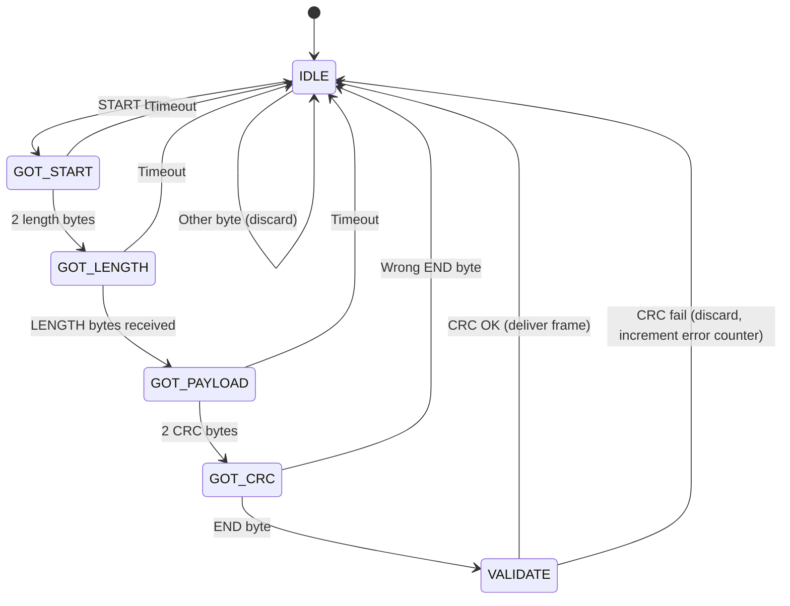

---

## Gateway Service

### Configuration

```json
{
  "gateway": {
    "nats_url": "nats://localhost:4222",
    "ports": [
      {
        "device": "/dev/ttyUSB0",
        "baud_rate": 115200,
        "data_bits": 8,
        "stop_bits": 1,
        "parity": "none",
        "flow_control": "none",
        "device_id": "mcu_left",
        "subject_prefix": "gorai.robot1"
      },
      {
        "device": "/dev/ttyUSB1",
        "baud_rate": 9600,
        "data_bits": 8,
        "stop_bits": 1,
        "parity": "none",
        "device_id": "gps_sensor",
        "subject_prefix": "gorai.robot1"
      }
    ],
    "ping_interval_ms": 1000,
    "ping_timeout_ms": 3000,
    "reconnect_delay_ms": 5000
  }
}
```

### Gateway Architecture

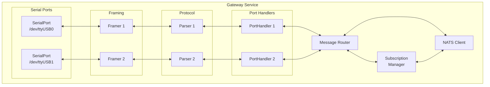

### Gateway Startup Sequence

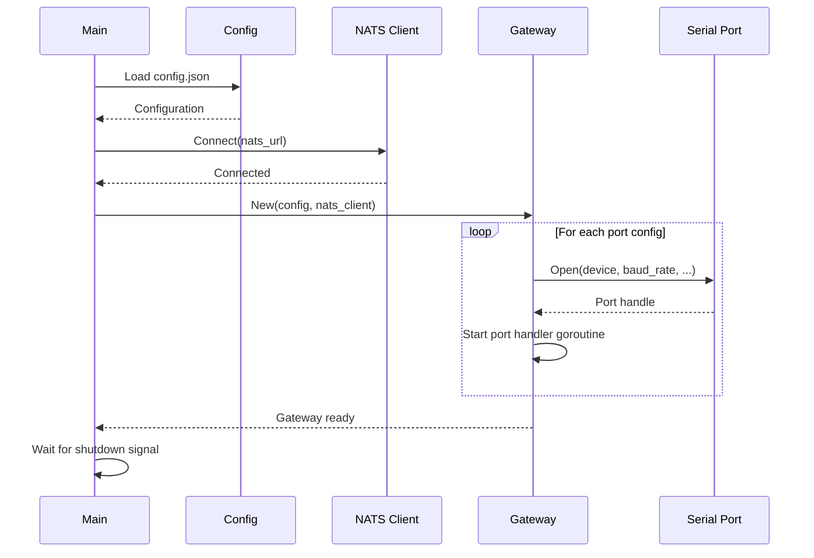

---

## Topic Mapping

### Subject Translation

Serial device subjects are prefixed with the gateway's configured prefix:

| Serial Command | NATS Subject |
|----------------|--------------|
| `PUB sensor.temp 4` | `gorai.robot1.mcu_left.sensor.temp` |
| `SUB motor.*.command 1` | `gorai.robot1.mcu_left.motor.*.command` |

### Full Subject Format

```
{prefix}.{device_id}.{device_subject}
```

Example:
```
gorai.robot1.mcu_left.sensor.encoder
└──────────┘ └──────┘ └────────────┘
   prefix   device_id  device_subject
```

### Bidirectional Mapping

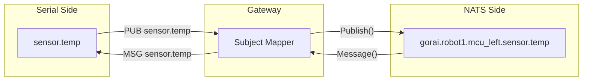

---

## Implementation

### Gateway Service (Go)

```go
package main

import (
    "encoding/binary"
    "hash/crc16"
    "log"
    "time"

    "github.com/nats-io/nats.go"
    "go.bug.st/serial"
)

// Frame constants
const (
    FrameStart = 0x02 // STX
    FrameEnd   = 0x03 // ETX
    MaxPayload = 4096
)

// Gateway bridges serial devices to NATS
type Gateway struct {
    nc     *nats.Conn
    ports  map[string]*PortHandler
    config *Config
}

// PortHandler manages a single serial port
type PortHandler struct {
    port      serial.Port
    deviceID  string
    prefix    string
    nc        *nats.Conn
    subs      map[int]*nats.Subscription
    nextSubID int
}

// Frame represents a framed serial message
type Frame struct {
    Payload []byte
}

// Encode wraps payload in a frame with CRC
func (f *Frame) Encode() []byte {
    length := len(f.Payload)
    buf := make([]byte, 1+2+length+2+1)

    buf[0] = FrameStart
    binary.BigEndian.PutUint16(buf[1:3], uint16(length))
    copy(buf[3:3+length], f.Payload)

    crc := crc16.ChecksumCCITT(buf[1 : 3+length])
    binary.BigEndian.PutUint16(buf[3+length:5+length], crc)
    buf[5+length] = FrameEnd

    return buf
}

// NewGateway creates a new serial-NATS gateway
func NewGateway(config *Config) (*Gateway, error) {
    nc, err := nats.Connect(config.NATSUrl)
    if err != nil {
        return nil, err
    }

    gw := &Gateway{
        nc:     nc,
        ports:  make(map[string]*PortHandler),
        config: config,
    }

    for _, portCfg := range config.Ports {
        if err := gw.addPort(portCfg); err != nil {
            return nil, err
        }
    }

    return gw, nil
}

func (gw *Gateway) addPort(cfg PortConfig) error {
    mode := &serial.Mode{
        BaudRate: cfg.BaudRate,
        DataBits: cfg.DataBits,
        StopBits: serial.StopBits(cfg.StopBits),
        Parity:   serial.Parity(cfg.Parity),
    }

    port, err := serial.Open(cfg.Device, mode)
    if err != nil {
        return err
    }

    handler := &PortHandler{
        port:     port,
        deviceID: cfg.DeviceID,
        prefix:   cfg.SubjectPrefix,
        nc:       gw.nc,
        subs:     make(map[int]*nats.Subscription),
    }

    gw.ports[cfg.Device] = handler
    go handler.run()

    return nil
}

func (ph *PortHandler) run() {
    framer := NewFramer(ph.port)

    for {
        frame, err := framer.ReadFrame()
        if err != nil {
            log.Printf("Frame error: %v", err)
            continue
        }

        if err := ph.handleMessage(frame.Payload); err != nil {
            log.Printf("Message error: %v", err)
        }
    }
}

func (ph *PortHandler) handleMessage(payload []byte) error {
    msg, err := ParseMessage(payload)
    if err != nil {
        return err
    }

    switch msg.Command {
    case "PUB":
        subject := ph.prefix + "." + ph.deviceID + "." + msg.Subject
        return ph.nc.Publish(subject, msg.Payload)

    case "SUB":
        subject := ph.prefix + "." + ph.deviceID + "." + msg.Subject
        sub, err := ph.nc.Subscribe(subject, func(m *nats.Msg) {
            ph.sendToDevice(msg.SubID, msg.Subject, m.Data)
        })
        if err != nil {
            return err
        }
        ph.subs[msg.SubID] = sub
        return ph.sendOK()

    case "UNSUB":
        if sub, ok := ph.subs[msg.SubID]; ok {
            sub.Unsubscribe()
            delete(ph.subs, msg.SubID)
        }
        return ph.sendOK()

    case "PING":
        return ph.sendPong()
    }

    return nil
}

func (ph *PortHandler) sendToDevice(subID int, subject string, payload []byte) error {
    msg := fmt.Sprintf("MSG %s %d %d\r\n%s", subject, subID, len(payload), payload)
    frame := &Frame{Payload: []byte(msg)}
    _, err := ph.port.Write(frame.Encode())
    return err
}
```

### Framer Implementation

```go
package main

import (
    "encoding/binary"
    "errors"
    "io"
    "time"
)

var (
    ErrFrameTimeout  = errors.New("frame timeout")
    ErrInvalidCRC    = errors.New("invalid CRC")
    ErrInvalidFrame  = errors.New("invalid frame")
    ErrPayloadTooBig = errors.New("payload too large")
)

// Framer handles frame encoding/decoding
type Framer struct {
    reader  io.Reader
    timeout time.Duration
}

func NewFramer(r io.Reader) *Framer {
    return &Framer{
        reader:  r,
        timeout: 100 * time.Millisecond,
    }
}

func (f *Framer) ReadFrame() (*Frame, error) {
    // Wait for start byte
    start := make([]byte, 1)
    for {
        _, err := io.ReadFull(f.reader, start)
        if err != nil {
            return nil, err
        }
        if start[0] == FrameStart {
            break
        }
    }

    // Read length
    lenBuf := make([]byte, 2)
    if _, err := io.ReadFull(f.reader, lenBuf); err != nil {
        return nil, err
    }
    length := binary.BigEndian.Uint16(lenBuf)

    if length > MaxPayload {
        return nil, ErrPayloadTooBig
    }

    // Read payload
    payload := make([]byte, length)
    if _, err := io.ReadFull(f.reader, payload); err != nil {
        return nil, err
    }

    // Read CRC
    crcBuf := make([]byte, 2)
    if _, err := io.ReadFull(f.reader, crcBuf); err != nil {
        return nil, err
    }
    receivedCRC := binary.BigEndian.Uint16(crcBuf)

    // Read end byte
    end := make([]byte, 1)
    if _, err := io.ReadFull(f.reader, end); err != nil {
        return nil, err
    }
    if end[0] != FrameEnd {
        return nil, ErrInvalidFrame
    }

    // Verify CRC
    data := append(lenBuf, payload...)
    expectedCRC := crc16.ChecksumCCITT(data)
    if receivedCRC != expectedCRC {
        return nil, ErrInvalidCRC
    }

    return &Frame{Payload: payload}, nil
}
```

---

## TinyGo Client

### Client Library for Microcontrollers

```go
package gsp

import (
    "machine"
    "strconv"
)

// Client provides GSP protocol over UART
type Client struct {
    uart      machine.UART
    rxBuf     [256]byte
    rxPos     int
    subCallbacks map[int]func(subject string, payload []byte)
}

// NewClient creates a GSP client
func NewClient(uart machine.UART) *Client {
    return &Client{
        uart:         uart,
        subCallbacks: make(map[int]func(string, []byte)),
    }
}

// Publish sends a message
func (c *Client) Publish(subject string, payload []byte) error {
    msg := "PUB " + subject + " " + strconv.Itoa(len(payload)) + "\r\n"
    c.sendFrame(append([]byte(msg), payload...))
    return nil
}

// Subscribe registers a callback for a subject
func (c *Client) Subscribe(subject string, id int, callback func(string, []byte)) error {
    msg := "SUB " + subject + " " + strconv.Itoa(id) + "\r\n"
    c.sendFrame([]byte(msg))
    c.subCallbacks[id] = callback
    return nil
}

// Poll checks for incoming messages (call from main loop)
func (c *Client) Poll() {
    for c.uart.Buffered() > 0 {
        b, _ := c.uart.ReadByte()
        c.processByte(b)
    }
}

func (c *Client) sendFrame(payload []byte) {
    frame := make([]byte, 1+2+len(payload)+2+1)
    frame[0] = 0x02 // STX
    frame[1] = byte(len(payload) >> 8)
    frame[2] = byte(len(payload))
    copy(frame[3:], payload)
    crc := c.crc16(frame[1 : 3+len(payload)])
    frame[3+len(payload)] = byte(crc >> 8)
    frame[4+len(payload)] = byte(crc)
    frame[5+len(payload)] = 0x03 // ETX
    c.uart.Write(frame)
}

func (c *Client) crc16(data []byte) uint16 {
    crc := uint16(0xFFFF)
    for _, b := range data {
        crc ^= uint16(b) << 8
        for i := 0; i < 8; i++ {
            if crc&0x8000 != 0 {
                crc = (crc << 1) ^ 0x1021
            } else {
                crc <<= 1
            }
        }
    }
    return crc
}
```

### TinyGo Example: Motor Controller

```go
//go:build tinygo

package main

import (
    "machine"
    "time"
    "encoding/json"

    "github.com/gorai-robotics/gorai/serial/gsp"
)

type MotorCommand struct {
    Power float32 `json:"power"`
}

type EncoderReading struct {
    Position int32   `json:"position"`
    Velocity float32 `json:"velocity"`
}

var (
    uart   = machine.UART0
    client *gsp.Client

    encoderPos   int32
    encoderVel   float32
    currentPower float32
)

func main() {
    // Configure UART
    uart.Configure(machine.UARTConfig{
        BaudRate: 115200,
        TX:       machine.UART0_TX_PIN,
        RX:       machine.UART0_RX_PIN,
    })

    // Create GSP client
    client = gsp.NewClient(uart)

    // Subscribe to motor commands
    client.Subscribe("motor.command", 1, func(subject string, payload []byte) {
        var cmd MotorCommand
        if err := json.Unmarshal(payload, &cmd); err == nil {
            setMotorPower(cmd.Power)
        }
    })

    // Main loop
    ticker := time.NewTicker(10 * time.Millisecond)
    publishTicker := time.NewTicker(50 * time.Millisecond)

    for {
        select {
        case <-ticker.C:
            client.Poll()
            updateEncoder()

        case <-publishTicker.C:
            publishEncoderReading()
        }
    }
}

func setMotorPower(power float32) {
    currentPower = power
    // Set PWM output...
}

func updateEncoder() {
    // Read encoder hardware...
    encoderPos++
    encoderVel = 100.0
}

func publishEncoderReading() {
    reading := EncoderReading{
        Position: encoderPos,
        Velocity: encoderVel,
    }
    payload, _ := json.Marshal(reading)
    client.Publish("encoder.reading", payload)
}
```

---

## Error Handling

### Error Types

| Error | Code | Description | Recovery |
|-------|------|-------------|----------|
| CRC mismatch | `E001` | Frame CRC validation failed | Discard frame, wait for next |
| Frame timeout | `E002` | Incomplete frame received | Reset framer state |
| Invalid command | `E003` | Unknown protocol command | Send `-ERR` response |
| Subject too long | `E004` | Subject exceeds 256 bytes | Send `-ERR` response |
| Payload too large | `E005` | Payload exceeds max size | Send `-ERR` response |
| NATS error | `E006` | NATS operation failed | Send `-ERR` with details |

### Error Response Format

```
-ERR <code> <message>\r\n
```

Example:
```
-ERR E003 unknown command: FOO\r\n
```

### Error Recovery Sequence

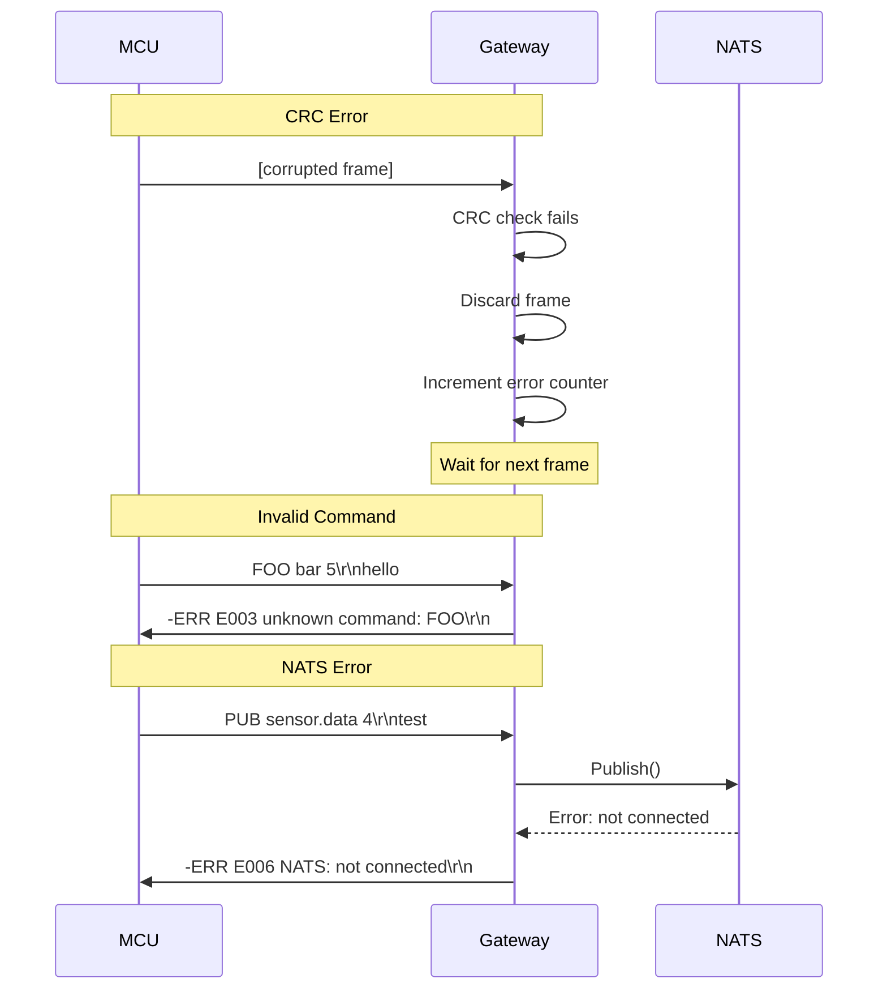

### Keepalive and Reconnection

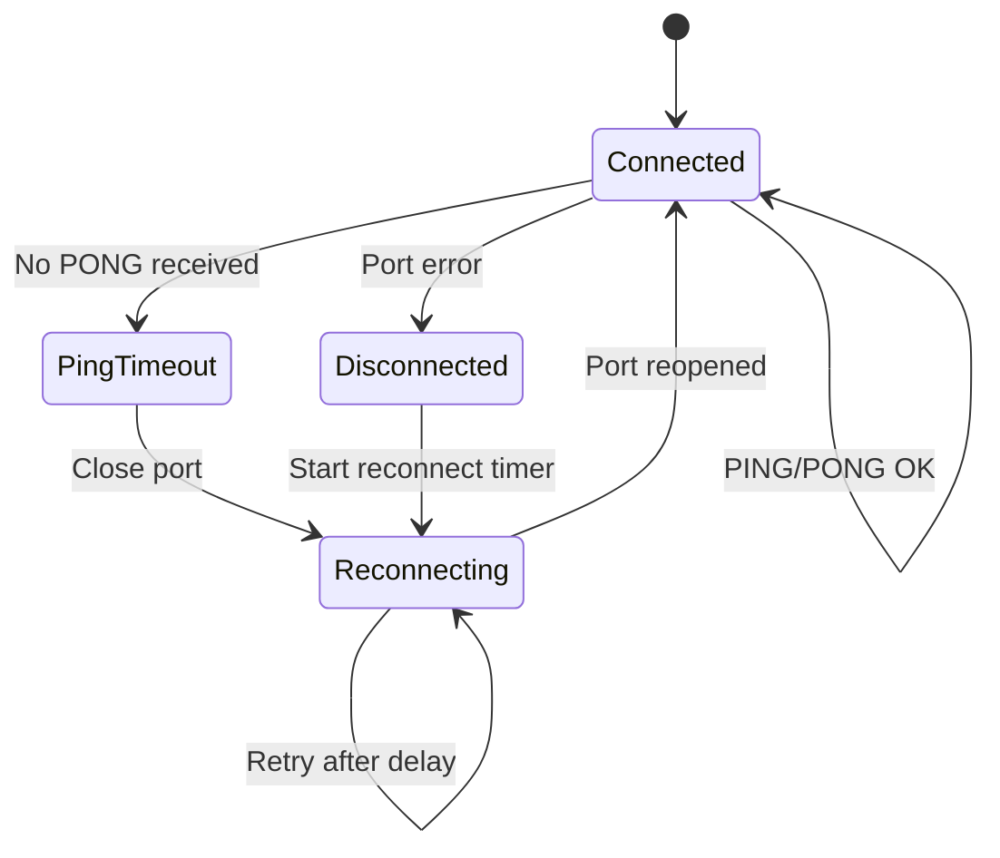

---

## Examples

### Example 1: Temperature Sensor

Serial device publishes temperature readings:

```
PUB sensor.temperature 6\r\n{"c":23.5}
```

Gateway translates to NATS:

```
Subject: gorai.robot1.temp_sensor.sensor.temperature
Payload: {"c":23.5}
```

### Example 2: Motor Control

NATS command to motor:

```
Subject: gorai.robot1.motor_left.motor.command
Payload: {"power":0.75,"direction":"forward"}
```

Gateway sends to serial device:

```
MSG motor.command 1 42\r\n{"power":0.75,"direction":"forward"}
```

### Example 3: Bidirectional Servo Control

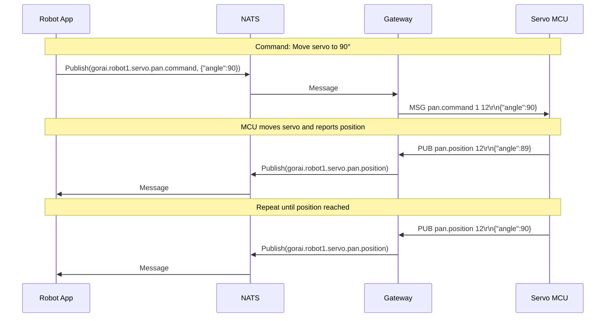

### Example 4: Multi-Device RS-485 Bus

```json
{
  "gateway": {
    "nats_url": "nats://localhost:4222",
    "ports": [
      {
        "device": "/dev/ttyUSB0",
        "baud_rate": 115200,
        "mode": "rs485",
        "device_id": "rs485_bus",
        "subject_prefix": "gorai.robot1",
        "rs485": {
          "rts_on_send": true,
          "rts_after_send": false,
          "delay_before_tx_us": 100,
          "delay_after_tx_us": 100
        }
      }
    ]
  }
}
```

For RS-485, devices must include their address in the subject:

```
PUB node1.sensor.temp 4\r\n23.5
PUB node2.motor.state 8\r\n{"rpm":100}
```

---

## Appendix A: Quick Reference

### Protocol Commands

| Command | Format | Example |
|---------|--------|---------|
| PUB | `PUB <subject> <len>\r\n<payload>` | `PUB temp 4\r\n23.5` |
| SUB | `SUB <subject> <id>\r\n` | `SUB cmd.* 1\r\n` |
| UNSUB | `UNSUB <id>\r\n` | `UNSUB 1\r\n` |
| MSG | `MSG <subject> <id> <len>\r\n<payload>` | `MSG cmd 1 3\r\nfoo` |
| PING | `PING\r\n` | `PING\r\n` |
| PONG | `PONG\r\n` | `PONG\r\n` |
| +OK | `+OK\r\n` | `+OK\r\n` |
| -ERR | `-ERR <code> <msg>\r\n` | `-ERR E001 crc\r\n` |

### Frame Format

```
[STX:1][LEN:2][PAYLOAD:n][CRC:2][ETX:1]
```

### Common Baud Rates

| Use Case | Baud Rate |
|----------|-----------|
| Low-power sensors | 9600 |
| General purpose | 115200 |
| High-speed control | 921600 |
| Maximum (varies by hardware) | 1000000+ |

---

## Appendix B: References

- [NATS Protocol](https://docs.nats.io/reference/reference-protocols/nats-protocol)
- [go.bug.st/serial](https://pkg.go.dev/go.bug.st/serial)
- [CRC-16/CCITT](https://reveng.sourceforge.io/crc-catalogue/16.htm#crc.cat.crc-16-ccitt-false)
- [COBS Encoding](https://en.wikipedia.org/wiki/Consistent_Overhead_Byte_Stuffing)
- [TinyGo](https://tinygo.org/)
