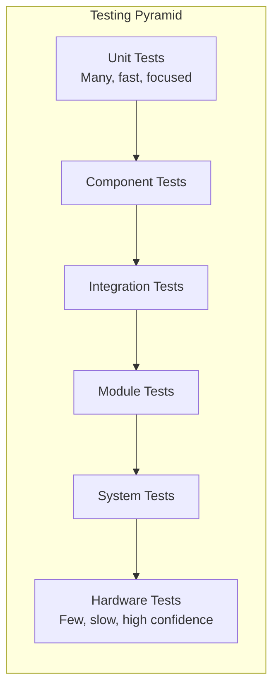
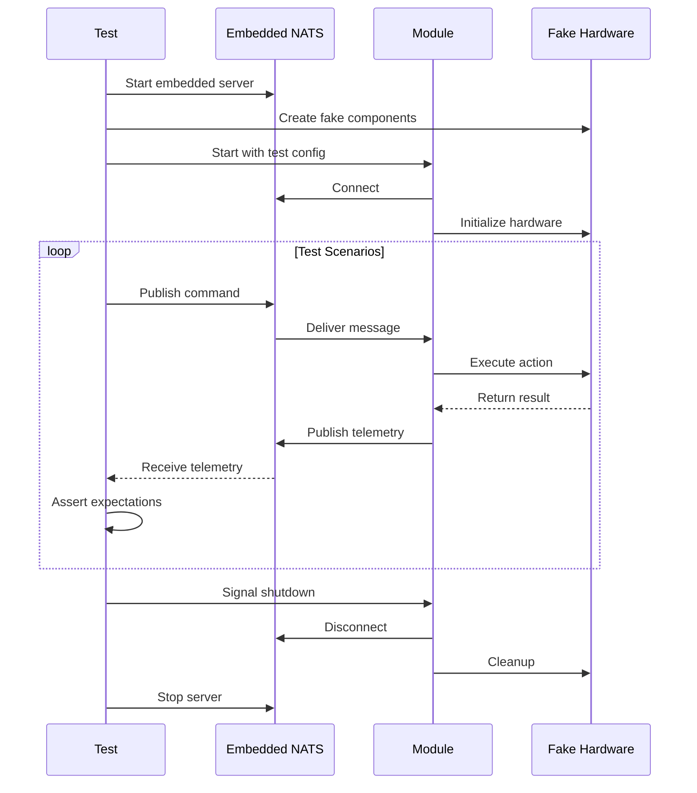

# Gorai Testing Approach Specification

**Version 0.1.0**

This specification defines the testing strategy, infrastructure, and practices for the Gorai robotics framework.

---

## Table of Contents

1. [Overview](#overview)
2. [Testing Pyramid](#testing-pyramid)
3. [Unit Testing](#unit-testing)
4. [Component Testing](#component-testing)
5. [Integration Testing](#integration-testing)
6. [Module Testing](#module-testing)
7. [System Testing](#system-testing)
8. [Hardware Testing](#hardware-testing)
9. [Running Tests](#running-tests)
10. [Test Infrastructure](#test-infrastructure)
11. [TinyGo Testing](#tinygo-testing)
12. [Continuous Integration](#continuous-integration)
13. [Coverage and Metrics](#coverage-and-metrics)

---

## Overview

Gorai testing follows a layered approach that balances speed, coverage, and confidence. Tests are organized to support both rapid development iteration and comprehensive regression testing.

### Guiding Principles

1. **Fast feedback**: Unit tests run in milliseconds; developers get immediate feedback
2. **Isolation**: Each test is independent; no shared state between tests
3. **Reproducibility**: Tests produce the same results regardless of execution order or environment
4. **NATS-native**: Integration tests use real (embedded) NATS, not mocks
5. **Hardware abstraction**: Hardware tests use fakes; real hardware tests are opt-in

### Test Categories

| Category | Speed | Scope | NATS | Hardware |
|----------|-------|-------|------|----------|
| Unit | <10ms | Function/type | No | No |
| Component | <100ms | Single component | Embedded | Fake |
| Integration | <1s | Multiple components | Embedded | Fake |
| Module | <5s | Full module lifecycle | Embedded | Fake |
| System | <30s | Complete robot | Embedded | Simulated |
| Hardware | Variable | Specific hardware | Real | Real |



---

## Testing Pyramid

### Layer Distribution

| Layer | % of Tests | Execution Time | When to Run |
|-------|------------|----------------|-------------|
| Unit | 60% | <30s total | Every save |
| Component | 20% | <1min total | Every commit |
| Integration | 10% | <2min total | Pre-push |
| Module | 5% | <3min total | Pre-merge |
| System | 4% | <5min total | CI pipeline |
| Hardware | 1% | Variable | Manual/scheduled |

### Coverage Targets

| Layer | Line Coverage | Branch Coverage |
|-------|---------------|-----------------|
| Unit | 80% | 70% |
| Component | 70% | 60% |
| Integration | 50% | 40% |
| Overall | 75% | 65% |

---

## Unit Testing

Unit tests verify individual functions, methods, and types in isolation.

### Structure

```
pkg/
├── node/
│   ├── node.go
│   ├── node_test.go        # Unit tests
│   └── testdata/           # Test fixtures
├── pub/
│   ├── publisher.go
│   └── publisher_test.go
```

### Naming Convention

```go
// Function: TestFunctionName_Scenario_ExpectedBehavior
func TestNew_WithValidConfig_ReturnsNode(t *testing.T) {}
func TestNew_WithEmptyName_ReturnsError(t *testing.T) {}
func TestPublish_WhenConnected_SendsMessage(t *testing.T) {}
func TestPublish_WhenDisconnected_ReturnsError(t *testing.T) {}
```

### Table-Driven Tests

All unit tests **SHOULD** use table-driven patterns:

```go
func TestParseConfig(t *testing.T) {
    tests := []struct {
        name    string
        input   string
        want    *Config
        wantErr bool
    }{
        {
            name:  "valid JSON",
            input: `{"name": "robot1"}`,
            want:  &Config{Name: "robot1"},
        },
        {
            name:    "invalid JSON",
            input:   `{invalid}`,
            wantErr: true,
        },
        {
            name:    "empty input",
            input:   "",
            wantErr: true,
        },
    }

    for _, tt := range tests {
        t.Run(tt.name, func(t *testing.T) {
            got, err := ParseConfig([]byte(tt.input))
            if (err != nil) != tt.wantErr {
                t.Errorf("ParseConfig() error = %v, wantErr %v", err, tt.wantErr)
                return
            }
            if !reflect.DeepEqual(got, tt.want) {
                t.Errorf("ParseConfig() = %v, want %v", got, tt.want)
            }
        })
    }
}
```

### Test Helpers

The `internal/testutil` package provides common helpers:

```go
// internal/testutil/testutil.go
package testutil

import (
    "testing"
    "time"
)

// AssertEventually retries assertion until timeout
func AssertEventually(t *testing.T, condition func() bool, timeout time.Duration, msg string) {
    t.Helper()
    deadline := time.Now().Add(timeout)
    for time.Now().Before(deadline) {
        if condition() {
            return
        }
        time.Sleep(10 * time.Millisecond)
    }
    t.Fatalf("condition not met within %v: %s", timeout, msg)
}

// RequireNoError fails immediately if err is not nil
func RequireNoError(t *testing.T, err error) {
    t.Helper()
    if err != nil {
        t.Fatalf("unexpected error: %v", err)
    }
}
```

### Running Unit Tests

```bash
# All unit tests
go test ./...

# Specific package
go test ./pkg/node/...

# Specific test
go test ./pkg/node -run TestNew_WithValidConfig

# With verbose output
go test -v ./pkg/node

# With coverage
go test -cover ./pkg/node
```

---

## Component Testing

Component tests verify a single Gorai component (motor, camera, sensor) with its dependencies faked.

### Fake Implementations

Every component interface **SHALL** have a fake implementation in the core repository:

```go
// component/motor/fake/fake.go
package fake

import (
    "context"
    "sync"

    "github.com/gorai/gorai/component/motor"
)

type Motor struct {
    mu       sync.Mutex
    power    float64
    position float64
    stopped  bool

    // Test hooks
    SetPowerFunc   func(float64) error
    GetPositionFunc func() (float64, error)
}

var _ motor.Motor = (*Motor)(nil)

func New() *Motor {
    return &Motor{}
}

func (m *Motor) SetPower(ctx context.Context, power float64) error {
    m.mu.Lock()
    defer m.mu.Unlock()

    if m.SetPowerFunc != nil {
        return m.SetPowerFunc(power)
    }

    m.power = power
    m.stopped = false
    return nil
}

func (m *Motor) GetPosition(ctx context.Context) (float64, error) {
    m.mu.Lock()
    defer m.mu.Unlock()

    if m.GetPositionFunc != nil {
        return m.GetPositionFunc()
    }

    return m.position, nil
}

func (m *Motor) Stop(ctx context.Context) error {
    m.mu.Lock()
    defer m.mu.Unlock()
    m.power = 0
    m.stopped = true
    return nil
}

// Test inspection methods
func (m *Motor) Power() float64 {
    m.mu.Lock()
    defer m.mu.Unlock()
    return m.power
}

func (m *Motor) IsStopped() bool {
    m.mu.Lock()
    defer m.mu.Unlock()
    return m.stopped
}
```

### Component Test Example

```go
// component/base/base_test.go
package base_test

import (
    "context"
    "testing"

    "github.com/gorai/gorai/component/base"
    fakemotor "github.com/gorai/gorai/component/motor/fake"
)

func TestDifferentialBase_SetVelocity(t *testing.T) {
    ctx := context.Background()

    leftMotor := fakemotor.New()
    rightMotor := fakemotor.New()

    b, err := base.NewDifferential(base.Config{
        LeftMotor:  leftMotor,
        RightMotor: rightMotor,
        WheelBase:  0.3, // 30cm
    })
    if err != nil {
        t.Fatalf("failed to create base: %v", err)
    }

    // Move forward at 0.5 m/s
    err = b.SetVelocity(ctx, 0.5, 0)
    if err != nil {
        t.Fatalf("SetVelocity failed: %v", err)
    }

    // Both motors should have equal positive power
    if leftMotor.Power() <= 0 {
        t.Errorf("left motor power = %v, want > 0", leftMotor.Power())
    }
    if rightMotor.Power() <= 0 {
        t.Errorf("right motor power = %v, want > 0", rightMotor.Power())
    }
    if leftMotor.Power() != rightMotor.Power() {
        t.Errorf("motor powers differ: left=%v, right=%v",
            leftMotor.Power(), rightMotor.Power())
    }
}

func TestDifferentialBase_Turn(t *testing.T) {
    ctx := context.Background()

    leftMotor := fakemotor.New()
    rightMotor := fakemotor.New()

    b, _ := base.NewDifferential(base.Config{
        LeftMotor:  leftMotor,
        RightMotor: rightMotor,
        WheelBase:  0.3,
    })

    // Turn right (positive angular velocity)
    err := b.SetVelocity(ctx, 0, 0.5)
    if err != nil {
        t.Fatalf("SetVelocity failed: %v", err)
    }

    // Left motor forward, right motor backward (or slower)
    if leftMotor.Power() <= rightMotor.Power() {
        t.Errorf("for right turn: left=%v should be > right=%v",
            leftMotor.Power(), rightMotor.Power())
    }
}
```

### Build Tag

Component tests use the `component` build tag:

```go
//go:build component

package motor_test
```

Run with:

```bash
go test -tags=component ./component/...
```

---

## Integration Testing

Integration tests verify multiple components working together through NATS.

### Embedded NATS Server

Integration tests use an embedded NATS server:

```go
// internal/testutil/nats.go
package testutil

import (
    "fmt"
    "testing"
    "time"

    "github.com/nats-io/nats-server/v2/server"
    "github.com/nats-io/nats.go"
)

type TestNATS struct {
    Server *server.Server
    URL    string
}

// StartNATS starts an embedded NATS server for testing
func StartNATS(t *testing.T) *TestNATS {
    t.Helper()

    opts := &server.Options{
        Host:           "127.0.0.1",
        Port:           -1, // Random available port
        NoLog:          true,
        NoSigs:         true,
        MaxControlLine: 2048,
    }

    ns, err := server.NewServer(opts)
    if err != nil {
        t.Fatalf("failed to create NATS server: %v", err)
    }

    go ns.Start()

    if !ns.ReadyForConnections(5 * time.Second) {
        t.Fatal("NATS server not ready")
    }

    tn := &TestNATS{
        Server: ns,
        URL:    fmt.Sprintf("nats://127.0.0.1:%d", ns.Addr().(*net.TCPAddr).Port),
    }

    t.Cleanup(func() {
        ns.Shutdown()
        ns.WaitForShutdown()
    })

    return tn
}

// Connect returns a NATS connection for testing
func (tn *TestNATS) Connect(t *testing.T) *nats.Conn {
    t.Helper()

    nc, err := nats.Connect(tn.URL)
    if err != nil {
        t.Fatalf("failed to connect to NATS: %v", err)
    }

    t.Cleanup(func() {
        nc.Close()
    })

    return nc
}
```

### Integration Test Example

```go
//go:build integration

package integration_test

import (
    "context"
    "testing"
    "time"

    "github.com/gorai/gorai/internal/testutil"
    "github.com/gorai/gorai/pkg/node"
    "github.com/gorai/gorai/pkg/pub"
    "github.com/gorai/gorai/pkg/sub"
    "github.com/gorai/gorai/api/gen/gorai/sensor"
)

func TestPubSub_IMUData(t *testing.T) {
    ctx, cancel := context.WithTimeout(context.Background(), 10*time.Second)
    defer cancel()

    // Start embedded NATS
    tn := testutil.StartNATS(t)

    // Create publisher node
    pubNode, err := node.New("imu_publisher", node.WithNATS(tn.URL))
    testutil.RequireNoError(t, err)
    defer pubNode.Close()

    // Create subscriber node
    subNode, err := node.New("imu_subscriber", node.WithNATS(tn.URL))
    testutil.RequireNoError(t, err)
    defer subNode.Close()

    // Set up subscriber
    received := make(chan *sensor.IMU, 1)
    _, err = sub.New[sensor.IMU](subNode, "sensor.imu", func(msg *sensor.IMU) {
        select {
        case received <- msg:
        default:
        }
    })
    testutil.RequireNoError(t, err)

    // Give subscriber time to connect
    time.Sleep(100 * time.Millisecond)

    // Create publisher and send message
    publisher := pub.New[sensor.IMU](pubNode, "sensor.imu")
    err = publisher.Publish(ctx, &sensor.IMU{
        LinearAcceleration: &sensor.Vector3{X: 0, Y: 0, Z: 9.81},
        AngularVelocity:    &sensor.Vector3{X: 0, Y: 0, Z: 0},
    })
    testutil.RequireNoError(t, err)

    // Wait for message
    select {
    case msg := <-received:
        if msg.LinearAcceleration.Z != 9.81 {
            t.Errorf("Z acceleration = %v, want 9.81", msg.LinearAcceleration.Z)
        }
    case <-ctx.Done():
        t.Fatal("timeout waiting for message")
    }
}

func TestRequestReply_MotorPosition(t *testing.T) {
    ctx, cancel := context.WithTimeout(context.Background(), 10*time.Second)
    defer cancel()

    tn := testutil.StartNATS(t)

    // Create service node
    svcNode, err := node.New("motor_service", node.WithNATS(tn.URL))
    testutil.RequireNoError(t, err)
    defer svcNode.Close()

    // Register service handler
    position := 42.5
    err = svcNode.HandleService("motor.get_position", func(req []byte) ([]byte, error) {
        return []byte(fmt.Sprintf(`{"position": %f}`, position)), nil
    })
    testutil.RequireNoError(t, err)

    // Create client node
    clientNode, err := node.New("motor_client", node.WithNATS(tn.URL))
    testutil.RequireNoError(t, err)
    defer clientNode.Close()

    // Make request
    resp, err := clientNode.Request(ctx, "motor.get_position", nil)
    testutil.RequireNoError(t, err)

    if !strings.Contains(string(resp), "42.5") {
        t.Errorf("response = %s, want position 42.5", resp)
    }
}
```

### Running Integration Tests

```bash
# All integration tests
go test -tags=integration ./...

# Specific integration test
go test -tags=integration ./tests/integration -run TestPubSub

# With race detection
go test -tags=integration -race ./...
```

---

## Module Testing

Module tests verify a complete Gorai module through its full lifecycle: initialization, operation, and shutdown. These tests start the module as it would run in production.

### Module Test Architecture



### Module Test Structure

```
tests/
├── module/
│   ├── motor_module_test.go
│   ├── camera_module_test.go
│   ├── vision_module_test.go
│   └── testdata/
│       ├── motor_config.json
│       └── camera_config.json
```

### Module Test Example

```go
//go:build module

package module_test

import (
    "context"
    "encoding/json"
    "os"
    "testing"
    "time"

    "github.com/gorai/gorai/internal/testutil"
    "github.com/gorai/gorai/pkg/node"
    "github.com/gorai/gorai/component/motor"
    fakemotor "github.com/gorai/gorai/component/motor/fake"
    "github.com/gorai/gorai/api/gen/gorai/control"
)

func TestMotorModule_Lifecycle(t *testing.T) {
    ctx, cancel := context.WithTimeout(context.Background(), 30*time.Second)
    defer cancel()

    // Start NATS
    tn := testutil.StartNATS(t)

    // Create fake motor
    fakeMotor := fakemotor.New()

    // Load test configuration
    configData, err := os.ReadFile("testdata/motor_config.json")
    testutil.RequireNoError(t, err)

    // Start module
    module, err := motor.NewModule(motor.ModuleConfig{
        NATSURL:    tn.URL,
        ConfigData: configData,
        Motor:      fakeMotor, // Inject fake for testing
    })
    testutil.RequireNoError(t, err)

    // Start module in background
    moduleCtx, moduleCancel := context.WithCancel(ctx)
    moduleDone := make(chan error, 1)
    go func() {
        moduleDone <- module.Run(moduleCtx)
    }()

    // Wait for module to be ready
    testutil.AssertEventually(t, func() bool {
        return module.Ready()
    }, 5*time.Second, "module not ready")

    // Create test client
    client, err := node.New("test_client", node.WithNATS(tn.URL))
    testutil.RequireNoError(t, err)
    defer client.Close()

    // Test: Set power via NATS
    t.Run("SetPower", func(t *testing.T) {
        cmd := &control.MotorCommand{Power: 0.75}
        cmdBytes, _ := json.Marshal(cmd)

        _, err := client.Request(ctx, "motor.left.set_power", cmdBytes)
        testutil.RequireNoError(t, err)

        // Verify fake motor received command
        testutil.AssertEventually(t, func() bool {
            return fakeMotor.Power() == 0.75
        }, time.Second, "motor power not set")
    })

    // Test: Get position via NATS
    t.Run("GetPosition", func(t *testing.T) {
        fakeMotor.SetPosition(123.45) // Set expected position

        resp, err := client.Request(ctx, "motor.left.get_position", nil)
        testutil.RequireNoError(t, err)

        var pos struct{ Position float64 }
        err = json.Unmarshal(resp, &pos)
        testutil.RequireNoError(t, err)

        if pos.Position != 123.45 {
            t.Errorf("position = %v, want 123.45", pos.Position)
        }
    })

    // Test: Stop command
    t.Run("Stop", func(t *testing.T) {
        _, err := client.Request(ctx, "motor.left.stop", nil)
        testutil.RequireNoError(t, err)

        testutil.AssertEventually(t, func() bool {
            return fakeMotor.IsStopped()
        }, time.Second, "motor not stopped")
    })

    // Shutdown module
    moduleCancel()
    select {
    case err := <-moduleDone:
        if err != nil && err != context.Canceled {
            t.Errorf("module error: %v", err)
        }
    case <-time.After(5 * time.Second):
        t.Fatal("module shutdown timeout")
    }
}
```

### Interactive Module Development

During development, you can start a module and test it interactively:

```bash
# Terminal 1: Start embedded NATS (or use external)
nats-server

# Terminal 2: Start module with test config
go run ./cmd/gorai module start motor --config testdata/motor_config.json

# Terminal 3: Interact via NATS CLI
nats pub motor.left.set_power '{"power": 0.5}'
nats req motor.left.get_position ''
nats sub 'motor.left.telemetry.>'
```

### Module Test Runner

```go
// tests/module/runner.go
package module

import (
    "context"
    "testing"
    "time"

    "github.com/gorai/gorai/internal/testutil"
)

// ModuleTestRunner provides a standard way to test modules
type ModuleTestRunner struct {
    t       *testing.T
    nats    *testutil.TestNATS
    modules []Module
}

type Module interface {
    Run(ctx context.Context) error
    Ready() bool
    Close() error
}

func NewRunner(t *testing.T) *ModuleTestRunner {
    return &ModuleTestRunner{
        t:    t,
        nats: testutil.StartNATS(t),
    }
}

func (r *ModuleTestRunner) NATSURL() string {
    return r.nats.URL
}

func (r *ModuleTestRunner) StartModule(m Module) {
    ctx, cancel := context.WithCancel(context.Background())
    r.t.Cleanup(cancel)

    go func() {
        if err := m.Run(ctx); err != nil && err != context.Canceled {
            r.t.Errorf("module error: %v", err)
        }
    }()

    testutil.AssertEventually(r.t, func() bool {
        return m.Ready()
    }, 5*time.Second, "module not ready")

    r.modules = append(r.modules, m)
}
```

---

## System Testing

System tests verify a complete robot configuration with all modules running together.

### System Test Structure

```
tests/
├── system/
│   ├── minimal_robot_test.go
│   ├── differential_drive_test.go
│   ├── pan_tilt_test.go
│   └── configs/
│       ├── minimal.json
│       ├── differential.json
│       └── pan_tilt.json
```

### System Test Example

```go
//go:build system

package system_test

import (
    "context"
    "testing"
    "time"

    "github.com/gorai/gorai/internal/testutil"
    "github.com/gorai/gorai/pkg/robot"
)

func TestDifferentialDriveRobot(t *testing.T) {
    ctx, cancel := context.WithTimeout(context.Background(), 60*time.Second)
    defer cancel()

    // Start NATS
    tn := testutil.StartNATS(t)

    // Load robot configuration
    r, err := robot.Load("configs/differential.json", robot.Options{
        NATSURL:     tn.URL,
        UseFakes:    true, // Use fake hardware
        EnableTrace: true,
    })
    testutil.RequireNoError(t, err)

    // Start robot
    robotCtx, robotCancel := context.WithCancel(ctx)
    defer robotCancel()

    go r.Run(robotCtx)

    testutil.AssertEventually(t, func() bool {
        return r.Ready()
    }, 10*time.Second, "robot not ready")

    // Get robot client
    client := r.Client()

    // Test: Move forward
    t.Run("MoveForward", func(t *testing.T) {
        err := client.Base().SetVelocity(ctx, 0.5, 0)
        testutil.RequireNoError(t, err)

        time.Sleep(100 * time.Millisecond)

        // Verify base is moving
        vel, err := client.Base().GetVelocity(ctx)
        testutil.RequireNoError(t, err)

        if vel.Linear < 0.4 {
            t.Errorf("linear velocity = %v, want >= 0.4", vel.Linear)
        }
    })

    // Test: Turn
    t.Run("Turn", func(t *testing.T) {
        err := client.Base().SetVelocity(ctx, 0, 0.5)
        testutil.RequireNoError(t, err)

        time.Sleep(100 * time.Millisecond)

        vel, err := client.Base().GetVelocity(ctx)
        testutil.RequireNoError(t, err)

        if vel.Angular < 0.4 {
            t.Errorf("angular velocity = %v, want >= 0.4", vel.Angular)
        }
    })

    // Test: Emergency stop
    t.Run("EmergencyStop", func(t *testing.T) {
        err := client.Stop(ctx)
        testutil.RequireNoError(t, err)

        // All motors should be stopped
        testutil.AssertEventually(t, func() bool {
            vel, _ := client.Base().GetVelocity(ctx)
            return vel.Linear == 0 && vel.Angular == 0
        }, time.Second, "robot not stopped")
    })
}
```

### Simulation Mode

System tests can use a physics simulator for more realistic testing:

```go
func TestNavigationWithSimulator(t *testing.T) {
    if testing.Short() {
        t.Skip("skipping simulator test in short mode")
    }

    ctx, cancel := context.WithTimeout(context.Background(), 2*time.Minute)
    defer cancel()

    // Start simulator
    sim := simulator.New(simulator.Config{
        World:     "testdata/worlds/office.world",
        RealTime:  false, // Run faster than real-time
        SpeedUp:   10.0,
    })
    defer sim.Close()

    // ... rest of test
}
```

---

## Hardware Testing

Hardware tests verify integration with real hardware. These tests are opt-in and require physical hardware.

### Hardware Test Tags

```go
//go:build hardware && raspberry_pi

package hardware_test

import (
    "testing"

    "github.com/gorai/gorai/driver/gpio"
)

func TestGPIO_Raspberry_Pi(t *testing.T) {
    // This test only runs on Raspberry Pi with hardware tag
    pin, err := gpio.Open(18)
    if err != nil {
        t.Fatalf("failed to open GPIO 18: %v", err)
    }
    defer pin.Close()

    // Test pin toggle
    for i := 0; i < 10; i++ {
        pin.High()
        time.Sleep(100 * time.Millisecond)
        pin.Low()
        time.Sleep(100 * time.Millisecond)
    }
}
```

### Running Hardware Tests

```bash
# On Raspberry Pi
go test -tags="hardware,raspberry_pi" ./driver/gpio/...

# On Jetson
go test -tags="hardware,jetson" ./driver/...

# All hardware tests (requires all hardware)
go test -tags=hardware ./...
```

### Hardware Test Configuration

```json
{
  "hardware_tests": {
    "gpio": {
      "test_pin": 18,
      "led_pin": 23
    },
    "i2c": {
      "bus": 1,
      "test_device": "0x48"
    },
    "serial": {
      "port": "/dev/ttyUSB0",
      "baud": 115200
    }
  }
}
```

---

## Running Tests

### Makefile Targets

```makefile
# Makefile

.PHONY: test test-unit test-component test-integration test-module test-system test-all

# Default: unit tests only (fast)
test: test-unit

# Unit tests
test-unit:
	go test ./...

# Component tests
test-component:
	go test -tags=component ./component/...

# Integration tests
test-integration:
	go test -tags=integration ./tests/integration/...

# Module tests
test-module:
	go test -tags=module ./tests/module/...

# System tests
test-system:
	go test -tags=system ./tests/system/...

# All tests (for CI)
test-all:
	go test -tags="component,integration,module,system" ./...

# Quick check (unit + component)
test-quick:
	go test -tags=component -short ./...

# Pre-push check
test-prepush:
	go test -tags="component,integration" -race ./...

# Coverage report
test-coverage:
	go test -tags="component,integration" -coverprofile=coverage.out ./...
	go tool cover -html=coverage.out -o coverage.html

# Run specific test pattern
test-pattern:
	go test -tags="component,integration,module,system" -run $(PATTERN) ./...
```

### Running Partial Tests

```bash
# By package
go test ./pkg/node/...
go test ./component/motor/...

# By test name pattern
go test ./... -run TestPublish
go test ./... -run "TestMotor.*Power"

# By directory
go test ./tests/integration/...

# Excluding slow tests
go test -short ./...

# Single test with verbose output
go test -v ./pkg/node -run TestNew_WithValidConfig
```

### Watch Mode Development

Use `air` or similar for continuous testing during development:

```bash
# Install air
go install github.com/cosmtrek/air@latest

# Create .air.toml for test watching
cat > .air.toml << 'EOF'
[build]
cmd = "go test -tags=component ./..."
bin = ""
delay = 500
exclude_dir = ["vendor", "testdata"]
include_ext = ["go"]
EOF

# Run
air
```

Or use `entr`:

```bash
# Watch and run tests
find . -name "*.go" | entr -c go test ./pkg/node/...
```

### Test Selection Matrix

| Scenario | Command |
|----------|---------|
| Quick feedback during coding | `go test ./pkg/...` |
| Before committing | `make test-quick` |
| Before pushing | `make test-prepush` |
| Full regression | `make test-all` |
| Specific component | `go test -tags=component ./component/motor/...` |
| Debug single test | `go test -v -run TestName ./pkg/node` |
| With race detection | `go test -race ./...` |
| Performance check | `go test -bench=. ./...` |

---

## Test Infrastructure

### Directory Structure

```
github.com/gorai/gorai/
├── internal/
│   └── testutil/          # Shared test utilities
│       ├── testutil.go    # Common helpers
│       ├── nats.go        # NATS test server
│       ├── fixtures.go    # Test data loading
│       └── assertions.go  # Custom assertions
│
├── tests/
│   ├── integration/       # Integration tests
│   │   ├── pubsub_test.go
│   │   └── service_test.go
│   ├── module/            # Module tests
│   │   ├── motor_test.go
│   │   └── camera_test.go
│   ├── system/            # System tests
│   │   ├── robot_test.go
│   │   └── configs/
│   └── benchmark/         # Performance tests
│       └── nats_bench_test.go
│
├── testdata/              # Shared test fixtures
│   ├── configs/
│   ├── images/
│   └── models/
```

### Test Fixtures

```go
// internal/testutil/fixtures.go
package testutil

import (
    "os"
    "path/filepath"
    "runtime"
    "testing"
)

// FixturePath returns absolute path to a test fixture
func FixturePath(t *testing.T, name string) string {
    t.Helper()

    _, filename, _, ok := runtime.Caller(0)
    if !ok {
        t.Fatal("failed to get caller info")
    }

    root := filepath.Dir(filepath.Dir(filepath.Dir(filename)))
    return filepath.Join(root, "testdata", name)
}

// LoadFixture loads a test fixture file
func LoadFixture(t *testing.T, name string) []byte {
    t.Helper()

    data, err := os.ReadFile(FixturePath(t, name))
    if err != nil {
        t.Fatalf("failed to load fixture %s: %v", name, err)
    }
    return data
}

// TempDir creates a temporary directory for test artifacts
func TempDir(t *testing.T) string {
    t.Helper()

    dir, err := os.MkdirTemp("", "gorai-test-*")
    if err != nil {
        t.Fatalf("failed to create temp dir: %v", err)
    }

    t.Cleanup(func() {
        os.RemoveAll(dir)
    })

    return dir
}
```

### Golden Files

For testing complex outputs:

```go
// internal/testutil/golden.go
package testutil

import (
    "flag"
    "os"
    "path/filepath"
    "testing"
)

var update = flag.Bool("update", false, "update golden files")

// AssertGolden compares output against a golden file
func AssertGolden(t *testing.T, name string, actual []byte) {
    t.Helper()

    goldenPath := filepath.Join("testdata", "golden", name+".golden")

    if *update {
        os.MkdirAll(filepath.Dir(goldenPath), 0755)
        if err := os.WriteFile(goldenPath, actual, 0644); err != nil {
            t.Fatalf("failed to update golden file: %v", err)
        }
        return
    }

    expected, err := os.ReadFile(goldenPath)
    if err != nil {
        t.Fatalf("failed to read golden file %s: %v", goldenPath, err)
    }

    if !bytes.Equal(expected, actual) {
        t.Errorf("output mismatch for %s\nwant:\n%s\ngot:\n%s",
            name, expected, actual)
    }
}
```

Update golden files with:

```bash
go test ./... -update
```

---

## TinyGo Testing

TinyGo code requires special testing considerations due to its limited runtime.

### TinyGo Test Structure

TinyGo repositories have separate test infrastructure:

```
github.com/gorai/gorai-tiny-core/
├── node/
│   ├── node.go
│   ├── node_test.go        # Standard Go tests (for logic)
│   └── node_tinygo_test.go # TinyGo-specific tests
├── serial/
│   └── gsp/
│       ├── gsp.go
│       └── gsp_test.go
└── tests/
    └── hardware/           # Hardware-in-the-loop tests
        └── esp32_test.go
```

### TinyGo Unit Tests

TinyGo tests run under standard Go for logic, with hardware tests on target:

```go
// node/node_test.go - runs with standard go test
package node

import "testing"

func TestFrameEncode(t *testing.T) {
    frame := Frame{
        Type:    TypePublish,
        Topic:   "sensor.imu",
        Payload: []byte(`{"x":1.0}`),
    }

    encoded := frame.Encode()

    decoded, err := DecodeFrame(encoded)
    if err != nil {
        t.Fatalf("decode failed: %v", err)
    }

    if decoded.Topic != frame.Topic {
        t.Errorf("topic = %s, want %s", decoded.Topic, frame.Topic)
    }
}
```

### TinyGo Hardware Tests

```go
//go:build tinygo && esp32

package hardware

import (
    "machine"
    "time"

    "github.com/gorai/gorai-tiny-core/serial/gsp"
)

func TestSerialLoopback() {
    // Configure UART
    uart := machine.UART0
    uart.Configure(machine.UARTConfig{
        BaudRate: 115200,
        TX:       machine.UART0_TX_PIN,
        RX:       machine.UART0_RX_PIN,
    })

    client := gsp.NewClient(uart)

    // Send test message
    err := client.Publish("test.topic", []byte("hello"))
    if err != nil {
        println("publish failed:", err.Error())
        return
    }

    println("test passed")
}
```

### Running TinyGo Tests

```bash
# Standard Go tests (logic only)
cd gorai-tiny-core
go test ./...

# TinyGo compilation check
tinygo build -target=esp32 ./...

# Flash and run hardware test
tinygo flash -target=esp32 ./tests/hardware/
```

### TinyGo CI Configuration

```yaml
# .github/workflows/tinygo.yml
name: TinyGo Tests

on: [push, pull_request]

jobs:
  test:
    runs-on: ubuntu-latest
    steps:
      - uses: actions/checkout@v4

      - uses: actions/setup-go@v5
        with:
          go-version: '1.21'

      - name: Install TinyGo
        run: |
          wget https://github.com/tinygo-org/tinygo/releases/download/v0.30.0/tinygo_0.30.0_amd64.deb
          sudo dpkg -i tinygo_0.30.0_amd64.deb

      - name: Go tests
        run: go test ./...

      - name: TinyGo build check
        run: |
          tinygo build -target=esp32 -o /dev/null ./...
          tinygo build -target=pico -o /dev/null ./...
          tinygo build -target=arduino-mega2560 -o /dev/null ./...
```

---

## Continuous Integration

### GitHub Actions Workflow

```yaml
# .github/workflows/test.yml
name: Tests

on:
  push:
    branches: [main]
  pull_request:
    branches: [main]

env:
  GO_VERSION: '1.21'

jobs:
  unit:
    name: Unit Tests
    runs-on: ubuntu-latest
    steps:
      - uses: actions/checkout@v4

      - uses: actions/setup-go@v5
        with:
          go-version: ${{ env.GO_VERSION }}

      - name: Run unit tests
        run: go test -race -coverprofile=coverage.out ./...

      - name: Upload coverage
        uses: codecov/codecov-action@v3
        with:
          files: coverage.out

  component:
    name: Component Tests
    runs-on: ubuntu-latest
    steps:
      - uses: actions/checkout@v4

      - uses: actions/setup-go@v5
        with:
          go-version: ${{ env.GO_VERSION }}

      - name: Run component tests
        run: go test -tags=component -race ./component/...

  integration:
    name: Integration Tests
    runs-on: ubuntu-latest
    steps:
      - uses: actions/checkout@v4

      - uses: actions/setup-go@v5
        with:
          go-version: ${{ env.GO_VERSION }}

      - name: Run integration tests
        run: go test -tags=integration -race ./tests/integration/...

  module:
    name: Module Tests
    runs-on: ubuntu-latest
    needs: [unit, component, integration]
    steps:
      - uses: actions/checkout@v4

      - uses: actions/setup-go@v5
        with:
          go-version: ${{ env.GO_VERSION }}

      - name: Run module tests
        run: go test -tags=module ./tests/module/...

  system:
    name: System Tests
    runs-on: ubuntu-latest
    needs: [module]
    steps:
      - uses: actions/checkout@v4

      - uses: actions/setup-go@v5
        with:
          go-version: ${{ env.GO_VERSION }}

      - name: Run system tests
        run: go test -tags=system -timeout=10m ./tests/system/...

  lint:
    name: Lint
    runs-on: ubuntu-latest
    steps:
      - uses: actions/checkout@v4

      - uses: actions/setup-go@v5
        with:
          go-version: ${{ env.GO_VERSION }}

      - uses: golangci/golangci-lint-action@v3
        with:
          version: latest

  benchmark:
    name: Benchmarks
    runs-on: ubuntu-latest
    if: github.event_name == 'push' && github.ref == 'refs/heads/main'
    steps:
      - uses: actions/checkout@v4

      - uses: actions/setup-go@v5
        with:
          go-version: ${{ env.GO_VERSION }}

      - name: Run benchmarks
        run: go test -tags=benchmark -bench=. -benchmem ./tests/benchmark/... | tee benchmark.txt

      - name: Store benchmark result
        uses: benchmark-action/github-action-benchmark@v1
        with:
          tool: 'go'
          output-file-path: benchmark.txt
          github-token: ${{ secrets.GITHUB_TOKEN }}
          auto-push: true
```

### Pre-commit Hooks

```bash
#!/bin/bash
# .git/hooks/pre-commit

set -e

echo "Running pre-commit checks..."

# Format
echo "Checking formatting..."
if [ -n "$(gofmt -l .)" ]; then
    echo "Please run 'go fmt ./...'"
    exit 1
fi

# Vet
echo "Running go vet..."
go vet ./...

# Unit tests
echo "Running unit tests..."
go test -short ./...

echo "Pre-commit checks passed!"
```

### Pre-push Hooks

```bash
#!/bin/bash
# .git/hooks/pre-push

set -e

echo "Running pre-push checks..."

# Full unit + component tests with race detection
go test -tags=component -race ./...

# Integration tests
go test -tags=integration ./tests/integration/...

echo "Pre-push checks passed!"
```

---

## Coverage and Metrics

### Coverage Requirements

| Package | Minimum Coverage |
|---------|-----------------|
| `pkg/*` | 80% |
| `component/*` | 75% |
| `service/*` | 75% |
| `driver/*` | 60% |
| `accel/*` | 70% |

### Generating Coverage Reports

```bash
# Full coverage
go test -tags="component,integration" -coverprofile=coverage.out ./...

# HTML report
go tool cover -html=coverage.out -o coverage.html

# Function-level coverage
go tool cover -func=coverage.out

# Package summary
go test -cover ./... | grep -E "^ok|^---"
```

### Coverage Enforcement

```go
// internal/testutil/coverage.go
package testutil

import (
    "os/exec"
    "strconv"
    "strings"
    "testing"
)

// RequireCoverage fails if package coverage is below threshold
func RequireCoverage(t *testing.T, pkg string, threshold float64) {
    t.Helper()

    out, err := exec.Command("go", "test", "-cover", pkg).Output()
    if err != nil {
        t.Fatalf("failed to run coverage: %v", err)
    }

    // Parse "coverage: 85.2% of statements"
    output := string(out)
    idx := strings.Index(output, "coverage: ")
    if idx == -1 {
        t.Fatal("could not parse coverage output")
    }

    pctStr := output[idx+10:]
    pctStr = pctStr[:strings.Index(pctStr, "%")]
    pct, _ := strconv.ParseFloat(pctStr, 64)

    if pct < threshold {
        t.Errorf("coverage %.1f%% below threshold %.1f%%", pct, threshold)
    }
}
```

### Benchmark Tracking

```go
//go:build benchmark

package benchmark

import (
    "testing"

    "github.com/gorai/gorai/pkg/pub"
    "github.com/gorai/gorai/internal/testutil"
)

func BenchmarkPublish(b *testing.B) {
    tn := testutil.StartNATSB(b)
    node := testutil.CreateNode(b, tn.URL)
    publisher := pub.New[TestMessage](node, "bench.topic")

    msg := &TestMessage{Data: make([]byte, 1024)}

    b.ResetTimer()
    b.ReportAllocs()

    for i := 0; i < b.N; i++ {
        publisher.Publish(context.Background(), msg)
    }
}

func BenchmarkPublishParallel(b *testing.B) {
    tn := testutil.StartNATSB(b)
    node := testutil.CreateNode(b, tn.URL)
    publisher := pub.New[TestMessage](node, "bench.topic")

    msg := &TestMessage{Data: make([]byte, 1024)}

    b.ResetTimer()
    b.ReportAllocs()

    b.RunParallel(func(pb *testing.PB) {
        for pb.Next() {
            publisher.Publish(context.Background(), msg)
        }
    })
}
```

---

## Summary

| Aspect | Specification |
|--------|---------------|
| Test pyramid | Unit → Component → Integration → Module → System → Hardware |
| Unit test coverage | 80% minimum |
| Test runner | Standard `go test` |
| NATS testing | Embedded server via `testutil.StartNATS` |
| Hardware abstraction | Fake implementations in `component/*/fake/` |
| Build tags | `component`, `integration`, `module`, `system`, `hardware` |
| CI pipeline | GitHub Actions with parallel jobs |
| TinyGo testing | Standard Go for logic, target builds in CI |
| Development workflow | Watch mode with `air` or `entr` |
| Pre-commit | Format, vet, unit tests |
| Pre-push | Component + integration tests with race detection |
